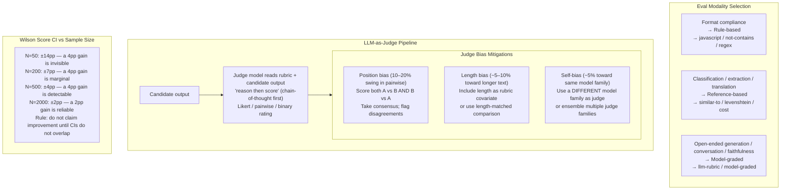

import Diagram from '../../../src/components/mdx/Diagram.astro';
import Prompt from '../../../src/components/mdx/Prompt.astro';
import PracticeTask from '../../../src/components/mdx/PracticeTask.astro';
import Feynman from '../../../src/components/mdx/Feynman.astro';
import Maintain from '../../../src/components/mdx/Maintain.astro';

## Core Idea

An **eval** is a test suite plus a graded outcome on a dataset, for a system whose outputs cannot be exactly predicted. It is the LLM-era equivalent of the integration test: it does not inspect model internals, it measures system behaviour over a representative input distribution. Three modalities exist: **rule-based** (regex, JSON-schema, must-contain/must-not-contain), **reference-based** (exact-match, F1, BERTScore against a known-correct answer), and **model-graded** (an LLM judge applies a written rubric to the candidate output). Each handles a different class of output; none can replace the others.

The load-bearing principle: **an eval without a written rubric is a vibe check.** The team must answer "what makes this output good?" in writing before the eval runs. Once the dataset and rubric are fixed, the eval becomes the regression contract: every prompt edit, model upgrade, or retrieval-pipeline change is scored on the same terms. [promptfoo](https://promptfoo.dev/) is the open-source CLI that runs all three modalities, integrates with CI, and stores results locally — no hosted service required.

> An eval without a rubric is a vibe check. The rubric is the assertion; the dataset is the fixture; together they make quality *defensible in writing*.

## 1. Set up

Everything from an empty folder to a green promptfoo eval run.

**Prerequisites:** Node >= 22.12.0, npm, a terminal, an OpenAI API key (or any [supported provider](https://promptfoo.dev/docs/providers/)).

### Create the project

```bash
mkdir eval-runbook && cd eval-runbook
npm init -y
```

### Install promptfoo (pinned)

```bash
npm install --save-dev promptfoo@0.121.13
```

> Pin the version. promptfoo's assertion DSL evolves quickly — a minor bump can rename assertion types or change output shapes. Only bump deliberately and re-run the full eval suite.

### Write the rubric first

Create `rubrics/incident-title.md` **before** touching the dataset or config. The rubric is the assertion; writing it post-hoc defeats the regression contract:

```markdown
## Incident Title Rubric v1

Each output is graded on four criteria. An output PASSES if it satisfies ALL four.

1. LENGTH      80 characters max (rule-based: output.length <= 80)
2. VERB-LEAD   Title starts with an imperative verb (rule-based: regex /^[A-Z][a-z]+/)
3. SUBJECT-REF Title references the actual subject of the ticket (model-graded)
4. NO-PII      Title contains no email address, phone number, or customer name
               (rule-based not-contains + model-graded for names)
```

### Write the eval config

Create `promptfooconfig.yaml`:

```yaml
description: "Incident title generator — eval suite v1"

prompts:
  - |
    You are an incident management assistant.
    Generate a concise one-line incident title (80 chars max) from this support ticket.
    Start with an imperative verb. Include no PII.

    Ticket: {{ticket}}

providers:
  - id: openai:gpt-4o-mini-2024-07-18
    config:
      temperature: 0

defaultTest:
  options:
    provider: anthropic:messages:claude-3-haiku-20240307

tests:
  - vars:
      ticket: "Database connection pool exhausted under peak load; users see 504 errors."
    assert:
      - type: javascript
        value: "output.length <= 80"
      - type: llm-rubric
        value: "Does the title reference a database or connection issue? Answer only 'pass' or 'fail'."

  - vars:
      ticket: "Customer john.doe@example.com reports login failures since 14:00 UTC."
    assert:
      - type: javascript
        value: "output.length <= 80"
      - type: not-contains
        value: "john.doe@example.com"
      - type: llm-rubric
        value: "Does the title avoid any email address or customer name? Answer only 'pass' or 'fail'."

  - vars:
      ticket: "Intermittent 503 on /api/orders endpoint; affects 12% of requests."
    assert:
      - type: javascript
        value: "output.length <= 80"
      - type: llm-rubric
        value: "Does the title reference an API, endpoint, or service availability issue? Answer only 'pass' or 'fail'."
```

### Run to green

```bash
OPENAI_API_KEY=sk-... npx promptfoo eval
```

Expected output (abbreviated):

```
Evaluating prompts: 100% | 3/3 | 00:05

promptfoo Results:
+-----------+------+------+
| Test      | Pass | Fail |
+-----------+------+------+
| Total     | 3    | 0    |
+-----------+------+------+

Run `npx promptfoo view` to open the browser viewer.
```

If all three test cases pass, the setup is complete. Move on.

### Folder tree after setup

```
eval-runbook/
  rubrics/
    incident-title.md
  promptfooconfig.yaml
  package.json
```

<Diagram caption="The three eval modalities, their grading targets, and how the LLM-as-judge pipeline introduces position bias, length bias, and self-bias — with mitigations for each">



</Diagram>

## 2. Implement + best practice

### Build a representative dataset (30 rows minimum)

A 5-row sample from a stochastic system has zero statistical power. Compose the dataset in three layers before running any eval:

| Row type | Target share | Why |
|---|---|---|
| Production logs (PII-scrubbed) | 60% | Represents real traffic distribution |
| Hand-crafted edge cases | 25% | Long tickets, multi-issue tickets, terse one-liners |
| Adversarial / failure-mode | 15% | PII injection, prompt injection, hostile tone |

Reference a CSV from the config to scale beyond inline tests:

```yaml
tests:
  - file://data/incidents.csv
```

### Calibrate the judge against humans before trusting it

Designate 10–20 rows as a calibration set, grade them yourself, then compare to the judge. Compute Cohen's kappa — anything below 0.6 means the rubric prompt is ambiguous. Fix the rubric prompt, not the dataset.

```bash
npx promptfoo eval --output calibration-results.json
```

Kappa below 0.4 (fair): rewrite the ambiguous criterion with a worked PASS/FAIL example before running the full eval.

### Pin the judge model to a full versioned ID

Never rely on a short alias like `gpt-4` rolling silently. Use the full versioned model ID with `temperature: 0`:

```yaml
providers:
  - id: openai:gpt-4o-mini-2024-07-18
    config:
      temperature: 0
```

### Use a different model family as judge

A GPT-4 judge scoring GPT-4 outputs inflates scores by approximately 5% due to self-bias. Use a model from a *different vendor family* as the judge:

```yaml
# Candidate: OpenAI. Judge: Anthropic.
providers:
  - openai:gpt-4o-mini-2024-07-18

defaultTest:
  options:
    provider: anthropic:messages:claude-3-haiku-20240307
```

### Tiered eval design for CI

Three tiers keep cost low without losing regression signal at release time:

| Tier | Rows | Cost est. | Gate | Purpose |
|---|---|---|---|---|
| PR smoke | 15 | ~$0.10 | block | Catch regression before merge |
| Release regression | 200 | ~$2 | block | Release decision gate |
| Weekly deep | 1000 | ~$10 | warn | Drift detection |

Use separate config files per tier, all importing from the same dataset:

```bash
# CI — PR smoke
npx promptfoo eval --config promptfooconfig.smoke.yaml

# Release gate
npx promptfoo eval --config promptfooconfig.release.yaml
```

## 3. Common pitfalls

- **Running 5 examples and shipping.** A 5-row sample from a stochastic system has zero statistical power. The Wilson CI at N=5 spans almost the entire 0–100% range — any "result" is noise. Fix: minimum 30–50 rows with a written rubric before the eval is valid. Why it happens: 5 examples *feel* representative; teams underestimate how much variance there is in an LLM's output distribution.

- **Writing the rubric after looking at outputs.** Back-fitting rubric criteria to outputs already seen destroys the regression signal — the rubric grades the sample, not the failure taxonomy. Fix: write the rubric before building the dataset. If you back-fit, name it explicitly so the next engineer knows the baseline has observer bias baked in.

- **Picking a metric before picking the dataset.** Teams decide "we'll use BLEU" before examining what kinds of failures actually occur. BLEU measures n-gram overlap — useless for free-form generation, factual accuracy, or tasks where semantically equivalent outputs differ in wording. Fix: build the dataset first, look at failure modes, then choose the assertion type that grades those failures.

- **Editing the eval to make the prompt look good.** When the eval score dips, the impulse is to soften the rubric rather than improve the prompt. This destroys the regression signal. Fix: treat the eval as immutable per release. Rubric changes get their own PR with explicit re-baselining and a written justification.

- **Reporting only the aggregate pass rate.** 80% aggregate on a 100-row eval can mask "95% on easy rows, 30% on adversarial rows." The aggregate hides the failure-mode distribution. Fix: stratify by row category and report pass rate with sample size per category.

- **Ignoring confidence intervals.** Teams compare "prompt v2 scored 82%, up from 78%" on a 50-row eval and celebrate. Wilson 95% CI at N=50: v1 = 65%–88%, v2 = 69%–91%. The intervals overlap substantially. Fix: compute Wilson score or bootstrap CIs for every comparison. Do not call a delta "real" if CIs overlap.

- **Never re-calibrating the judge against humans.** Provider-side model upgrades — often silent alias rolls — shift judge scores on fixed candidate outputs. A score drop may reflect judge drift, not product regression. Fix: maintain a 10–20 row human-graded calibration set; re-run judge vs. human agreement on every judge model upgrade, and pin the judge model ID explicitly.

## 4. Maintain

<div role="list" aria-label="Maintenance triggers and responses">
<Maintain trigger="promptfoo ships a new minor or major version">
  1. Read the [promptfoo changelog](https://github.com/promptfoo/promptfoo/releases) for breaking assertion-type renames or config schema changes.
  2. Bump `promptfoo` in `package.json` to the new pinned version.
  3. Re-run `npx promptfoo eval` on your smoke tier — most failures will be renamed assertion types or changed output field names.
  4. Update the `verified.versions` block and `verified.date` in frontmatter.
  5. Note: promptfoo is under active development (drift risk is HIGH — minor versions ship weekly). Only bump when a specific fix or feature is needed.
</Maintain>

<Maintain trigger="LLM provider deprecates or renames a model (e.g. a short alias rolls silently)">
  1. Check your `promptfooconfig.yaml` for any non-versioned model aliases (`gpt-4`, `gpt-4o`, `claude-3-opus`).
  2. Replace with the full versioned model ID (e.g. `openai:gpt-4o-mini-2024-07-18`).
  3. Re-run the calibration tier: compare judge scores on the human-graded calibration set before and after the model change. A score shift on unchanged candidate outputs means judge drift, not product regression.
  4. Re-baseline if the score shift exceeds your noise floor (typically greater than the Wilson CI width for your N).
  5. Update `verified.versions` with the new pinned model IDs and `verified.date`.
</Maintain>

<Maintain trigger="Eval flakes on non-deterministic output (llm-rubric passes 8/10 runs, fails 2/10)">
  1. Set `temperature: 0` on both the candidate and judge providers in `promptfooconfig.yaml`.
  2. If flakiness persists at temperature 0, the rubric prompt is ambiguous — run the judge three times on the same output and check for disagreement. Rewrite the ambiguous criterion with a worked PASS/FAIL example.
  3. For high-stakes assertions, run majority-vote across three judge calls via a custom grader script.
  4. Never increase a pass threshold to hide flakiness — it masks the root cause.
</Maintain>

<Maintain trigger="Provider API change breaks the eval run (authentication error, 4xx/5xx)">
  1. Check provider credentials: `OPENAI_API_KEY`, `ANTHROPIC_API_KEY`, or equivalent env vars.
  2. Verify the model ID is still valid — providers retire model IDs with notice periods.
  3. Check the promptfoo provider adaptor for the breaking change: `npx promptfoo@latest info providers`.
  4. If the provider changed its request or response schema, bump promptfoo to the version that ships the updated adaptor.
</Maintain>

<Maintain trigger="Eval dataset rots (rows whose expected outputs no longer reflect the product)">
  1. Schedule a quarterly dataset review: read every adversarial and edge-case row and ask "is this still a realistic failure mode for the current product?"
  2. Retire rows whose context has changed; document the retirement with a comment in the CSV.
  3. Add new adversarial rows whenever a production failure mode is discovered that the existing dataset missed.
  4. Re-run the calibration tier after any dataset change to confirm the human-grade baseline is still valid.
</Maintain>
</div>

## Retrieval Prompts

<Prompt id="eval-1">
  Name the three eval modalities. For each, give one task it handles well and one task where it produces misleading results.
</Prompt>

<Prompt id="eval-2">
  A teammate proposes shipping a prompt change because "5 examples all looked better." What is the minimum eval discipline you would ask for before agreeing to ship, and why does sample size matter more than the team expects?
</Prompt>

<Prompt id="eval-3">
  Define position bias in LLM-as-judge pairwise evaluation. Quantify the typical swing. Name one concrete orchestration mitigation and explain why it works.
</Prompt>

<Prompt id="eval-4">
  Explain why reporting aggregate pass rate is not enough. Construct a scenario where an 80% aggregate score hides a critical failure mode, and describe the reporting discipline that would have surfaced it.
</Prompt>

<Prompt id="eval-5">
  A judge model is silently upgraded by the provider. The eval score on a fixed, unchanged candidate drops 4 points. Did the product regress? What artefact do you need to answer that question, and how do you maintain it?
</Prompt>

<Prompt id="eval-6">
  Why are BLEU and ROUGE considered insufficient for free-form generation evals? What do they actually measure, and what should replace them for open-ended output quality?
</Prompt>

<Prompt id="eval-7">
  Define Cohen's kappa. Why is it more informative than raw percentage agreement between two graders? State the Landis and Koch threshold for "substantial agreement."
</Prompt>

<Prompt id="eval-8">
  A 500-row eval costs $5 per run. The team wants to run it on every PR in a repo that sees 50 PRs per week. Propose a tiered eval design that keeps PR cost low without losing regression signal at release time.
</Prompt>

<Prompt id="eval-9" requiresDiagram>
  Sketch the relationship between sample size and Wilson-score confidence interval width for a binary pass/fail eval. Mark the approximate N below which a 4-percentage-point improvement is statistically invisible.
</Prompt>

<Prompt id="eval-10">
  The team proposes using GPT-4 as the judge for GPT-4-generated outputs. Name the bias this introduces, quantify it, and describe the fix.
</Prompt>

## Practice Task

<PracticeTask id="eval-task-1" rubric="eval-rubric-v1">
  Design, configure, and document a versioned, defensible eval using promptfoo. Use the incident-title generator from the Set up section, or substitute an LLM feature from a system you have access to (a summariser, a classification endpoint, a Q&A bot). Your deliverable must be a written artefact a second engineer could pick up and run.

  **Deliverable 1 — The rubric (written before the eval runs)**

  Write the rubric in markdown. For each criterion:
  - Name the criterion and the grading target (rule-based assertion type, or `llm-rubric` prompt with exact judge prompt text).
  - Give a worked example of a PASS output and a FAIL output for that criterion.
  - Specify what score constitutes a release gate.

  The rubric must exist before you touch the dataset. If you write it after, note that you wrote it after — the rubric-first discipline is part of the grading.

  **Deliverable 2 — The promptfooconfig.yaml (30+ test rows)**

  Produce a valid `promptfooconfig.yaml` with:
  - At least 30 test cases typed by composition: production-log rows, edge-case rows, adversarial rows.
  - Each test case has at least one rule-based assertion and, where the output is open-ended, one `llm-rubric` assertion with the exact judge prompt text.
  - The judge provider pinned to a full versioned model ID (not an alias).
  - `temperature: 0` on the judge provider.

  **Deliverable 3 — Judge calibration result**

  Take 10 rows from your dataset. Run the eval. Compare judge scores to your own human grades. Report:
  - Raw agreement percentage.
  - Cohen's kappa with interpretation (use the Landis and Koch bands).
  - A written verdict: is the judge fit for purpose? If kappa is below 0.4, what would you change in the rubric prompt?

  **Deliverable 4 — Stratified results**

  Run the eval on your test cases. Report:
  - Per-category pass rate (production / edge-case / adversarial) with sample size.
  - At least one finding from the adversarial rows that the aggregate score would have hidden.
  - Wilson 95% CI for the overall pass rate. Interpret whether the sample is large enough to be decisive.

  **Deliverable 5 — CI tier design**

  Define three tiers: PR-smoke, release-regression, weekly-deep. For each:
  - Row count and selection strategy.
  - Estimated cost and runtime.
  - Gate action (block / warn / inform) and the trigger condition.
  - One drift signal the tier is responsible for catching.

  **Deliverable 6 — Drift watch plan**

  Name four concrete drift signals and for each: what changes, how you detect it, and what action you take:
  - Judge-model drift (provider upgrades the judge alias silently).
  - Candidate-model drift (the production model alias rolls to a newer version).
  - Dataset rot (rows whose expected outputs no longer make sense as the product evolves).
  - Production-distribution shift (real traffic diverges from the eval dataset).

  Rubric (revealed after submission):
  - Was the rubric written before the dataset was built, or back-fit to outputs? Back-fitting is noted but not disqualifying — it must be named.
  - Does the `promptfooconfig.yaml` use a pinned full-version model ID for the judge, not an alias?
  - Does the rubric distinguish rule-based and `llm-rubric` assertions with explicit judge prompts? A rubric that says "judge if the output is good" without the prompt text fails.
  - Does the dataset composition include adversarial rows, or only happy-path? Happy-path-only fails.
  - Was Cohen's kappa computed and interpreted, or just raw agreement %? Raw % only fails.
  - Were confidence intervals reported for the pass rate, or only point estimates? Point-estimate-only fails.
  - Was the CI tier design genuinely tiered (different row counts, different gates), or just "run everything three times"? Non-tiered fails.
  - Does the drift watch name *concrete* detection mechanisms for each of the four drift types, or just "monitor it"? Vague detection fails.
</PracticeTask>

## Feynman Prompt

<Feynman id="eval-feynman-1" wordTarget={150}>
  Explain eval design to an engineer who ships LLM features by "checking a few outputs and seeing if they look right." Cover: why a 5-example vibe check has no statistical power for a stochastic system, what a rubric is and why it must exist before the eval runs (not after), and what it means for the eval to be a "regression contract" — why changing the eval and the prompt in the same PR destroys your ability to know whether the product improved. Give one concrete example of a failure mode the vibe check would miss that a 50-row adversarial eval would catch.

  Rubric (revealed after submit): Did you explain why sample size matters for a stochastic system — not just "5 is small" but what variance means for LLM outputs? Did you define the rubric as something written before the eval runs, with a specific consequence if it isn't? Did you explain "regression contract" with a mechanism — what actually happens to your signal when you change eval and prompt together — rather than just "it's bad practice"? Did your concrete example name a specific failure mode (PII leakage, prompt injection, adversarial input, bias toward a specific category) rather than "something could go wrong"?
</Feynman>
