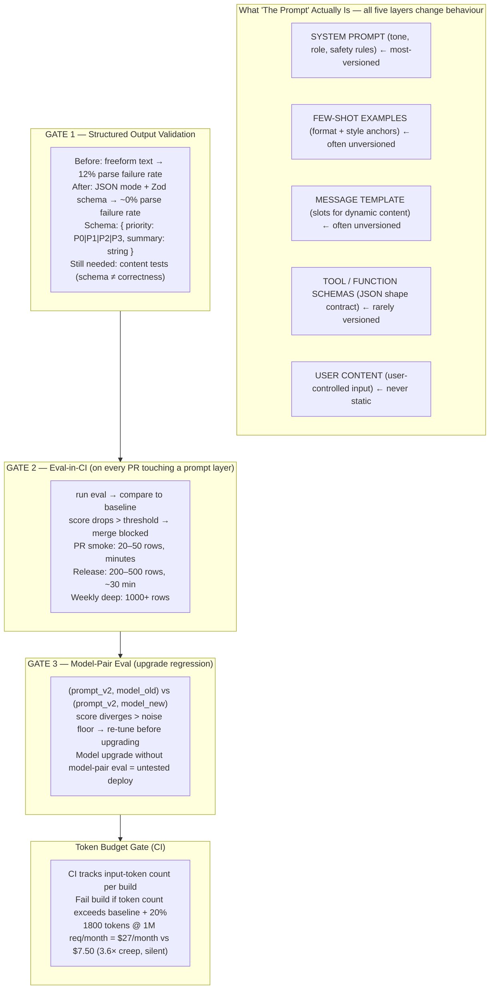

import Diagram from '../../../src/components/mdx/Diagram.astro';
import Prompt from '../../../src/components/mdx/Prompt.astro';
import PracticeTask from '../../../src/components/mdx/PracticeTask.astro';
import Feynman from '../../../src/components/mdx/Feynman.astro';

## Core Idea

A prompt is **the spec, the source code, and the runtime contract for an LLM-powered feature — all at once.** It is the highest-leverage code in the system, yet most teams ship prompt changes with zero test coverage.

Prompt regression is the discipline that fixes this. It treats prompts like production code: version-controlled, diff-reviewable, and gated behind a regression eval before any change goes live. The eval is the test suite; the schema is the type system; the CI gate is the merge check.

Three sub-disciplines compose the whole:

1. **Versioning** — every prompt is a tagged, reviewable artefact: system prompt + message template + few-shot examples + tool schemas, all versioned together.
2. **Structured-output validation** — JSON mode / schema-constrained decoding enforces output shape; downstream code stops parsing free-form text.
3. **Regression suites** — every prompt change re-runs the eval; a score drop blocks merge.

> A prompt change with no regression eval is an unmonitored production deploy. The discipline converts it into a tested, measured, reversible release.

## Diagram

<Diagram caption="The full prompt assembly — the layers that reach the model — and the three regression gates (schema validation, CI eval, model-pair eval) that defend each layer change">



</Diagram>

## Worked Example

### From freeform output to schema-validated regression suite

**The starting point — freeform output with a bug**

A bug-triage assistant classifies incoming issues. The original prompt:

```
System: You are a QA triage assistant. Given a bug report, reply with
        the priority (P0–P3) and a one-line summary.

User: {{bug_report}}
```

Across 50 runs the output looks like this:

```
Issue priority: P1. Summary: Login form crashes on submit.
Priority: P2 — Tooltip text truncated on mobile.
**P1** - Cannot export CSV with special characters.
p0: Production database returning 503.
```

Parse failure rate: ~12% — the downstream ticket-router breaks on unexpected formats. The team "fixes" this by adding a re-prompt on parse failure. This is the wrong fix; re-prompting patches the symptom while the root cause (unconstrained output) stays.

**Gate 1 fix — enforce structured output**

Switch to JSON mode and add a Zod schema (TypeScript):

```ts
import { z } from 'zod';

const TriageSchema = z.object({
  priority: z.enum(['P0', 'P1', 'P2', 'P3']),
  summary: z.string().min(5).max(120),
});

// On LLM response: parse with schema
const result = TriageSchema.parse(JSON.parse(llmResponse));
```

Updated system prompt:

```
System: You are a QA triage assistant. Given a bug report, respond
        with a JSON object matching this schema:
        { "priority": "P0"|"P1"|"P2"|"P3", "summary": "<one sentence>" }
        No additional keys. No prose outside the JSON object.

User: {{bug_report}}
```

Parse failure rate after: ~0%. But note — the schema enforces *shape*, not *correctness*. A P0 that should be P2 will pass schema validation. Content tests are still required in the eval suite.

**Gate 2 — build the regression suite**

Before changing the prompt further, lock the baseline. A minimal eval fixture (CSV format):

```
bug_report,expected_priority,expected_summary_keywords
"Login crashes on empty password submit",P1,"login,crash"
"Dashboard loads in 45 seconds",P2,"dashboard,slow"
"Production DB returning 503 for all users",P0,"production,503"
"Button label has a typo: 'Subbmit'",P3,"typo"
"Authenticated users can view other users' private notes",P0,"auth,private"
```

A basic eval runner:

```ts
// scripts/eval-triage-prompt.ts
let passed = 0;
for (const row of evalFixture) {
  const result = await triagePrompt(row.bug_report);
  const priorityMatch = result.priority === row.expected_priority;
  const keywordsMatch = row.expected_summary_keywords
    .split(',')
    .every(kw => result.summary.toLowerCase().includes(kw));
  if (priorityMatch && keywordsMatch) passed++;
}
const score = passed / evalFixture.length;
console.log(`Eval score: ${score * 100}%`);
if (score < BASELINE_SCORE - 0.05) {
  process.exit(1); // CI gate: block merge
}
```

**The deliberate mistake — and how the regression catches it**

A developer adds a "be concise" instruction to the prompt, intending to shorten verbose summaries. The new summary constraint causes the model to drop priority keywords in short summaries. Rows like `"Authenticated users can view other users' private notes"` now produce `priority: P2, summary: "Access issue"` instead of `P0`.

Old score: 88%. New score: 72%. The CI gate blocks the PR. The developer reviews the failing rows, realises the "be concise" instruction is degrading security-class triage, and refines to `"Summarise concisely, but always include the affected component."` Score restores to 90%. **The regression caught a silent accuracy drop that freeform testing would have missed entirely.**

**Gate 3 — model-pair eval before upgrading the model**

Six months later, the provider releases a new model version. The team wants to upgrade. They run:

```bash
# Run the same 50-row eval against both model versions
TRIAGE_MODEL=provider/model-v1 npx tsx scripts/eval-triage-prompt.ts
# Score: 88%

TRIAGE_MODEL=provider/model-v2 npx tsx scripts/eval-triage-prompt.ts
# Score: 79%
```

The drop is outside the noise floor. Inspection reveals the new model is more verbose: it wraps the JSON in a markdown code block (`\`\`\`json ... \`\`\``), which breaks the `JSON.parse` call for ~18% of rows. Fix: add explicit instruction `"Respond with raw JSON only, no markdown fences."` Re-run: 91%. The model upgrade is now safe. Without the model-pair eval, the team would have deployed a 9-point accuracy regression.

## Common Pitfalls

- **Versioning only the system prompt.** The system prompt is one of five prompt layers. Few-shot examples, message templates, tool schemas, and post-processing logic all change behaviour. Fix: version the entire prompt assembly as a single artefact — a manifest file checked into source control alongside the code that calls it. Why it happens: the system prompt is visible; the other layers are buried in code.

- **Using re-prompts on parse failure as the fix.** When the model returns malformed output, re-prompting is a useful circuit-breaker, but it treats the symptom. Fix: adopt structured outputs / JSON mode + schema validation. The eval should track re-prompt rate as a metric — a rising rate signals the prompt has degraded. Why it happens: adding a retry is faster than rethinking the prompt schema.

- **Shipping a prompt change without running the eval.** "It looks better for the bug in JIRA-1234" is not evidence. Fix: require the eval to run on every PR that touches any prompt layer; make the eval gate mandatory in CI. Why it happens: prompt changes feel like "configuration," not code — so the code-review and test disciplines don't follow.

- **Treating model upgrades as no-ops.** A prompt tuned against one model version may fail subtly on the next. Format compliance shifts, verbosity changes, refusal rates move. Fix: run a model-pair eval (same dataset, both model versions) before any model upgrade. Why it happens: the team's code didn't change, so the change feels invisible.

- **Writing negative instructions.** `"Do NOT mention pricing"` often increases pricing mentions — the model attends to the named concept. Fix: reframe as positive scope: `"Respond only about product features."` Why it happens: negative framing maps directly to the intent ("I want to exclude X"), but the model's attention works differently.

- **Single-placement of key instructions in long prompts.** In prompts over ~2000 tokens, instructions stated only once in the middle are frequently ignored — the "lost-in-the-middle" effect. Fix: the instruction sandwich — state the critical constraints at the start *and* repeat them at the end. Why it happens: authors write prompts linearly and assume the model reads the same way.

- **Letting the prompt grow unbounded.** Teams add rules and examples week by week. A 500-token prompt becomes 2000 tokens in two months. Fix: add a CI gate on input-token count; treat additions as budget decisions with a cost delta. Why it happens: each addition seems small; the accumulation is invisible without a gate.

## Retrieval Prompts

<Prompt id="per-1">
  Why is "the prompt is code" not a metaphor? Name two concrete engineering practices that follow directly from treating it as code — practices that teams typically skip when they treat prompts as configuration.
</Prompt>

<Prompt id="per-2">
  A teammate proposes merging a prompt edit because "it looks better for the bug in JIRA-1234." What process do you require before the merge, and what specific artefact does that process produce?
</Prompt>

<Prompt id="per-3">
  Define structured outputs / JSON mode. Name the class of bugs it eliminates and the class of bugs it does NOT eliminate. Give one concrete example of a bug that would survive schema validation.
</Prompt>

<Prompt id="per-4">
  A prompt is being migrated from one model version to the next. The team reports "same behaviour." What evidence — specific commands or artefacts — would you require before accepting that claim?
</Prompt>

<Prompt id="per-5">
  Why do negative instructions ("don't do X") often fail in LLM prompts? What is the correct reframing, and why does it work differently?
</Prompt>

<Prompt id="per-6">
  The "instruction sandwich" pattern — what is it, what problem does it solve, and what underlying model behaviour makes it necessary?
</Prompt>

<Prompt id="per-7">
  A user reports "the bot started giving wrong priority ratings two days ago." Your team's prompt file has not changed in three weeks. Name three hypotheses you investigate first, ordered by likelihood.
</Prompt>

<Prompt id="per-8" requiresDiagram>
  Sketch the five-layer prompt assembly that reaches the model (system, few-shot, template, tool schemas, user content). Mark which layers most teams version and which they typically leave unversioned. Explain the QA consequence of versioning only one layer.
</Prompt>

<Prompt id="per-9">
  A 4-step LLM chain has 95% per-step reliability. What is the end-to-end reliability, and what does this imply about chain-length decisions and where regression evals should be placed?
</Prompt>

<Prompt id="per-10">
  CI tracks prompt token count per build. Over eight weeks, the count drifts from 500 to 1800 tokens. Explain why this is a quality concern — not just a cost concern — and describe the CI gate that catches it.
</Prompt>

## Practice Task

<PracticeTask id="per-task-1" rubric="per-rubric-v1">
  Ship a prompt change with regression discipline. Take an existing LLM-integrated feature (the project's, or a provided sample prompt). Identify a real or proposed prompt change — an instruction addition, a few-shot example update, a schema tightening. Produce the following seven deliverables.

  **Deliverable 1 — Prompt manifest (before and after)**

  The full assembled prompt as two versioned artefacts: system prompt + message template + few-shot examples + tool/function schemas. Present them as files, not inline strings. Include a markdown diff between the two versions showing exactly what changed and in which layer.

  **Deliverable 2 — Change rationale**

  What the change is intended to improve, with a user-facing motivation (a bug report, a usability finding, or a concrete failure case from the eval). "It looked better" fails the rubric.

  **Deliverable 3 — Structured-output schema**

  The Zod or Pydantic schema for the prompt's output. If the prompt does not yet use structured outputs, add one as part of the change and document the parse-failure rate before and after. If it already has one, document why the schema version does or does not need a breaking-change bump for this change.

  **Deliverable 4 — Eval run (regression)**

  The regression eval executed against both prompt versions (before and after). Minimum 20 rows. Report: per-category pass rates (not just a single aggregate), and whether the score delta exceeds the noise floor. Conclude: does the change pass or fail the regression gate?

  **Deliverable 5 — Model-pair check**

  Run the same eval against the current production model and one adjacent model version. Conclusion: is the prompt change robust across model versions, or does it require model-specific tuning?

  **Deliverable 6 — Cost and token delta**

  Input-token count, output-token count, and estimated dollar cost per 1,000 calls at production volume — for both prompt versions. Use the provider's tokenizer, not estimation.

  **Deliverable 7 — Ramp and rollback plan**

  How the new prompt is exposed: shadow eval on N% of traffic, ramp percentages, kill-switch criteria, and the specific production signal that would trigger an immediate rollback.

  Rubric (revealed after submission):
  - Did the prompt manifest include all five layers (system + template + few-shot + tool schemas + user-content slot), or only the system prompt? Manifest missing any layer fails.
  - Did the change rationale cite a measurable user-facing problem, or just subjective improvement? "Looked better" fails.
  - Does the schema enforce shape only, or also semantic constraints? Did the candidate acknowledge what the schema cannot catch?
  - Did the eval produce stratified per-category scores with a noise-floor comparison, or a single aggregate? Single aggregate fails.
  - Did the model-pair check actually run, or was it skipped with "we're not changing the model"? Skipping fails.
  - Did the cost delta use the provider's tokenizer or hand-wave an estimate? Estimation fails.
  - Is the ramp plan concrete — named percentages, named kill-switch signals — or hand-wavy? "Gradual rollout" fails.
  - Bonus: did the candidate identify a hidden prompt component (a feature-flag override, a per-tenant system prompt) that should also be in the manifest?
</PracticeTask>

## Feynman Prompt

<Feynman id="per-feynman-1" wordTarget={150}>
  Explain prompt regression testing to a developer who thinks "I'll just look at the output and see if it's still good." Cover: why visual spot-checking is insufficient (name the specific failure mode it misses), what a regression suite adds that spot-checking cannot, why a model upgrade that "should be a no-op" requires the same discipline as a code change, and why a schema-validated output still requires content tests. Give one concrete example of a silent regression — a real failure class — that spot-checking would miss and an eval suite would catch. Rubric (revealed after submit): Did you name a specific failure mode spot-checking misses (e.g., a 9-point accuracy drop on a minority class, a format shift on model upgrade) rather than "it's less rigorous"? Did you explain what the regression suite adds mechanistically (stratified scores, noise-floor comparison, per-row diffs) rather than "it's more thorough"? Did you explain why schema validation and content validation are different concerns with a concrete example? Did your silent-regression example name a real failure class (minority-class degradation, format-compliance shift on model upgrade, cost-token creep) rather than "something might go wrong"?
</Feynman>
