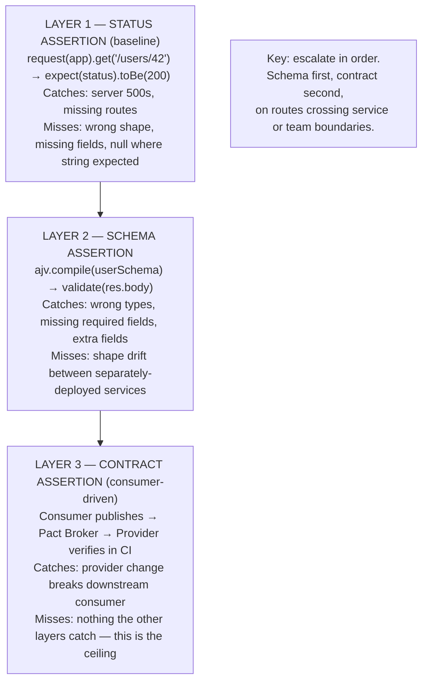

import Diagram from '../../../src/components/mdx/Diagram.astro';
import Prompt from '../../../src/components/mdx/Prompt.astro';
import PracticeTask from '../../../src/components/mdx/PracticeTask.astro';
import Feynman from '../../../src/components/mdx/Feynman.astro';
import Maintain from '../../../src/components/mdx/Maintain.astro';

## Core Idea

API testing is a **layered practice** built on three escalating commitments: ad-hoc exploration (Postman, Bruno), scripted regression in code (Supertest, Vitest), and consumer-driven contract testing (Pact). The load-bearing insight is that **status-code-only assertions are the dominant API test smell** — a `200 OK` with `{ error: 'not found' }` passes them silently. Adding schema validation and behaviour assertions to every route doubles the caught-bug count for a few extra lines. Contract testing then prevents the structural failure class no per-team schema catches: **silent shape drift between separately-deployed services**. Each layer earns its place by catching a different bug class; none replaces the other.

## 1. Set up

Everything from an empty folder to a green Supertest run against a real Express server.

**Prerequisites:** Node >= 22.12.0, npm, a terminal.

### Create the project

```bash
mkdir api-runbook && cd api-runbook
npm init -y
```

### Install dependencies (pinned)

```bash
npm install express@5.2.1
npm install --save-dev supertest@7.2.2 @types/supertest@7.2.0 ajv@8.20.0 vitest@4.1.7 typescript@5.8.3 @types/node@22.15.21 @types/express@5.0.2
```

> Pin the versions. Supertest wraps the Node.js `http` module directly; a major bump can change how it handles Express 5's streaming response behaviour. Only bump deliberately and rerun the full test suite.

### Scaffold the config

Create `tsconfig.json`:

```json
{
  "compilerOptions": {
    "target": "ES2022",
    "module": "NodeNext",
    "moduleResolution": "NodeNext",
    "strict": true,
    "outDir": "dist"
  },
  "include": ["src", "tests"]
}
```

Create `vitest.config.ts`:

```ts
import { defineConfig } from 'vitest/config';

export default defineConfig({
  test: {
    environment: 'node',
  },
});
```

Add a `test` script to `package.json`:

```json
"scripts": {
  "test": "vitest run"
}
```

### Create the app under test

Create `src/app.ts`:

```ts
import express from 'express';

export const app = express();
app.use(express.json());

const users: Array<{ id: number; name: string; email: string }> = [
  { id: 1, name: 'Alice', email: 'alice@example.com' },
];

app.get('/users/:id', (req, res) => {
  const user = users.find((u) => u.id === Number(req.params.id));
  if (!user) {
    res.status(404).json({ error: 'not found', code: 'USER_NOT_FOUND' });
    return;
  }
  res.json(user);
});

app.post('/users', (req, res) => {
  const { name, email } = req.body as { name?: string; email?: string };
  if (!name || !email) {
    res.status(400).json({ error: 'missing fields', code: 'BAD_REQUEST' });
    return;
  }
  const user = { id: users.length + 1, name, email };
  users.push(user);
  res.status(201).json(user);
});
```

### Write a first test

Create `tests/smoke.test.ts`:

```ts
import { describe, it, expect } from 'vitest';
import request from 'supertest';
import { app } from '../src/app';

describe('GET /users/:id', () => {
  it('returns a user', async () => {
    const res = await request(app).get('/users/1');
    expect(res.status).toBe(200);
    expect(res.body.name).toBe('Alice');
  });
});
```

### Run to green

```bash
npm test
```

Expected output:

```
 ✓ tests/smoke.test.ts > GET /users/:id > returns a user

 Test Files  1 passed (1)
 Tests       1 passed (1)
```

If the run is green, the setup is complete. Move on.

### Folder tree after setup

```
api-runbook/
  src/
    app.ts
  tests/
    smoke.test.ts
  package.json
  tsconfig.json
  vitest.config.ts
```

<Diagram caption="API test layers — each layer catches a distinct bug class; each requires the layer below">



</Diagram>

## 2. Implement + best practice

### Assert status AND shape

```ts
import Ajv from 'ajv';

const ajv = new Ajv();

const userSchema = {
  type: 'object',
  required: ['id', 'name', 'email'],
  properties: {
    id:    { type: 'number' },
    name:  { type: 'string', minLength: 1 },
    email: { type: 'string', format: 'email' },
  },
  additionalProperties: false,
};

const validateUser = ajv.compile(userSchema);

it('returns a valid user shape', async () => {
  const res = await request(app).get('/users/1');
  expect(res.status).toBe(200);
  expect(validateUser(res.body)).toBe(true);
  expect(res.body.id).toBe(1);
});
```

`additionalProperties: false` catches when the provider adds a field the consumer
never agreed to receive. Omitting it leaves additive regressions undetected.

### Validate error-path shape

```ts
const errorSchema = {
  type: 'object',
  required: ['error', 'code'],
  properties: {
    error: { type: 'string' },
    code:  { type: 'string' },
  },
};

const validateError = ajv.compile(errorSchema);

it('returns a valid error shape for unknown id', async () => {
  const res = await request(app).get('/users/9999');
  expect(res.status).toBe(404);
  expect(validateError(res.body)).toBe(true);
});
```

Error-path shape is where silent rot accumulates. Consumers depend on `code` to route
error handling; dropping it breaks them without breaking the success path.

### Test idempotency on write endpoints

```ts
it('POST /users is not idempotent — second call creates a second user', async () => {
  const payload = { name: 'Bob', email: 'bob@example.com' };
  const first  = await request(app).post('/users').send(payload);
  const second = await request(app).post('/users').send(payload);

  expect(first.status).toBe(201);
  // For a non-idempotent endpoint, 201 again is correct —
  // but if your endpoint SHOULD be idempotent (payments, orders),
  // the second call must be 200 or 409, never 201.
  expect(second.status).toBe(201);
});
```

For write endpoints that **must** be idempotent (payments, order creation), the test becomes:

```ts
it('POST /payments is idempotent when key is reused', async () => {
  const payload = { amount: 100, currency: 'USD', idempotencyKey: 'key-abc' };
  const first  = await request(app).post('/payments').send(payload);
  const second = await request(app).post('/payments').send(payload);

  expect(first.status).toBe(201);
  expect([200, 409]).toContain(second.status); // idempotent or conflict — not 201 again
});
```

Three lines; catches half of all production payment-class bugs.

### JWT claim assertion

```ts
import jwt from 'jsonwebtoken';

it('issues a token with the correct claims', async () => {
  const res = await request(app).post('/auth/token').send({ user: 'alice' });
  expect(res.status).toBe(200);

  // Never assert on the encoded token string — it differs by timestamp
  const decoded = jwt.decode(res.body.token) as { sub: string; scope: string };
  expect(decoded.sub).toBe('alice');
  expect(decoded.scope).toContain('read:users');
});
```

## 3. Common pitfalls

- **Status-code-only assertions.** `expect(res.status).toBe(200)` passes when the body is `{ error: 'not found' }`, when `name` is `null`, or when `id` is missing entirely. Fix: always add a schema assertion for every endpoint that a consumer calls. This happens because status is the first visible field and asserting it feels complete.

- **Hand-written schemas that drift from code.** A schema typed by hand diverges from the implementation within weeks. Fix: generate schemas from the code's type definitions — Zod `.toJSONSchema()`, Pydantic `.model_json_schema()`, Spring `@Schema` annotations — and compile the generated artefact at test time. This happens because the generation pipeline is set up after the test is already green.

- **Skipping the error-path schema.** Most API test suites validate the happy path and ignore `4xx`/`5xx` shapes. Consumers route errors by `code` field; silent rot here causes upstream breakage. Fix: write schema assertions for error responses as rigorously as for success responses.

- **Mocking the HTTP library that calls a third party.** A test that mocks `axios.post('/stripe/charges')` tests the consumer's assumption, not reality. When Stripe changes its response shape, the mock still passes. Fix: use the provider's sandbox or record-and-replay fixtures (nock, vcrpy) — never mock the library that makes the external call.

- **Treating Postman collections as the regression suite.** Collections are powerful for exploration and operator runbooks; they are hard to version-control, code-review, and refactor at scale. Fix: use code-based tests for the regression suite, collections for ad-hoc exploration. This happens because Newman in CI feels like "API automation is covered."

- **JWT equality assertions.** Asserting `expect(res.body.token).toBe('<captured-value>')` fails on every run — tokens differ by timestamp. Fix: decode the token and assert on claims (`sub`, `scope`, `exp` delta).

- **Asserting full response literals.** `expect(res.body).toEqual({ id: 42, name: 'Alice' })` breaks on every non-breaking additive change. Fix: use shape validators that allow unspecified fields — `additionalProperties: true` in AJV where extra fields are permitted, or Pact's `like()` matcher for contract assertions.

## 4. Maintain

<div role="list" aria-label="Maintenance triggers and responses">
<Maintain trigger="Supertest ships a major version bump (e.g. 7.x → 8.x)">
  1. Read the changelog for breaking changes to `request(app)` call signatures or assertion helpers.
  2. Bump `supertest` and `@types/supertest` together in `package.json`.
  3. Run `npm test` — most failures will be changed response-object shapes or renamed status-code helpers.
  4. Update the `verified.versions` block and `verified.date` in frontmatter.
</Maintain>

<Maintain trigger="A route schema assertion starts failing after a backend change">
  1. Read the AJV validation errors — `ajv.errors` contains the exact path and failure reason.
  2. Check whether the change is **intentional** (the contract changed) or **accidental** (a regression). Intentional: update the schema and the consumer. Accidental: revert the backend change.
  3. If intentional: update the JSON Schema definition, add or remove `required` fields, and update all downstream consumers before the provider deploys.
  4. If the schema was hand-written rather than generated: take this as the trigger to generate it from the code type definitions so the next change is automatic.
</Maintain>

<Maintain trigger="An error-path test starts returning 200 where it expected 4xx">
  1. Identify whether the route handler's error branch was accidentally removed or whether a middleware is swallowing the error.
  2. Run the failing route in isolation with `supertest` and log `res.body` — a `200 OK` with an error body is the most common shape.
  3. Fix the handler: ensure error paths return the correct status code and the agreed error schema.
  4. Add a regression test specifically for this path so the same reversion is caught immediately in future.
</Maintain>

<Maintain trigger="A Pact contract verification fails on the provider's CI after a provider change">
  1. Read the Pact broker output: it names the exact consumer, the interaction that failed, and the fields that differed.
  2. Determine whether the provider change was intentional. If yes, contact the consumer team — the consumer must update its contract and deploy first, or simultaneously.
  3. If the change was accidental (a rename or field deletion), revert the provider change.
  4. Never bypass Pact verification to unblock a deploy — this is the exact scenario the contract exists to prevent.
</Maintain>

<Maintain trigger="Test suite grows past 30 seconds on a CI runner">
  1. Profile with `vitest --reporter verbose` to find the slowest tests.
  2. Replace any tests that start a full HTTP server per test with a single shared `app` instance via `beforeAll`.
  3. For tests that hit a real database, use a transaction per test and roll back in `afterEach` — this isolates without the cost of seeding and truncating.
  4. Move contract verification to its own CI job — it calls the real provider and inherently takes longer than unit-level schema tests.
</Maintain>
</div>

## Retrieval Prompts

<Prompt id="api-1">
  Distinguish a schema test from a contract test with a one-line definition for each. Then name one bug class that only the contract test catches — and explain why the schema test misses it.
</Prompt>

<Prompt id="api-2">
  An API test asserts only `expect(response.status).toBe(200)`. Name two specific bug classes this test silently passes. Give a concrete example of each.
</Prompt>

<Prompt id="api-3">
  Explain the "consumer-driven" inversion in Pact. Who owns the contract, who publishes it, who verifies it, and why does this direction matter? Name the specific failure class it catches that provider-published contracts miss.
</Prompt>

<Prompt id="api-4">
  A Pact verification fails on the provider's CI pipeline. Whose merge does this block — the consumer's or the provider's — and why? What does it signal about the provider's change?
</Prompt>

<Prompt id="api-5">
  Why are error-path schemas more important to validate than success-path schemas? Name the mechanism by which error-shape rot causes production failures silently.
</Prompt>

<Prompt id="api-6">
  Name three high-leverage API-test additions that each take fewer than 5 lines of code. For each, state the bug class it catches that a status-only assertion misses.
</Prompt>

<Prompt id="api-7">
  A test mocks `axios.post('/stripe/charges')` to return `{ status: 'succeeded' }`. Name the rule this violates, the bug class it now misses, and a structural alternative that does not mock the library.
</Prompt>

<Prompt id="api-8">
  An OpenAPI spec exists but the production API has drifted from it. Name two structural reasons this happens and one pipeline change that prevents it.
</Prompt>

<Prompt id="api-9">
  Postman collections run via Newman in CI. Is this equivalent to a code-based regression suite? State your reasoning and name one specific thing collections cannot do that code-based tests can.
</Prompt>

<Prompt id="api-10" requiresDiagram>
  Sketch the three API test layers. For each layer, name: what assertion it makes, what bug class it catches, and what bug class it still misses.
</Prompt>

## Practice Task

<PracticeTask id="api-task-1" rubric="api-rubric-v1">
  Pick one HTTP endpoint in a real or scaffolded service (suggested: `POST /orders` or `GET /users/:id`). Produce a three-layer test file:

  **Layer 1 — Schema:** validate the response shape with AJV / JSON Schema (or your language's equivalent). Cover both the happy path (200) and at least one error path (400 or 404). Generate or copy the schema from your code's type definitions if possible — do not hand-write a schema that already exists in code.

  **Layer 2 — Behaviour:** functional assertions — given specific inputs, expect specific outputs or side effects. Include at least one idempotency test (send the same write request twice; assert the second call does not create a duplicate).

  **Layer 3 — Contract:** write a Pact-style consumer contract (or equivalent) capturing what one downstream client actually needs from this endpoint — narrower than the full schema. Include the consumer-side test that generates the contract file.

  Also produce:

  - **Baseline diff:** show the original test (status-only or no test) and the full three-layer suite side by side. Annotate which bugs the new suite would catch that the baseline misses.
  - **Reflection (200 words max):** name one specific bug class this endpoint is now protected against that it wasn't before. Be specific — "the error response now requires a `code` field, so refactoring the controller can't silently drop it" is specific; "more coverage" is not.

  Rubric (revealed after submission):
  - Does the schema layer cover both a success path and at least one error path? Error-path coverage is the load-bearing addition — missing it is a fail.
  - Does the behaviour layer assert on outputs and side effects, not just status codes?
  - Is the idempotency test present? Three lines; its absence signals the assignment was not taken seriously.
  - Does the contract narrow the consumer's actual usage, or does it restate the full schema? A contract that is as wide as the schema has not understood the consumer-driven inversion — this is a fail.
  - Does the reflection name a specific bug class with a mechanism? Generic answers ("I added more assertions") fail the rubric.
</PracticeTask>

## Feynman Prompt

<Feynman id="api-feynman-1" wordTarget={150}>
  Explain API testing to a developer who already writes unit tests and wonders why they need anything else. Your explanation must cover: why status-code-only assertions leave a large class of bugs undetected, what "consumer-driven" means and why the direction of the contract matters, and why a layered approach (ad-hoc to scripted to contract) beats picking one tool and stopping. Give a concrete example of a bug that passes unit tests and status-only API tests but is caught by a schema or contract assertion. Rubric (revealed after submit): Did you name the status-and-shape distinction without using the word "comprehensive"? Did you explain the consumer-driven inversion in terms of who publishes and who verifies — not just "the consumer writes the contract"? Did your concrete example name a specific failure (wrong field type, missing required field, dropped error field) rather than a vague "contract mismatch"?
</Feynman>
