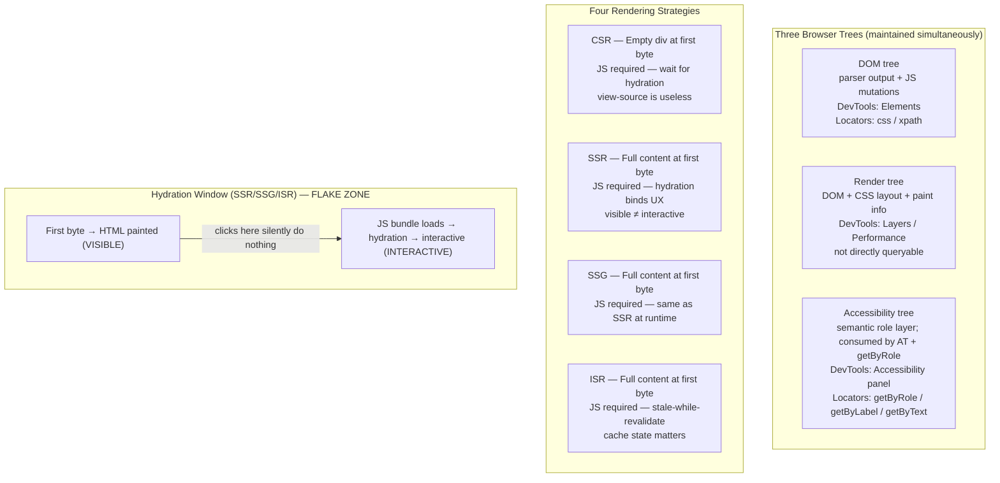

import Diagram from '../../../src/components/mdx/Diagram.astro';
import Prompt from '../../../src/components/mdx/Prompt.astro';
import PracticeTask from '../../../src/components/mdx/PracticeTask.astro';
import Feynman from '../../../src/components/mdx/Feynman.astro';

## Core Idea

A modern frontend is not "the page." It is a *rendering machine* whose output depends on time (when did hydration finish?), strategy (was this HTML produced on a server, in the browser, or at build time?), state (what is in localStorage or a service-worker cache?), and the observer (which DevTools panel are you looking at?). Tests that assume a single static DOM they can read once are the dominant source of frontend-test flakiness across every automation tool.

Two facts are load-bearing. First: **the DOM and the source HTML diverge** — `view-source` shows what came down the wire; the Elements panel shows what JavaScript has done since. Second: **the browser maintains three trees simultaneously** — the DOM, the render tree, and the accessibility tree — and `getByRole` queries the third one, not the first.

> A tester who doesn't understand what the browser is actually doing cannot write reliable automation against it.

## Diagram

<Diagram caption="The three browser trees, four rendering strategies, and which DevTools panel exposes each — with the hydration window where flaky clicks live">



</Diagram>

## Worked Example

A Next.js page renders a "Subscribe" button via SSR. The button is in the HTML at first byte and is visible immediately. A Playwright test:

```ts
await page.goto('/newsletter');
await page.getByRole('button', { name: 'Subscribe' }).click();
await expect(page.getByText('Thanks for subscribing!')).toBeVisible();
```

This test passes 80% of the time and silently fails 20%. The symptom: the click lands, nothing happens, the `Thanks!` assertion times out. No error is thrown; the button was visible; the test "should" have worked.

**Diagnosis via DevTools:**

1. Open the **Performance panel**, reload the page, and look for the hydration mark. The React/Next hydration event fires roughly 400ms after first paint on a mid-range device. The `onClick` handler is not bound until that event completes.
2. The test drove the page, found the button visible (DOM check passes), clicked immediately, and the click landed in the hydration window — before `onClick` was wired.

**Fix — wait for interactivity, not just visibility:**

```ts
await page.goto('/newsletter');
const button = page.getByRole('button', { name: 'Subscribe' });

// Option A: the component disables the button until hydrated
await expect(button).toBeEnabled();
await button.click();

// Option B: wait for an explicit hydration marker on the container
await page.locator('[data-hydrated="true"]').waitFor();
await button.click();

await expect(page.getByText('Thanks for subscribing!')).toBeVisible();
```

The root cause — clicking in the hydration window — is invisible without the Performance panel. With it, the 400ms gap between "painted" and "interactive" is a named, measurable artefact, not a random flake.

**DOM vs source HTML divergence — the companion check:**

After the page loads, run `view-source:http://localhost:3000/newsletter`. The Subscribe button is present in the HTML (SSR). Now open a CSR-only page — a legacy Create React App build — and repeat: `view-source` shows `<div id="root"></div>`. Playwright sees the post-hydration DOM in both cases, but the *timing* of when content exists differs by rendering strategy.

**Network panel — mocking the full request set:**

Open the Network panel, load `/newsletter`, and observe every request. Suppose two fire: `GET /api/subscription-status` (checks if the user is already subscribed) and `GET /api/newsletter-config` (loads the button label). A test that intercepts only the first request leaves the second unmocked. Playwright:

```ts
await page.route('/api/subscription-status', route =>
  route.fulfill({ json: { subscribed: false } })
);
// /api/newsletter-config is not intercepted — the real server is called
// If CI has no network access, the test fails with "fetch failed"
```

The Network panel is the source of truth for what to mock. Not the application code — the panel.

## Common Pitfalls

- **Treating `view-source` as the DOM.** The source shows what came down the wire; the Elements panel shows what JavaScript has mutated since. Selectors written against source fail on dynamically-rendered content. Fix: use Elements as the selector reference, not `view-source`. This happens because `view-source` is the first thing developers learn and the habit persists.

- **Waiting on `load` or `DOMContentLoaded` in SPAs.** These events fire for the *initial* document. In-app SPA navigation (history pushState) does not fire either event. Tests that wait for `load` after a route transition wait forever. Fix: wait on content presence (`expect(locator).toBeVisible()`) — never on navigation events in a SPA. This happens because the `load` pattern is correct for MPA pages and the reflex transfers incorrectly.

- **Clicking before hydration completes.** A button is visible and in the DOM but its `onClick` is not yet bound. The click silently does nothing; the next assertion times out. Fix: wait for an enabled-state change, a hydration marker, or an explicit app-level signal before clicking interactive elements. This happens because Playwright's auto-wait checks *visibility*, not *interactivity-readiness*.

- **Mocking only the requests the developer wrote.** Lazy-loaded chunks, redirects, and side-effect requests fire at runtime but don't appear in the application code search. A test that mocks only the "main" endpoint lets unknown calls reach a server (or fail in CI with no network). Fix: open the Network panel, complete a manual walkthrough, and mock every request that appears. This happens because the test author models the page from the source code, not from observing the browser.

- **Letting service workers persist between test runs.** A service worker registered in test session N caches `/api/me` with a specific response. Test session N+1 runs without that mock; the SW serves the cached response, producing a false pass. Fix: configure the test runner to block or unregister service workers per session (`serviceWorkers: 'block'` in Playwright config). This happens because SW registration is invisible unless you check DevTools → Application → Service Workers.

- **Using CSS selectors against shadow DOM.** Custom elements (web components, Stencil, Lit, Stripe Elements) hide their internals behind a shadow root. Standard `querySelector('input')` stops at the shadow boundary and returns nothing. Fix: use Playwright's `getByRole` (pierces open shadow roots) or the `>>` piercing combinator. This happens because the selector "looks right" and the shadow root is invisible until you see the `#shadow-root (open)` line in the Elements panel.

- **Assuming `document.readyState === 'complete'` means the app is ready.** It means the initial HTML and its linked resources finished loading. Hydration, `useEffect`/`onMounted` fetch-on-mount calls, and route resolution all happen after. Fix: use a content-presence assertion or an explicit app-level marker. The classic Selenium "wait for complete" pattern is a footgun on every modern SSR framework.

## Retrieval Prompts

<Prompt id="fept-1">
  Name the four primary rendering strategies (CSR, SSR, SSG, ISR) and state one tester-relevant consequence of each. Focus on what is or isn't in the HTML at first byte, and what that means for when a test can start asserting.
</Prompt>

<Prompt id="fept-2">
  Define *hydration* in one sentence. Why does the period between "first paint" and "hydration complete" cause flaky click tests? Name the Playwright assertion family that detects the boundary correctly.
</Prompt>

<Prompt id="fept-3">
  The DOM and the source HTML can diverge. Name two causes of the divergence and name the DevTools panel that shows each view. State one test scenario where confusing the two directly causes a selector failure.
</Prompt>

<Prompt id="fept-4">
  Sketch the three trees a browser maintains simultaneously. For each, name: what it represents, which DevTools panel exposes it, and which Playwright locator family queries it.
</Prompt>

<Prompt id="fept-5">
  A test passes locally and fails in CI with "element not found." Name three items to check in the Application panel and state the test-cleanup implication of each.
</Prompt>

<Prompt id="fept-6">
  An SPA navigation fires after a button click. Name the browser event that fires and the browser event that does NOT fire. State the test-design consequence for code that waits on the missing event.
</Prompt>

<Prompt id="fept-7">
  A page contains a `<stripe-card-element>` web component. Standard `page.locator('input[type="text"]')` returns nothing. Explain why, name the DevTools panel that reveals the cause, and give two Playwright locator strategies that work.
</Prompt>

<Prompt id="fept-8">
  Why is `document.readyState === 'complete'` a misleading readiness signal on a modern SSR page? Replace it with a more reliable wait strategy and explain why your replacement catches what `readyState` misses.
</Prompt>

## Practice Task

<PracticeTask id="fept-task-1" rubric="fept-rubric-v1">
  Pick any public page you don't own — a Wikipedia article, a GitHub pull request, or any Shopify checkout demo. Open DevTools and produce a one-page audit covering all five areas below. Write your audit as a structured document (bullet lists are fine).

  **1. Rendering strategy.** Identify whether the page uses CSR, SSR, SSG, ISR, or a hybrid. Evidence: does `view-source` show real content or an empty shell? Are there `__NEXT_DATA__`, `__NUXT__`, or `astro:*` markers? Is there visible hydration activity in the Console?

  **2. Network requests on first paint.** Open the Network panel, clear it, and reload. List every URL, its status code, and its resource type (document, XHR/fetch, script, image, stylesheet). Mark with ★ any request a test would need to intercept or mock.

  **3. Hydration window estimate.** Open the Performance panel, record a page load, and identify the gap between the "First Contentful Paint" mark and the first "Hydration" or "React" mark (or equivalent). Report the gap in milliseconds and name one interactive element that may be unclickable during it.

  **4. Application state inventory.** Open the Application panel. List every cookie, localStorage key, sessionStorage key, and any active service worker registrations. For each, write one sentence on what a test would need to clear or seed.

  **5. Accessibility tree spot-check.** Pick three visible elements (a heading, a button, and a link). Open the Accessibility panel for each and record its computed role. Identify one element that has *no meaningful role* and would require `getByText` or `getByTestId` as a fallback.

  **Rubric (revealed after submission):**
  - Rendering-strategy finding cites *specific evidence* (marker name or DOM inspection), not just "it looks like React."
  - Network audit includes at least one request the eye doesn't immediately see (a preflight, a lazy chunk, or a beacon).
  - Hydration estimate references a Performance-panel timestamp or named mark, not a subjective impression.
  - Application state section produces a per-item cleanup sentence, not a generic "clear storage."
  - Accessibility spot-check names actual ARIA roles (button, link, heading, textbox) from the panel, not inferred from the visual appearance.
</PracticeTask>

## Feynman Prompt

<Feynman id="fept-feynman-1" wordTarget={150}>
  Explain to a developer who has only ever written Selenium tests why their "wait for page load" pattern breaks on modern apps. Use the hydration window concept to show concretely what is happening when the click silently does nothing. Name the DevTools panel that makes the invisible window visible, and describe what a reliable replacement wait strategy looks like. Rubric (revealed after submit): Did you explain that SSR makes content *visible* before hydration makes it *interactive* — not just that "the page loads differently"? Did you reference a specific DevTools panel by name and describe what to look for in it? Did you give a concrete alternative wait pattern (enabled-state check, hydration marker, or content-presence assertion) rather than "just use Playwright's auto-wait"?
</Feynman>
