import Diagram from '../../../src/components/mdx/Diagram.astro';
import Prompt from '../../../src/components/mdx/Prompt.astro';
import PracticeTask from '../../../src/components/mdx/PracticeTask.astro';
import Feynman from '../../../src/components/mdx/Feynman.astro';

## Core Idea

Selenium, Cypress, and Playwright are three different architectural bets, not three competing implementations of the same idea. Selenium bets on *protocol stability*: WebDriver is a W3C standard and a 2018 test has a strong chance of running unmodified in 2030. Cypress bets on *in-browser ergonomics*: running the test inside the same JS context as the app enables low-latency command retry and direct access to DOM state. Playwright bets on *out-of-process control with first-class isolation*: browser contexts are cheap, parallel by default, and fully isolated without the cross-origin and multi-tab constraints that the Cypress iframe model carries.

"Which tool is best?" is the wrong question. The right question is: which architectural constraints match the project's constraints? Team language, multi-tab requirements, mobile needs, CI parallelism budget, and dashboard requirements all have the potential to disqualify a tool entirely — before feature lists become relevant.

> The tool choice is a bet on which architectural constraints your project will live with. Make it in writing, name the constraint that drives it, and name the single constraint that would flip the answer.

## Diagram

```mermaid
flowchart TD
    subgraph SE["Selenium (WebDriver / W3C protocol)"]
        S1["Test process (Java/Python/JS/C#/Ruby)"]
        S2["Browser driver (chromedriver/geckodriver/safaridriver)"]
        S3["Browser (Chrome/Firefox/Edge/IE)"]
        S1 -->|"HTTP/REST"| S2 -->|"driver protocol"| S3
        S_NOTE["Out-of-process. W3C standard. Protocol-stable.\nNo built-in trace. Parallel: Grid or cloud."]
    end
    subgraph CY["Cypress (in-browser / same JS context)"]
        C1["Node proxy (cy.intercept, webpack bundle)"]
        C2["Iframe: Cypress test JS + App JS\nsame tab · same origin · cy.intercept via XHR hook"]
        C1 -->|"injects"| C2
        C_NOTE["Trace: Cypress App time-travel replay.\nMulti-tab: limited. Cross-origin: cy.origin (v12+).\nParallel: Cypress Cloud (paid)."]
    end
    subgraph PW["Playwright (CDP/BiDi · out-of-process, in-context)"]
        P1["Test process (JS/TS/Python/Java/.NET)"]
        P2["Playwright server (out-of-process)\npage.route() · storageState"]
        P3["Browser contexts A/B/C (cheap, isolated, parallel)"]
        P1 -->|"WebSocket"| P2 -->|"CDP / BiDi"| P3
        P_NOTE["Trace: trace.zip (action-by-action time travel, built-in).\nMulti-tab: yes. Cross-origin: yes. Parallel: free, default."]
    end
    subgraph DA["Decision Axes"]
        D["Java/Ruby/C#/Python team? → Selenium or Playwright\nMulti-tab / OAuth popup? → Playwright or Selenium\nMobile-web real device? → Selenium + Appium\nLong-lived enterprise suite (10+ yrs)? → Selenium\nGreenfield JS/TS E2E (2023+)? → Playwright (default)\nTurnkey dashboard/reporting? → Cypress Cloud or BrowserStack\nFree parallel in CI? → Playwright"]
    end
```

<Diagram caption="Three browser-automation architectures: where the test process runs, how commands cross the browser boundary, and what trace artefact (if any) is produced">



</Diagram>

## Worked Example

A team needs to test their checkout flow end-to-end. The critical path: (1) log in via Google OAuth popup, (2) add item to cart, (3) submit payment — the server returns `409` on a duplicate cart entry, (4) assert the error message is displayed.

**Step 1 — OAuth popup: which tools handle it cleanly?**

Google OAuth opens in a new tab/window.

```ts
// Playwright — popup is a first-class primitive
const [popup] = await Promise.all([
  page.context().waitForEvent('page'),
  page.click('[data-testid="login-google"]'),
]);
await popup.fill('#email', 'user@example.com');
await popup.fill('#password', 'secret');
await popup.click('[type="submit"]');
await popup.waitForEvent('close');
// Back in main page — storage state is shared via the browser context
```

```java
// Selenium — switch window handles
String mainHandle = driver.getWindowHandle();
driver.findElement(By.cssSelector("[data-testid='login-google']")).click();
new WebDriverWait(driver, Duration.ofSeconds(5))
    .until(ExpectedConditions.numberOfWindowsToBe(2));
for (String handle : driver.getWindowHandles()) {
    if (!handle.equals(mainHandle)) driver.switchTo().window(handle);
}
driver.findElement(By.id("email")).sendKeys("user@example.com");
// ... complete login, switch back
driver.switchTo().window(mainHandle);
```

```js
// Cypress — cy.origin required (v12+); session state doesn't auto-cross
// This is possible but requires explicit session handling across origins.
// For teams on Cypress < v12, multi-origin OAuth is effectively blocked.
cy.origin('accounts.google.com', () => {
  cy.get('#email').type('user@example.com');
  // session cookie not automatically available back in main origin
});
```

**Step 2 — Intercept the 409 and assert the UI response:**

```ts
// Playwright
await page.route('**/api/checkout', route =>
  route.fulfill({ status: 409, body: JSON.stringify({ error: 'duplicate' }) })
);
await page.click('[data-testid="submit-order"]');
await expect(page.getByRole('alert')).toContainText('already in cart');
```

```js
// Cypress
cy.intercept('POST', '/api/checkout', { statusCode: 409, body: { error: 'duplicate' } });
cy.get('[data-testid="submit-order"]').click();
cy.get('[role="alert"]').should('contain.text', 'already in cart');
```

```java
// Selenium — no built-in intercept without BiDi (Selenium 4+ adds network intercept)
// Without BiDi: requires pre-seeded database state or a test proxy (BrowserMob etc.)
// With Selenium 4 BiDi:
devTools.send(Fetch.enable(Optional.empty(), Optional.empty()));
devTools.addListener(Fetch.requestPaused(), req -> {
    devTools.send(Fetch.fulfillRequest(req.getRequestId(), 409, Optional.empty(),
        Optional.empty(), Optional.of("{\"error\":\"duplicate\"}"), Optional.empty()));
});
```

**The diagnosis:** For this specific project the Cypress single-tab constraint is a real friction point (Google OAuth popup). Selenium handles it but with verbose handle switching. Playwright handles it with a first-class primitive and shared storage state. The 409 intercept is now available in all three tools — but with very different ergonomic cost.

## Common Pitfalls

- **"Selenium is dead — just use Playwright."** This is a constraints claim disguised as a fact. Selenium remains correct for: multi-language enterprise teams (Java/C#/Python), suites over 10 years old where protocol stability is a real requirement, stacks with Selenium-based vendor tools (Tricentis, Provar, Worksoft), and IE11 / legacy browser targets. The lesson is not "Playwright wins"; it is "Selenium wins under specific constraints." Declare the constraints, then make the claim.

- **Choosing Cypress for a product with OAuth popups or multi-tab flows.** The single-tab model is not an oversight — it is the architectural consequence of running the test inside the browser. `cy.origin` (v12+) relaxes cross-origin steps but session state does not auto-cross; every OAuth or payment provider tab requires explicit handling. For products where multi-tab flows appear in more than one or two places, the accumulation of workarounds is the real cost.

- **Comparing "speed" without scoping which speed you mean.** Per-test authoring speed favours Cypress (polished UI). Per-test execution speed favours Cypress on short specs. Total suite wall-clock speed favours Playwright (free parallelism). Diagnosis speed after failure favours Playwright (trace.zip). Quote *which* speed — without the scope, the claim is misleading.

- **Assuming Cypress parallelism is free.** Cypress Cloud charges for parallel orchestration beyond the free tier. Playwright's parallel-by-default model has no licensing cost. For a team running 200+ tests in CI, this is a multi-thousand-dollar annual line item that is invisible during local evaluation.

- **Treating Selenium 4 as Selenium 3.** Selenium 4 added BiDi commands: network request interception, console listening, and network log capture. A claim that "Selenium can't intercept network requests" was true for Selenium 3; it is no longer true for Selenium 4. Verify the version before declaring capability gaps.

- **Using `data-cy` attributes and then claiming Cypress lock-in.** `data-cy` is a Cypress *convention*, not a tool feature. Playwright's `getByTestId` uses `data-testid` by default but is configurable to `data-cy` via `testIdAttribute`. If a team uses uniform `data-cy` attributes, migrating selectors to Playwright is mechanical. The lock-in is selector *sloppiness*, not the attribute.

- **Evaluating mobile-web coverage with Cypress.** Playwright supports mobile device emulation contexts (device descriptors). Cypress has no real-device mobile story. Selenium + Appium is the path for real-device mobile-web. If the project requires both web and real-device mobile coverage, Cypress is disqualified at the mobile axis alone.

## Retrieval Prompts

<Prompt id="scp-1">
  Name the three tools' architectural bets in one sentence each. Then give one project constraint that would make each bet the *correct* choice.
</Prompt>

<Prompt id="scp-2">
  A project must test a Google OAuth login flow end-to-end. Which tool is most architecturally constrained by this requirement, why, and what specific feature partially addresses the constraint in recent versions?
</Prompt>

<Prompt id="scp-3">
  Give two project constraints under which Selenium remains the *correct* choice for a new test suite in 2025. Constraints must be operational (a tester could verify them from a project brief), not generic preferences.
</Prompt>

<Prompt id="scp-4">
  "Speed" has at least four distinct meanings when comparing test frameworks. Name them and identify which tool tends to lead on each. Why is citing only one speed misleading?
</Prompt>

<Prompt id="scp-5">
  A team migrates from Cypress to Playwright. Name one thing that ports mechanically and one thing that requires re-thinking at the architectural level. Why does the Cypress-to-Playwright direction carry a higher rewrite multiplier than Selenium-to-Playwright?
</Prompt>

<Prompt id="scp-6">
  Cypress Cloud charges for parallelism orchestration. How does Playwright's parallel model differ, and what is the practical implication for a team with 300 E2E tests in CI?
</Prompt>

<Prompt id="scp-7">
  WebDriver BiDi is closing the protocol gap between Selenium and Playwright. Name one capability it adds to Selenium 4 that previously required Playwright or a test proxy.
</Prompt>

## Practice Task

<PracticeTask id="scp-task-1" rubric="scp-rubric-v1">
  Pick a real or well-specified fictional project. Produce a one-page tool decision card.

  **Part 1 — Constraints (≤ 8 bullets).** List the project's concrete constraints across: team languages, browser matrix, multi-tab / cross-origin requirements, mobile-web / real-device needs, CI provider and parallelism budget, dashboard / reporting obligations, regulatory constraints (on-prem grid, etc.).

  **Part 2 — Per-tool card (one card each for Selenium, Cypress, and Playwright), four rows per card:**
  - **Buy if:** the conditions under which this tool is the right answer for this project.
  - **Skip if:** the conditions under which this tool is disqualified for this project.
  - **Hidden cost:** the cost not visible in the feature list (licensing, ergonomic friction, parallelism orchestration, migration tax, ecosystem dependency).
  - **Migration cost from current state:** in person-weeks, with a one-line justification.

  **Part 3 — Recommendation (1 paragraph).** Name the chosen tool, the specific constraint that drove the choice, and the single constraint that would flip the answer to a different tool.

  Rubric (revealed after submission):
  - Do your constraints include at least one that *actually disqualifies a tool* (multi-tab, language, mobile)? Generic constraints ("we want fast tests") are a fail.
  - Are "buy if" and "skip if" rows in operational language — could a tester match them to a real project brief?
  - Does the hidden-cost row name an honest cost? (Cypress Cloud licensing, Playwright's still-maturing Java bindings, Selenium's ergonomics — each tool has one.)
  - Does the recommendation name the single constraint that would flip it? A decision without that line is faith, not analysis.
  - Does the card avoid "Playwright always wins"? Sometimes it does. The decision-frame must be capable of producing other answers.
</PracticeTask>

## Feynman Prompt

<Feynman id="scp-feynman-1" wordTarget={150}>
  Explain to a developer who has only used Cypress why a team might intentionally choose Selenium for a new 2025 project — without resorting to "legacy" as the only reason. Name at least two specific constraints that make Selenium the correct choice, and explain what "protocol stability" means in practical terms for a long-lived suite. Rubric (revealed after submit): Did you name concrete constraints (language, enterprise SUT, long-tail browser) rather than nostalgia? Did you explain protocol stability as a concrete guarantee (W3C standard, test written in 2018 likely runs in 2030) rather than a vague "more stable"? Did you avoid framing it as "Selenium vs the world" — the point is constraints, not loyalty?
</Feynman>
