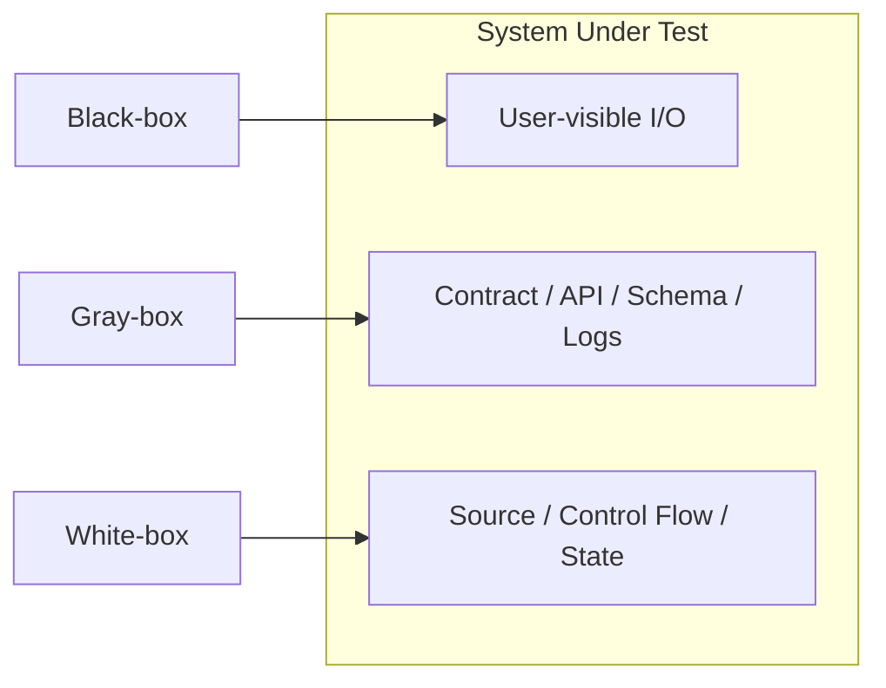

import Diagram from '../../../src/components/mdx/Diagram.astro';
import Prompt from '../../../src/components/mdx/Prompt.astro';
import Feynman from '../../../src/components/mdx/Feynman.astro';

## Core Idea

Black, white, and gray box name **how much internal information the tester admits as evidence** — not what category of test is being run, not what phase you are in, not whose team you sit on.

- **Black-box:** inputs and outputs only; the system is a sealed box.
- **White-box** *(a.k.a. clear-box, structural):* source code, control flow, internal state.
- **Gray-box:** some structural knowledge — schema, API contract, logs — without necessarily reading source.

Crucially, the three terms describe a **per-test choice**, not a role or a test type. A unit test that only checks public output is black-box at the unit level. A Playwright e2e test that selects by `data-testid` is gray-box at the system level despite running through the UI. The same vocabulary recurs in security testing with a different shade: black-box pen-test simulates an external attacker; white-box provides full source and architecture; gray-box gives limited insider knowledge.

> Black, white, and gray name **what the tester reads to design the test**. Treating them as roles or test-type buckets hides the choice — and the choice is the skill.

## Diagram

<Diagram caption="Three lenses on the same system under test">

</Diagram>

## Worked Example

A login endpoint returns HTTP 200 with a `null` token for invalid credentials. Three testers, each choosing a different lens:

**Black-box test** — From the UI, submit invalid credentials. Assert the user sees an error message and is not navigated to the dashboard. This catches the user-visible failure. It does *not* catch that the API returned 200 instead of 401.

**Gray-box test** — Hit the API directly. Assert status is 401, the body has no `token` field, and `WWW-Authenticate` is present. This catches the contract violation. It does *not* catch whether the UI behaves correctly downstream.

**White-box test** — Read the auth-controller source. Notice an early-return that emits 200 before the credential check. Write a unit test that proves the early-return path produces `token=null`, fail it, fix the early-return. This catches the structural defect. It does *not* catch whether the controller's contract matches consumer expectations.

Same bug. Three different designs. Three different missed cases.

**The point:** choosing the lens is choosing what to leave uncovered. A team running only one lens misses an entire class of bugs systematically.

## Common Pitfalls

- **Treating "I do black-box" as a role.** Lens is a per-test choice; use multiple lenses on the same feature. This happens because bootcamps and job descriptions present it as a job category.
- **Confusing the lens with the test layer.** A unit test can be black-box (only checks public output); an e2e test can be gray-box (asserts on a database row or structured log). The bucket pairing of "unit = white-box, e2e = black-box" is wrong and produces mis-designed tests.
- **Coverage-chasing without intent.** White-box coverage numbers are countable; intent is not. Pair every structural coverage target with an oracle-strength assertion, or the coverage statistic is silent on correctness.
- **Reading internals to write a test, then claiming black-box.** If you used the implementation to choose your inputs, you ran gray-box. Name it accurately — "black-box" sounds purer but the label is wrong and hides the dependency.
- **Refusing to read code on principle.** Pure black-box is a deliberate guard against "the test is the implementation" failures, not a rule about never reading code. Read when it improves the test; abstain when you want refactor-resilience. The discipline is per test.
- **Mixing security and functional vocabulary unannounced.** When black/white/gray appear in a security context the same words mean something shifted (realism of attacker model, not internal-information depth). Switch frames explicitly; mixed vocabularies confuse cross-team conversations.
- **Forgetting that `data-testid` attributes are a contract.** When developers add test IDs they expose an internal collaboration point deliberately. That contract belongs in code review, should evolve with the design, and should have dead ones removed — it is not a forever-stable hook that belongs only in test code.

## Retrieval Prompts

<Prompt id="box-thinking-1">
  Define black, white, and gray box thinking in terms of what the tester admits as input to test design, without using the word "code."
</Prompt>

<Prompt id="box-thinking-2">
  A Playwright e2e test selects elements by `data-testid`. Which lens is this, and why is it not "black-box because it's end-to-end"?
</Prompt>

<Prompt id="box-thinking-3">
  A login endpoint returns HTTP 200 with a null token for invalid credentials. Sketch one test from each lens. For each, name one failure mode the other two lenses would catch that this one misses.
</Prompt>

<Prompt id="box-thinking-4">
  Why is "I am a black-box tester" a limiting self-description for a junior engineer? What self-description better captures the skill?
</Prompt>

<Prompt id="box-thinking-5">
  In a security pen-test, how does the black/white/gray vocabulary shift in meaning compared to functional testing? Name one consequence for engagement scoping.
</Prompt>

<Prompt id="box-thinking-6">
  Two suites test the same module: Suite A has 95% statement coverage with assertions that only check "did not throw." Suite B has 60% statement coverage with every test checking output against a specified oracle. Which gives more confidence and why? Name the lens each suite is operating from.
</Prompt>

## Feynman Prompt

<Feynman id="box-thinking-feynman-1" wordTarget={150}>
  Explain black/white/gray box thinking to a developer who believes "unit tests are white-box and e2e tests are black-box." Where is that framing wrong, and what is the correct way to choose a lens? Give one concrete example where the bucket framing would produce a mis-designed test. Rubric (revealed after submit): Did you reframe lens as a per-test choice rather than a fixed category? Did you give a concrete example (not just an abstract claim)? Did you avoid defining "black-box" as simply "not reading code"?
</Feynman>
