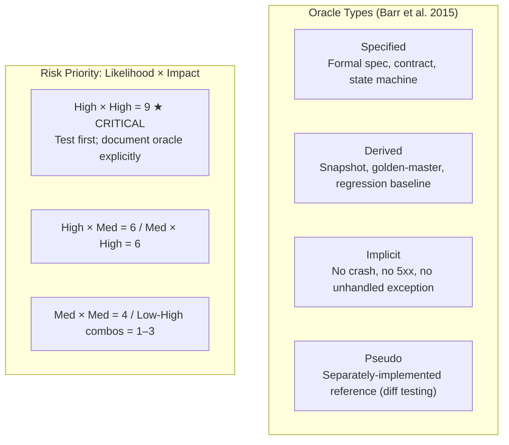

import Diagram from '../../../src/components/mdx/Diagram.astro';
import Prompt from '../../../src/components/mdx/Prompt.astro';
import Feynman from '../../../src/components/mdx/Feynman.astro';
import PracticeTask from '../../../src/components/mdx/PracticeTask.astro';

## Core Idea

A **test oracle** is anything that lets you decide whether an observed behaviour is correct or incorrect. Every test has one, even when nobody named it. The **oracle problem** is the recognition that deciding correct behaviour for a non-trivial program is undecidable in general — most testing is therefore a heuristic activity using *approximate* oracles that are fallible.

**Prioritization** answers a companion question: given finite testing effort, which parts of the system deserve it? The mature frame is **risk = likelihood × impact**: effort flows to high-risk areas; low-risk areas get documented and monitored, not exhaustively tested. Both oracle choice and risk prioritization are exercises in judgement, not calculation.

> Every test has an oracle and a priority. Name them explicitly — or you are guessing about both what to check and whether your check means anything.

## Diagram

<Diagram caption="Oracle types and risk prioritization — the two axes of testing judgement">



</Diagram>

## Worked Example

Consider a snapshot test on a date-formatting function:

```ts
expect(formatDate(new Date('2024-03-05'))).toMatchSnapshot();
// Snapshot value: "2024-03-05T00:00:00.000Z"
```

The snapshot pins the *current* output as the oracle. Now a developer makes a "quick fix" that silently returns `"undefined-03-01T..."` on Feb 29 leap-day input. The developer updates the snapshot during review — the test still passes.

**What went wrong?** The oracle (snapshot) is a *derived* oracle. When it was updated during a buggy period, the bug became the truth. The snapshot now asserts that the wrong output is correct.

**The oracle identification exercise:** Take this Playwright assertion:

```ts
await expect(page.getByRole('button', { name: 'Save' })).toBeEnabled();
```

Ask: what oracle is this using?
- **Specified oracle**: a UX spec that says the Save button must enable after form validation.
- **Implicit oracle**: the button should exist and be a `<button>`, not a `<div>`.
- **Derived oracle**: previous versions enabled the button in the same condition.

All three are in play simultaneously — but only the specified oracle would catch a regression where a spec *changed intentionally*. The others would not.

**The risk-matrix conversation:** A fictional checkout system has five features: payment processing, address autocomplete, gift wrapping, marketing opt-in checkbox, country selector. An engineering manager fears outages and scores payment at L=High, I=High (risk=9). A VP of Marketing fears churn and scores marketing opt-in at L=Medium, I=High (risk=6). Both are right — about different impact axes. The matrix exists to surface and resolve this disagreement, not to replace it.

## Common Pitfalls

- **Treating "the spec" as the only oracle.** Specs are the most tangible oracle but rarely the complete one. Fix: name at least three oracle types in play before writing a test. Why it happens: specs are documented and reviewable; other oracle types require judgement to identify.
- **Snapshot tests with no audit of what is being snapshotted.** Snapshots updated during a buggy period embed the bug as truth. Fix: treat snapshot updates as code changes during review, not formalities. Why it happens: snapshot diffs feel like noise rather than decisions.
- **Mistaking coverage for confidence.** A 95%-coverage suite with weak oracles is less informative than a 40%-coverage suite with strong oracles. Fix: pair every coverage metric with an oracle-strength assessment. Why it happens: coverage is a number on a dashboard; oracle strength is a judgement.
- **Risk matrices treated as outputs, not conversations.** Scoring L×I mechanically produces a number that obscures disagreement between stakeholders. Fix: make the L and I assignments a multi-stakeholder discussion; record the disagreements explicitly. Why it happens: matrices feel objective.
- **Single-axis impact scoring.** Financial, reputational, regulatory, and life-safety impacts do not collapse into one number without hiding trade-offs. Fix: require the team to name the impact axis before scoring. Why it happens: tools present a single "impact" column.
- **Confusing test-suite priority with feature priority.** A high-priority feature may need fewer tests if it is well-understood; a fragile low-priority feature may need many. Fix: derive test priority from risk assessment, not from product roadmap importance alone. Why it happens: the word "priority" is shared between product and QA without differentiation.
- **Pretending AI/LLM features have a normal oracle.** LLM outputs have no ground truth — applying a derived or specified oracle uncritically produces meaningless green. Fix: name them as pseudo-oracle or metamorphic-relation problems and design accordingly. Why it happens: LLM features are often built first and tested-as-if-normal second.

## Retrieval Prompts

<Prompt id="oracles-1">
  Name the four oracle types from Barr et al. (2015) and give one concrete test artefact that exemplifies each.
</Prompt>

<Prompt id="oracles-2">
  A snapshot test passes. Without using the word "snapshot," explain what oracle is in play and one specific way it can silently embed a bug.
</Prompt>

<Prompt id="oracles-3">
  An LLM-powered summariser has no ground truth. Name two oracle strategies — using the names from Barr's taxonomy — that can still produce useful testing.
</Prompt>

<Prompt id="oracles-4">
  Why does risk = likelihood × impact tend to fail as a calculation but succeed as a meeting?
</Prompt>

<Prompt id="oracles-5">
  A team has 95% line coverage and is still shipping bugs. Without changing the test count, name two interventions that would raise confidence — one oracle-side and one prioritization-side.
</Prompt>

<Prompt id="oracles-6">
  The same feature receives a risk score of 9 from the engineering manager and 4 from the VP of Marketing. Neither is wrong. What does this reveal about impact scoring, and what is the productive next step?
</Prompt>

<Prompt id="oracles-7" requiresDiagram>
  Sketch a 3×3 risk matrix and place one real feature from a product you know in each risk band. Then write one sentence on what impact axis you used — and name one stakeholder who would use a different axis.
</Prompt>

## Practice Task

<PracticeTask id="oracles-task-1" rubric="oracles-rubric-v1">
  Take one feature of a real product (yours or a public one) and three existing tests that cover it — one unit, one integration, one e2e. For each test:

  1. Identify the oracle type from Barr's taxonomy (specified / derived / implicit / pseudo).
  2. Name one failure mode that *this* oracle would miss.
  3. Propose one additional test using a *different* oracle type that covers the missed failure mode.

  Then produce a one-page risk matrix for the feature with likelihood × impact scores for five plausible failure modes. Include one paragraph identifying which stakeholder you would disagree with on the scoring and why — and name the impact axis that causes the disagreement.

  Rubric (revealed after submission):
  - Did you name the oracle type (e.g. "derived"), not the test framework (e.g. "snapshot")?
  - Did each "failure mode it would miss" point to a concrete gap, not a generic one?
  - Was the additional test you proposed of a genuinely *different* oracle type?
  - Did the risk matrix name the impact axis explicitly (financial / reputational / regulatory / safety)?
  - Did you name a real or realistic stakeholder — not a hypothetical "someone"?
</PracticeTask>

## Feynman Prompt

<Feynman id="oracles-feynman-1" wordTarget={150}>
  Explain the oracle problem to a developer who thinks "my tests pass, therefore the feature works." Why does a passing test not guarantee correctness? What is the difference between a derived oracle and an implicit oracle, and which one is harder to get wrong silently? Rubric (revealed after submit): Did you name a concrete way a passing test can embed a bug rather than detect one? Did you distinguish the two oracle types by mechanism, not just by label? Did you avoid the circular claim that "tests prove correctness"?
</Feynman>
