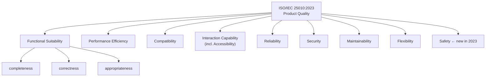

import Diagram from '../../../src/components/mdx/Diagram.astro';
import Prompt from '../../../src/components/mdx/Prompt.astro';
import Feynman from '../../../src/components/mdx/Feynman.astro';

## Core Idea

"Quality" in software has no single agreed-upon definition. Crosby defines it as *conformance to requirements* — useful under contract, but collapses when requirements are wrong. Juran defines it as *fitness for use* — useful when users have clear goals. Weinberg defines it as *value to some person* — the most flexible framing, because it forces the question: **which person?** That question makes quality explicitly relational and politically owned. ISO/IEC 25010:2023 operationalises quality as nine measurable characteristics, the closest the industry has to a shared vocabulary.

A tester who can only say "it works / it doesn't work" is doing about 20% of the job. Most defects users actually punish a product for sit on the **non-functional side** — slow, inaccessible, insecure, data-losing — yet most test suites disproportionately cover functional correctness.

> Quality is not a property of an artefact in isolation. It is value to some person, in some context — which means two stakeholders can correctly disagree about whether the same build is high quality.

## Diagram

<Diagram caption="ISO/IEC 25010:2023 — nine product-quality characteristics">

</Diagram>

## Worked Example

A checkout flow has been "tested" — every E2E test passes. A blind user cannot complete a purchase because the credit-card field label is not announced to screen readers.

Map the gap onto ISO 25010:

| Characteristic | Status |
|---|---|
| Functional Suitability | ✅ Correct — the field accepts and processes valid cards |
| Interaction Capability / Accessibility | ❌ Fail — field is not screen-reader-accessible |

The test suite covered Functional Suitability completely and Interaction Capability not at all, and the team did not notice because their working definition of quality was functional-only. Under Weinberg's definition — *value to some person* — a user who cannot complete the purchase experiences zero value regardless of whether the backend is correct.

The deliberate mis-classification: calling the feature "done" because every automated test is green.

## Common Pitfalls

- **Defining quality as "no bugs."** Bug counts measure one axis (Functional Suitability / correctness) and ignore the other eight. Fix: reframe quality as value to a specific stakeholder under known constraints. *Why it happens:* "no bugs" is easy to write on a slide and hard to disagree with.
- **Quoting "100× more expensive to fix in production" as measured fact.** Bossavit's *Leprechauns of Software Engineering* traces this figure back to weak primary sources. The direction is defensible (later defects cost more, on average); the multiplier is not calibrated. Fix: cite the direction, not the number. *Why it happens:* the figure appears in every testing slide deck and is rarely questioned.
- **Confusing QA (process) with QC (product / testing).** Quality Assurance is process-side — preventing defects. Quality Control is product-side — detecting them. The industry job title "QA Engineer" usually means tester; the curriculum uses the umbrella term but the distinction matters. Fix: name which activity you mean on first use. *Why it happens:* the job title collapsed the distinction years ago.
- **Treating ISO 25010 as a coverage target.** Mechanically chasing all nine characteristics produces busywork. Fix: treat the model as a prompt — "have we considered Safety on this feature?" — not a test plan. *Why it happens:* checklists feel safer than judgement.
- **Reporting a finding without naming the quality axis.** A bug filed as "broken" with no axis named lands in the wrong queue and dies. Fix: tag every report with the ISO 25010 characteristic it concerns. *Why it happens:* QA training historically focused on functional bugs; testers stop noticing the others.
- **Owning quality on behalf of the team.** "Whole-team quality" does not mean no one is accountable; it means the test specialist makes quality decisions visible to the people who own them. Fix: report findings to inform trade-off decisions; don't absorb ownership. *Why it happens:* management often reinforces the frame that QA = the person responsible for quality.
- **Skipping the "to whom?" question.** An abstract quality statement is uncontroversial and therefore useless. Fix: every quality claim must name a stakeholder. *Why it happens:* naming a stakeholder invites disagreement, which feels uncomfortable.

## Retrieval Prompts

<Prompt id="what-is-qa-quality-1">
  Name three definitions of "quality" used in serious testing literature. For each, give one situation where that definition is the wrong choice.
</Prompt>

<Prompt id="what-is-qa-quality-2">
  What does the 2023 revision of ISO 25010 add that the 2011 version did not, and what two characteristics were renamed?
</Prompt>

<Prompt id="what-is-qa-quality-3">
  A login API returns 200 OK with a null token for invalid credentials. Which ISO 25010 characteristics does this defect violate, and which does it satisfy?
</Prompt>

<Prompt id="what-is-qa-quality-4">
  Why is the claim "bugs cost 100× more to fix in production" considered overstated? What is the defensible version of the statement?
</Prompt>

<Prompt id="what-is-qa-quality-5">
  Distinguish "Quality Assurance" from "Quality Control" without using the words "quality" or "assurance."
</Prompt>

<Prompt id="what-is-qa-quality-6">
  An accessibility defect is filed. Two stakeholders disagree on whether it is a bug. How does Weinberg's definition of quality let you frame the dispute without picking a side?
</Prompt>

## Feynman Prompt

<Feynman id="what-is-qa-quality-feynman-1" wordTarget={150}>
  Explain to a developer who thinks "quality = no bugs" why that definition is insufficient. Use a concrete example where every automated test passes and the product still fails a user. Name the ISO 25010 characteristic the example violates. Rubric (revealed after submit): Did you name a specific characteristic, not just "non-functional"? Did you give a concrete example where functional tests pass but the user fails? Did you avoid using the word "quality" as a definition of itself? Did you name a stakeholder?
</Feynman>
