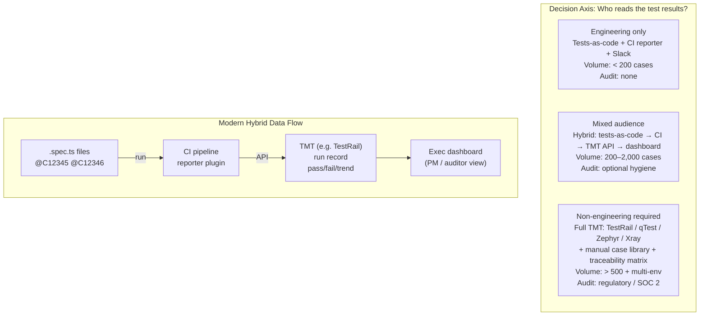

import Diagram from '../../../src/components/mdx/Diagram.astro';
import Prompt from '../../../src/components/mdx/Prompt.astro';

## Core Idea

Test management tools (TMTs) — TestRail, qTest, Zephyr, Xray — are case databases, run trackers, traceability surfaces, and reporting dashboards in one. They turn the abstract artefacts of testing into queryable records that non-engineers can read.

The deciding question is not about features; it is about audience. When your test results need to be read by regulators, auditors, or account managers, a TMT is leverage: it produces the dashboard they need. When every reader of the results is already in the repository, a TMT is overhead — the same information is available in CI logs and a Slack reporter at zero per-user cost.

The spreadsheet hinge marks the tipping point: below roughly 200 maintained cases and a single release environment, a shared sheet usually suffices. The hinge is crossed when "who ran case X against env Y in release Z?" is no longer answerable from a column.

> A test management tool is leverage when readers of the records are outside the engineering team, and overhead when every reader is already in the repo.

## Diagram

<Diagram caption="Tool choice mapped to audience, case volume, and audit obligation — with data-flow in the modern hybrid pattern">



</Diagram>

## Worked Example

A 12-person SaaS team managing a SOC 2 Type II audit. The auditor's evidence requirement: every security-related requirement must link to at least one passing test, across each named environment, for each quarterly release.

**Before TMT (spreadsheet approach):**
```
requirements.xlsx
  Column A: Req ID     Column B: Case ID     Column C: Q1-staging     Column D: Q1-prod
  REQ-001              TC-023                PASS                      PASS
  REQ-002              TC-047, TC-051        PASS                      ?
  REQ-003              —                     —                         —
```
Questions the auditor asks that the sheet cannot answer cleanly: "Show me every failing test for REQ-002 in Q1-prod." "Which requirements have no test coverage?" The tester must manually cross-reference three tabs under time pressure.

**After TMT (TestRail with API reporter):**

1. Each Playwright spec carries a TestRail case annotation: `@C47`, `@C51`.
2. CI reporter plugin posts pass/fail to TestRail via REST API on every pipeline run.
3. Manual cases (pre-release security review checklist — 15 cases not automatable) live in TestRail and are executed by a human pre-quarterly release.
4. TestRail generates a traceability report: requirement → test cases → run results → environments. Export to PDF in two clicks.

The auditor reads the PDF. The tester spent zero time formatting it. The team did not write a single manual case for the automated suite — the cases exist as code annotations; TestRail receives results.

**Tool comparison at a glance:**

| Signal | TestRail | qTest | Zephyr Scale | Zephyr Squad |
|---|---|---|---|---|
| Strength | API clarity, stable UI | Enterprise feature depth | Adaptavist lineage | Jira-native (free tier) |
| Best paired with | Any CI via REST | Large regulated teams | Atlassian shops | Jira-only, small teams |
| Key distinction | Standalone; broadest API | Tricentis ecosystem | Scale ≠ Squad (different schemas) | Squad ≠ Scale (free, limited) |
| Vendor lock risk | Low (honest CSV export) | Medium | Medium | Low (limited feature set) |

Zephyr Scale and Zephyr Squad share a name but are different products with incompatible schemas. Both are now SmartBear-owned but originated separately. Choosing the wrong one requires a full migration.

## Common Pitfalls

- **Dashboard green, product broken.** The TMT records which cases ran and whether they passed, not whether the product behaves correctly. A suite of poorly-written cases all passing produces a confident green dashboard against a broken system. Fix: remember the tool surfaces the quality of your cases, not the quality of the product. This happens because the dashboard is visible to management and becomes the proxy for "QA is done."

- **Metadata maintenance exceeds testing time.** Linking every case to every requirement, every defect, and every release produces a traceability web so expensive to maintain that testers spend more time linking than testing. Fix: adopt a minimum-viable-metadata policy — pick one granularity (e.g., each release links cases to requirements; escaped bugs link case to defect). Anything finer is bureaucracy. This happens because the tool makes linking easy and managers mistake link density for rigour.

- **Vendor lock-in via proprietary case schema.** TMT case formats embed tool-specific markup, screenshot links, and custom field schemas. After two years, migrating 2,000 cases to a different tool costs tester-weeks, not hours. Fix: evaluate the export format at adoption time — prefer tools with honest JSON or CSV export and test the export before committing. This happens because migration cost is invisible during the demo.

- **Choosing the wrong Zephyr.** Zephyr Scale and Zephyr Squad have similar names but different schemas, pricing tiers, and origins. A team that adopts Squad expecting Scale-level traceability features will need to migrate. Fix: disambiguate explicitly before buying — Scale targets enterprise traceability; Squad targets Jira-native lightweight management. This happens because vendor marketing and community forum posts often conflate the two.

- **Free tier evaluated against real needs.** The TMT demo always includes multi-environment run tracking, API access, and custom fields. These are usually enterprise-tier features. Fix: map your actual workflow (multi-env runs, CI API integration, custom fields) against the pricing tiers before signing. This happens because demos showcase maximum capability, not the tier the team will actually purchase.

- **Adopting a TMT before establishing tests-as-code.** A team without a stable automated suite will fill the TMT with manual cases. The manual-case library becomes a maintenance burden that crowds out automation investment. Fix: establish the test medium first — decide whether the team's primary output is manual cases or code, then choose tooling accordingly. As [[test-planning-cases-and-scenarios]] frames it, the artefact choice precedes the tooling choice. This happens because the TMT is bought to solve a visibility problem before the underlying test strategy is stable.

- **TMT chosen by QA without engineering input.** Engineers will live with the CI integration. A tool that lacks a usable REST API, or whose reporter plugin conflicts with the existing CI setup, will be bypassed within months. Fix: evaluate the API and the CI reporter as first-class criteria, not afterthoughts. This happens because the purchasing conversation happens in QA-only meetings and the integration pain is only discovered after the contract is signed.

## Retrieval Prompts

<Prompt id="tmt-1">
  State the load-bearing rule for deciding whether a test management tool is leverage or overhead. Apply it to: (a) a 6-person startup with tests-as-code and no regulators; (b) a 200-person medical-device team with quarterly release audits.
</Prompt>

<Prompt id="tmt-2">
  A team crosses the "spreadsheet hinge." Describe in one sentence what question they are now unable to answer from a column — and name the axis that caused the hinge, not just the case count.
</Prompt>

<Prompt id="tmt-3">
  Disambiguate Zephyr Scale from Zephyr Squad. Name: (a) one key difference in origin or ownership history; (b) the concrete consequence of choosing the wrong one; (c) the signal that tells you which to evaluate.
</Prompt>

<Prompt id="tmt-4">
  Describe the modern hybrid pattern for test management. Name: (a) where the cases live; (b) how results reach the TMT; (c) what human action the TMT still requires; (d) which step a startup without a regulator can skip.
</Prompt>

<Prompt id="tmt-5">
  A TMT dashboard shows 98% pass rate. Name two conditions under which this number provides false confidence, and state what artefact or practice would expose the gap.
</Prompt>

<Prompt id="tmt-6">
  A team is adopting a TMT. Rank these three evaluation criteria by importance and justify the order: (a) case-authoring UI; (b) reporting and dashboard; (c) API and CI reporter integration. Change the ranking if the team has no regulator and explain why.
</Prompt>

<Prompt id="tmt-7">
  TestRail and qTest overlap on many features. Name one signal that decisively favours TestRail, and one that decisively favours qTest. Signals must describe a team condition, not a feature.
</Prompt>
