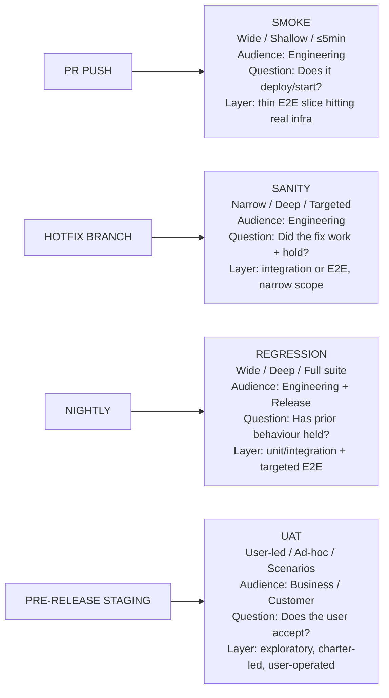

import Diagram from '../../../src/components/mdx/Diagram.astro';
import Prompt from '../../../src/components/mdx/Prompt.astro';
import Feynman from '../../../src/components/mdx/Feynman.astro';

## Core Idea

Smoke, sanity, regression, and UAT are not four different suites you write — they are **four different questions you can ask the same test suite at four different moments**. A single Playwright spec can be a smoke test today (does the build deploy?), a sanity check tomorrow (did this hotfix land correctly?), and part of the nightly regression next week (has prior behaviour held?). The code doesn't change; the intent does.

Each name labels a question and a moment: Smoke asks "does it start?" (wide-shallow, every build). Sanity asks "does this specific change work, without breaking its nearest neighbours?" (narrow-deep, after a focused fix). Regression asks "has anything that used to work stopped working?" (wide-deep, pre-release). UAT asks "does the **user** accept this as the thing we promised?" (user-led, pre-release stage gate). As [[test-pyramid-and-trophy]] establishes, the cost of each role is shaped by the level at which it runs — mislabelling forces the wrong layer choice.

> Name the question the run is answering, not the suite. The label you give a CI stage shapes which team gets paged when it fails.

## Diagram

<Diagram caption="Four test-type roles mapped to CI pipeline stages, run shape, and primary audience">



</Diagram>

## Worked Example

A payment provider's team ships a hotfix: a one-line fix to a rounding error in the checkout total. Here are three distinct actions triggered by one change — each a different role:

**Smoke (unchanged, runs on every deploy):**
```
POST /api/checkout  → HTTP 200  (deploy gate: "is the service alive?")
GET  /health        → {"status":"ok"}
```
The smoke doesn't test the rounding fix — it confirms the deployment didn't break the service. It finishes in under 90 seconds. Nothing about it changes for this hotfix.

**Sanity (run once, targeted to the hotfix):**
```
checkout(items=[{price: 10.005, qty: 3}])  →  expect total = 30.02  ✓
checkout(items=[{price: 0.001, qty: 1}])   →  expect total =  0.00  ✓
checkout(items=[{price:  9.99, qty: 2}])   →  expect total = 19.98  ✓
adjacent: coupon-apply still rounds correctly                        ✓
```
Narrow (three cases + one adjacent check). Deep on the fix. Done in 2 minutes. Tag: `@sanity`.

**Regression (added to the nightly suite — because a bug escaped):**
```
// New regression guard — added because this bug reached prod
test('checkout total rounds to 2dp — rounding bug #4471', () => {
  expect(calculateTotal([{ price: 10.005, qty: 3 }])).toBe(30.02);
});
```
This single test is added with a bug-link comment. The rule: a regression test is added only when a bug escaped that *must never recur*. Never write one "just in case."

**UAT (stakeholder walkthrough on staging):**
A product manager and a sales engineer walk through three checkout scenarios on staging. The PM observes. One scenario — a split-currency purchase — behaves unexpectedly. The filed issue is a *spec-clarity* bug, not a code bug: the spec didn't define the rounding rule for mixed currencies. The tester facilitates; the PM makes the acceptance call.

The four roles ran against the same underlying code base. Only the question — and the audience — differed.

## Common Pitfalls

- **Smoke that takes 30 minutes.** A smoke longer than 5 minutes is not playing the smoke role — it has become a regression in disguise. Fix: time-box smoke ruthlessly; move everything beyond the 5-minute mark to the nightly regression run. This happens because teams keep adding "quick checks" to the smoke stage without ever auditing the total time.
- **Sanity blurred into regression.** If the "sanity" suite grows to cover dozens of surfaces, it is no longer sanity — it is a slow, poorly-labelled regression. Fix: enforce the narrow-deep rule; sanity should cover the changed path and one ring of adjacent behaviour, nothing more. This happens because developers add "while I'm here" checks during a hotfix.
- **Regression that grows monotonically.** A 4-hour nightly suite that flakes 5% of the time produces no signal — the team stops investigating failures. Fix: require a bug link or explicit risk citation before adding any regression test; regularly delete tests whose coverage overlaps with unit-level cases. This happens because the cost of *adding* a regression test is low but the cost of *maintaining* it is paid forever.
- **UAT done by QA instead of the stakeholder.** When QA signs off on the "UAT pass," the user has no veto and acceptance becomes a fiction. Fix: restore the business stakeholder as the accepting party; QA observes and facilitates. This happens because scheduling a stakeholder walkthrough is harder than a tester running a script.
- **Smoke that mocks its dependencies.** A smoke that runs against mocked infrastructure cannot catch deployment failures — config errors, missing secrets, wrong environment variables. Fix: smoke must hit real infrastructure to earn the title "deploy gate." This happens because mocked smokes are faster and never flake, which makes them feel safer.
- **Mislabelled CI stages.** A stage named "smoke" that runs for 20 minutes and touches every endpoint will page the wrong people when it fails. Engineering will treat it as a deployment failure when it is actually a regression signal. Fix: audit every pipeline stage name against the four-question framing; rename before the next incident reveals the confusion.
- **UAT concentrated at the project's end.** A single late UAT pass concentrates risk at the most expensive moment to fix it. Fix: distribute acceptance across the iteration — demos, stakeholder previews, [[exploratory-testing]] bug bashes — so the UAT stage gate is a confirmation, not a discovery session. As [[tdd-bdd-atdd]] shows, ATDD moves acceptance criteria earlier without eliminating the final stakeholder sign-off.

## Retrieval Prompts

<Prompt id="ttype-1">
  Smoke, sanity, regression, and UAT label what? Defend the answer in one sentence — without using the word "test."
</Prompt>

<Prompt id="ttype-2">
  A smoke test takes 30 minutes. Name the rule it has violated, state which role it is actually playing, and describe the cheapest fix.
</Prompt>

<Prompt id="ttype-3">
  Distinguish sanity from smoke using the checkout-rounding hotfix example: what question does each ask, what is the expected run time, and who reads the failure?
</Prompt>

<Prompt id="ttype-4">
  A regression suite of 3,000 tests flakes 4% of the time. Describe the compounding cost in terms of suite trust, and state the deletion rule that prevents this outcome.
</Prompt>

<Prompt id="ttype-5">
  The team plans to "do UAT in the final sprint." Identify two structural problems with that plan and name the agile practice that distributes the same acceptance role across the iteration.
</Prompt>

<Prompt id="ttype-6">
  A bug escaped to production — a rounding error in checkout totals. State the rule that decides whether to add a regression test for it, and state the one piece of metadata the test must carry.
</Prompt>

<Prompt id="ttype-7" requiresDiagram>
  Sketch a CI pipeline with four named stages. Place smoke, sanity, regression, and UAT at the moments they belong. For each, label: run shape (wide/narrow × shallow/deep), trigger, and audience.
</Prompt>

## Feynman Prompt

<Feynman id="ttype-feynman-1" wordTarget={150}>
  Explain the difference between smoke, sanity, regression, and UAT to a developer who thinks "tests are tests." Use one concrete product scenario to show that the same code can be asked four different questions at four different moments. Make sure your answer names what changes between the roles (the question and the moment, not the code), explains why mislabelling a CI stage costs money, and describes what makes UAT culturally different from the other three. Rubric (revealed after submit): Did you use "question" as the central frame rather than "type of test code"? Did you name a concrete product scenario? Did you explain the UAT cultural difference — stakeholder acceptance vs tester sign-off — rather than treating it as just another technical run?
</Feynman>
