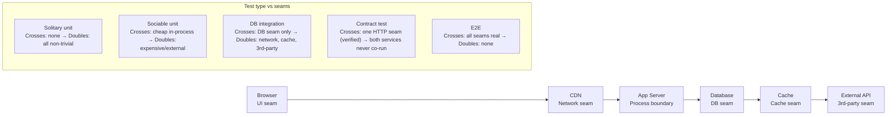

import Diagram from '../../../src/components/mdx/Diagram.astro';
import Prompt from '../../../src/components/mdx/Prompt.astro';
import Feynman from '../../../src/components/mdx/Feynman.astro';

## Core Idea

The labels "unit," "integration," and "E2E" are unstable because every team draws the lines differently. The durable framing is the **seam**: a point where the system under test is separated from a collaborator — a network boundary, a process boundary, a database call, a clock, a filesystem access. A test's level is set by *which seams it crosses and whether those seams use real collaborators or substitutes*. Once you name the seam instead of the label, the vocabulary war evaporates and the decision becomes concrete.

This matters because boundary choice is the most-leveraged architectural decision in a test suite. It determines cost, feedback latency, and failure clarity — permanently. A mis-located test pays its cost forever: a business-logic bug buried in a 90-second E2E will always cost more to diagnose than the same bug in a 2ms unit test.

> Name the seam, not the level. The seam is concrete; the label is taxonomy.

## Diagram

<Diagram caption="Seams in a typical web request flow and which test type crosses each one">



</Diagram>

## Worked Example

A `notifyUser(userId, message)` function fetches a user via `userRepo`, checks notification preferences, then sends via `emailClient`. The same function tested three ways reveals what each boundary catches — and misses.

**Solitary unit test** — mock `userRepo` and `emailClient`:

```ts
it('sends to the correct address', () => {
  userRepo.findById.mockResolvedValue({ id: '1', email: 'a@example.com', prefs: { notify: true } });
  await notifyUser('1', 'Hello');
  expect(emailClient.send).toHaveBeenCalledWith({ to: 'a@example.com', body: 'Hello' });
});
// Runtime: ~2ms. Catches: logic bugs in notifyUser itself.
// Misses: SQL query bugs, column-name mismatches, preference schema drift.
```

**DB integration test** — real Postgres (Testcontainers), mock `emailClient` only:

```ts
it('resolves the correct user from the database', async () => {
  await db.insert(users).values({ id: '1', email: 'a@example.com', prefs: { notify: true } });
  await notifyUser('1', 'Hello');
  expect(emailClient.send).toHaveBeenCalledWith({ to: 'a@example.com', body: 'Hello' });
});
// Runtime: ~200ms. Catches: LIMIT 0 typo in SQL, column renames, JSON coercion bugs.
// Misses: nothing the DB integration covers above.
```

**The diagnostic question:** which test would catch a `LIMIT 0` typo in the SQL query? Only the DB integration — the solitary unit test's mocked `userRepo` returns the value regardless of what the SQL says. The seam you double is the seam you stop testing.

A Testcontainers Postgres starts in roughly 2–3 seconds — fast enough to run in CI on every push. Mocking the repository to avoid "slow" tests was a reasonable trade-off in 2015; it is rarely justified in 2026.

## Common Pitfalls

- **Naming tests by file location instead of seams crossed.** A file in `__tests__/unit/` that starts a Docker container is an integration test regardless of folder. Fix: classify by which seams are real, not by directory name. Why it happens: folder structure is visible; seam policy is implicit.

- **Mocking the database to avoid slow tests.** Mock-DB tests miss every migration bug, type-coercion error, and constraint violation. Fix: use Testcontainers or ephemeral DB branches — cold start is now 2–3 seconds, not 30. Why it happens: the "real DB is slow" reflex was calibrated to 2012 infrastructure and hasn't been updated.

- **E2E tests that grow for every new feature.** E2E suites expand at O(features); CI time grows linearly until the suite becomes a bottleneck. Fix: adopt a rule — new features go to integration first, E2E only for cross-system flows that cannot be verified at a lower seam. Why it happens: E2E tests feel comprehensive; teams reward coverage breadth without pricing CI time.

- **Retrying flaky E2E tests instead of pushing them down.** Retries convert a 10% flake into a 1% false-pass and the underlying bug ships. Fix: investigate which seam is causing flake and ask whether the test can be re-expressed as an integration test at that seam. Why it happens: retries are one config line; re-locating a test requires understanding the seam architecture.

- **"Integration test" without naming the seam.** "Integration test" can mean function-plus-function, function-plus-DB, service-plus-service, or service-plus-network. A failure is undiagnosable if you don't know which seam broke. Fix: always qualify — "DB integration," "HTTP integration," "queue integration." Why it happens: the word "integration" is inherited as a label, not derived from a seam analysis.

- **Solitary-everywhere by default.** Teams that mock everything produce test suites that survive refactors badly — a rename breaks dozens of mocks, not a single behaviour assertion. Fix: pick a documented default (solitary or sociable) explicitly, and revisit it annually. Why it happens: mocking is the path of least friction in most test frameworks; the default is never questioned.

- **Treating contract tests as optional extras.** In microservice architectures, a consumer/provider seam that isn't contract-tested is implicitly trusted — and trust is how silent drift reaches production. Fix: treat consumer-driven contracts as the primary inter-service test for each HTTP seam. Why it happens: contract tests require cross-team coordination; both sides must opt in, so neither does.

## Retrieval Prompts

<Prompt id="uieb-1">
  Why is "is this a unit test?" the wrong question to ask about a test? What question replaces it, and what does the replacement question make concrete that the original obscures?
</Prompt>

<Prompt id="uieb-2">
  Define a seam in your own words. Give two examples of seams in a typical web application and state one concrete thing you stop testing at each seam when you substitute a double for the real collaborator.
</Prompt>

<Prompt id="uieb-3">
  A `notifyUser` function is covered by a solitary unit test that mocks the database repository. A developer introduces a `LIMIT 0` typo in the SQL query. Does the test fail? Explain why or why not, and name the test type that would have caught the bug.
</Prompt>

<Prompt id="uieb-4">
  A 90-second E2E test covers the checkout flow and flakes 8% of the time. Without seeing the test, describe three architectural moves to consider — in order — to reduce both runtime and flake.
</Prompt>

<Prompt id="uieb-5">
  Explain why the test pyramid (from [[test-pyramid-and-trophy]]) is an economic argument rather than an aesthetic preference. State the argument in one sentence using cost and cycle time.
</Prompt>

<Prompt id="uieb-6">
  A teammate says "we mock the database so our unit tests stay fast." List three bug classes that their test suite systematically misses as a result, and name the modern infrastructure option that removes the original trade-off.
</Prompt>

<Prompt id="uieb-7">
  Describe the difference between a solitary and a sociable unit test. For each, name one project type or domain where it is the better default and explain why.
</Prompt>

<Prompt id="uieb-8">
  What is a consumer-driven contract test, and why is it described as "the integration test you don't have to run"? Give a two-service example and state which bug class it catches that a shared integration environment would miss.
</Prompt>

## Feynman Prompt

<Feynman id="uieb-feynman-1" wordTarget={150}>
  Explain unit, integration, and E2E boundaries to a developer who classifies tests by folder name. Introduce the concept of a seam. Why does naming the seam matter more than attaching a label? Give one concrete example of a seam choice that changes which bug class a test can catch. Rubric (revealed after submit): Did you use "seam" as the central organising concept rather than "level" or "layer"? Did you give a specific seam (not "the boundary between components") and tie it to a concrete bug class? Did you explain what is lost when a seam is doubled — not just that doubling happens?
</Feynman>
