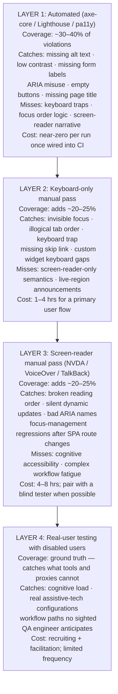

import Diagram from '../../../src/components/mdx/Diagram.astro';
import Prompt from '../../../src/components/mdx/Prompt.astro';
import PracticeTask from '../../../src/components/mdx/PracticeTask.astro';
import Feynman from '../../../src/components/mdx/Feynman.astro';
import Maintain from '../../../src/components/mdx/Maintain.astro';

## Core Idea

Accessibility testing is the practice of verifying that a system works for people with disabilities — and for anyone using it in a non-standard way (keyboard-only, screen reader, voice control, high contrast). It operates against **WCAG** (four POUR principles: Perceivable, Operable, Understandable, Robust) at conformance levels A, AA, and AAA.

The load-bearing number: automated tools like axe-core catch **~30–40% of WCAG violations** (Deque Systems' own published estimate). The remaining ~60% require human passes — keyboard-only navigation, screen-reader walkthroughs, and real-user testing. A QA process that stops at "axe passes" has tested less than half the accessibility floor. This lesson covers the automated layer in depth and treats the manual layers as required companions, not optional extras.

> Automated accessibility tools catch ~30–40% of WCAG violations. The other ~60% requires keyboard, screen-reader, and real-user passes. "Axe passes" is a floor, not a verdict.

<Diagram caption="Four accessibility testing modalities layered by coverage and cost — automated tools cover the floor; human passes cover the ceiling.">



</Diagram>

## 1. Set up properly

Everything from an empty folder to a green first axe scan.

**Prerequisites:** Node ≥ 22.12.0, Playwright already installed (see the [[playwright]] lesson), a running local dev server.

### Install axe-core for Playwright (pinned)

```bash
npm install --save-dev @axe-core/playwright@4.11.3 axe-core@4.11.4
```

> Pin both packages together. `@axe-core/playwright` wraps `axe-core` — version skew between them can produce false rule mismatches. Only bump together and re-verify your baseline violation count.

### Project layout

```
tests/
  e2e/
    a11y.spec.ts      ← axe scans across page states
    keyboard.spec.ts  ← manual keyboard-flow assertions
playwright.config.ts
```

### Write the first axe scan

Create `tests/e2e/a11y.spec.ts`:

```typescript
import { test, expect, type Page } from '@playwright/test';
import AxeBuilder from '@axe-core/playwright';

// Scope to WCAG 2.x AA criteria only — not every axe rule.
const WCAG_TAGS = ['wcag2a', 'wcag2aa', 'wcag21a', 'wcag21aa', 'wcag22aa'];

async function runAxe(page: Page, name: string) {
  const results = await new AxeBuilder({ page })
    .withTags(WCAG_TAGS)
    .analyze();

  // Two-tier: serious/critical block the build; moderate/minor warn only.
  const blocking = results.violations.filter(
    (v) => v.impact === 'serious' || v.impact === 'critical',
  );
  const lesser = results.violations.filter(
    (v) => v.impact === 'moderate' || v.impact === 'minor',
  );

  for (const v of lesser) {
    console.warn(`[a11y:${name}] ${v.impact}: ${v.id} — ${v.help}`);
  }

  expect(blocking, `Serious/critical a11y violations on "${name}"`).toEqual([]);
}

test('home page — initial load', async ({ page }) => {
  await page.goto('/');
  await expect(page.locator('h1').first()).toBeVisible();
  await runAxe(page, 'home');
});
```

### Run to green

```bash
npx playwright test tests/e2e/a11y.spec.ts
```

Expected output:

```
Running 1 test using 1 worker
  ✓  tests/e2e/a11y.spec.ts:27:1 › home page — initial load (1.8s)

  1 passed (3.1s)
```

If the run is green, the automated layer is wired. Move on.

## 2. Implement + best practice

### Scan after interaction, not just on load

axe can only see the current DOM. A modal's violations are invisible before it opens.

```typescript
test('search modal opened', async ({ page }) => {
  await page.goto('/');
  // Wait for React islands to hydrate before dispatching the custom event.
  await expect(page.getByRole('button', { name: /Search/i })).toBeVisible();
  await page.evaluate(() => window.dispatchEvent(new CustomEvent('search:open')));
  const dialog = page.getByRole('dialog', { name: 'Search' });
  await expect(dialog).toBeVisible();
  await expect(dialog.getByRole('searchbox')).toBeFocused();
  await runAxe(page, 'search-modal');  // axe runs with modal OPEN
});
```

Run axe at every meaningful interactive state: modal open, dropdown expanded, form validation error, authenticated view, error state. Any state hidden during initial page load is a blind spot for automated scanning.

### Scope scans with `.withTags()`

Without `.withTags()`, axe runs every rule including experimental and best-practice rules that don't map to any conformance criterion — producing noise that isn't actionable against a WCAG AA target.

```typescript
// ✓ scoped to WCAG 2.x AA — actionable violations only
new AxeBuilder({ page }).withTags(['wcag2a', 'wcag2aa', 'wcag21a', 'wcag21aa', 'wcag22aa'])

// ✗ no tag filter — includes non-standard rules, harder to prioritise
new AxeBuilder({ page })
```

### Two-tier impact filter

Not all violations carry equal WCAG weight. A missing button label (`critical`) is categorically different from a minor colour issue on a decorative element (`minor`).

```typescript
const blocking = results.violations.filter(
  (v) => v.impact === 'serious' || v.impact === 'critical',
);
const lesser = results.violations.filter(
  (v) => v.impact === 'moderate' || v.impact === 'minor',
);
// Block on serious/critical; surface moderate/minor as warnings.
expect(blocking, `Serious/critical violations on "${name}"`).toEqual([]);
```

### Wire a Lighthouse-CI a11y budget

Lighthouse Accessibility scores pages against a curated axe subset at the full-page level. Add a budget in `lighthouserc.json`:

```json
{
  "ci": {
    "collect": {
      "url": [
        "http://localhost:4321/",
        "http://localhost:4321/lessons/foundations/qa-mindset"
      ],
      "numberOfRuns": 3
    },
    "assert": {
      "assertions": {
        "categories:accessibility": ["error", { "minScore": 0.95 }]
      }
    }
  }
}
```

`minScore: 0.95` means a single serious violation on a tested page drops the score below threshold and blocks the merge. Lighthouse is Layer 1 automated coverage running on representative routes — it doesn't replace per-state axe scans.

### Pair automated scans with keyboard passes

Automated tooling cannot detect keyboard traps, illogical tab order, or broken focus management after SPA route changes. After wiring axe, add a keyboard-flow spec:

```typescript
test('modal keyboard flow', async ({ page }) => {
  await page.goto('/');
  await page.keyboard.press('Control+k');
  const dialog = page.getByRole('dialog', { name: 'Search' });
  await expect(dialog).toBeVisible();
  // Focus must land inside the modal immediately
  await expect(dialog.getByRole('searchbox')).toBeFocused();
  // Escape must close and return focus to the trigger
  await page.keyboard.press('Escape');
  await expect(dialog).not.toBeVisible();
  await expect(page.getByRole('button', { name: /Search/i })).toBeFocused();
});
```

This is an automated keyboard check — it verifies specific interactions, not a full tab-order traversal. A complete Layer 2 pass still requires a human navigating the whole flow keyboard-only.

**The honest ceiling:** automated tooling covers the floor. The remaining ~60% — focus management, reading order, live-region timing, real assistive-tech behaviour — require keyboard and screen-reader passes. Build a checklist: for every user flow, document which interactive states received an axe scan, which received a keyboard pass, and which still need a screen-reader pass.

## 3. Common pitfalls

- **Treating axe results as the accessibility verdict.** axe catches ~30–40% of violations. Teams that stop at "axe passes" are shipping a partial story. Fix: add keyboard-only and screen-reader passes to the definition of "accessibility tested." The remaining ~60% of violations — including focus management, reading order, live-region timing, and real assistive-tech behaviour — are invisible to automated tools.

- **Running axe only on the static page load.** A modal's accessibility violations are invisible to a scan that runs before the modal opens. Fix: run `AxeBuilder.analyze()` after every meaningful interactive state — modal open, dropdown expanded, form validation error, authenticated view. axe can only see the current DOM; it cannot predict what states the page will enter.

- **Adding ARIA to "improve" accessibility without the first rule of ARIA.** `<div role="button" tabindex="0" onkeydown={...}>` reproduces about 60% of `<button>` behaviour at best — and fails in ways that vary across screen readers. Fix: use the native element when one exists. ARIA should extend semantics that native HTML cannot express, not replace elements it can. Native elements carry focus, keyboard handling, activation patterns, and screen-reader exposure for free; custom ARIA reproduces these piecemeal.

- **Using placeholder text as a form label.** Placeholders disappear on focus, fail contrast requirements at 4.5:1, and are not programmatic labels — they don't satisfy WCAG 1.3.1 (Info and Relationships). Fix: use `<label for="id">` (visible) or `aria-label` (icon-only inputs). Screen readers use the programmatic label, not the visual placeholder, to announce what a field is for.

- **Removing `:focus` outlines for aesthetic reasons.** WCAG 2.4.7 (Focus Visible) is one of the most-failed AA criteria. Fix: use `:focus-visible` to scope the outline to keyboard users, and replace the outline with a design-intentional equivalent (background shift, underline, box-shadow) rather than removing it. Keyboard-only users cannot see which element is active without a visible focus indicator.

- **Testing no interactive states inside a modal.** A correct modal requires: focus trapped inside, focus moved to first focusable element on open, focus returned to the trigger on close, ESC closes, background `inert`, `role="dialog"`, and `aria-labelledby`. Automated tools won't catch most of these. Fix: add keyboard tests that open the modal, Tab through it, and Esc to close — verifying focus placement at each step. Modal focus management is the single highest-failure interaction pattern in SPA accessibility.

- **Trusting a Lighthouse Accessibility score of 100.** 100 means no axe-detectable violations at tested pages in their initial state. It does not cover authenticated routes, interactive states, or the full axe rule set. Fix: treat Lighthouse as the CI floor, not the coverage ceiling. Lighthouse Accessibility is axe under the hood, inheriting the same ~30–40% coverage ceiling.

## 4. Maintain

<div role="list" aria-label="Maintenance triggers and responses">
<Maintain trigger="axe-core or @axe-core/playwright ships a new version">
  1. Read the changelog for new or changed rules that might alter your violation baseline.
  2. Bump both `@axe-core/playwright` and `axe-core` in `package.json` — always together.
  3. Run the full `tests/e2e/a11y.spec.ts` suite and triage any new violations: fix genuine regressions, add `.disableRules(['rule-id'])` with a comment only for confirmed false positives — track them in an issue.
  4. Re-run Lighthouse-CI and confirm the `categories:accessibility` budget still passes.
  5. Update the `verified.versions` block and `verified.date` in this file's frontmatter.
</Maintain>

<Maintain trigger="axe scan starts failing on a previously-passing page">
  1. Run the failing spec with `--reporter=list` to get the full violation detail including `helpUrl`.
  2. Open `v.helpUrl` in a browser — axe links directly to the WCAG criterion and the affected element.
  3. Triage: is this a genuine regression (UI changed) or a rule change (axe version bump)?
  4. For genuine regressions: fix the markup. Common fixes: add a missing `aria-label`, use a `<button>` instead of a `<div onClick>`, add `<label>` to an unlabelled input.
  5. If the violation is inside a third-party widget you cannot fix: add `.disableRules(['rule-id'])` with a comment and a tracking issue — never suppress silently.
  6. Rerun the suite after the fix to confirm the violation count dropped, not just that the specific assert passes.
</Maintain>

<Maintain trigger="A keyboard flow breaks (focus lands in wrong place after navigation)">
  1. Run the failing keyboard spec with `--trace on` to capture a trace.
  2. Open the trace: `npx playwright show-trace trace.zip`. Check the DOM snapshot at the step where focus is lost.
  3. Common root causes: SPA route change does not call `element.focus()` on the new page's `<h1>` or skip-link target; a modal closes without returning focus to the trigger; a React re-render moves the focused element.
  4. Fix at the component level: call `focus()` explicitly after async navigation; use a `useEffect` cleanup to return focus on modal close.
  5. Re-run the keyboard spec 3 times to confirm focus is stable across runs.
</Maintain>

<Maintain trigger="Lighthouse-CI accessibility budget fails in CI (score drops below 0.95)">
  1. Pull the Lighthouse HTML report from the CI artefact. Open the Accessibility section.
  2. Each failing audit links to an axe rule ID and the affected element. Triage each one.
  3. If the failure is a genuine regression: fix the markup and re-run.
  4. If the Lighthouse-CI URL list no longer matches real routes (e.g. a route was renamed): update the `url` array in `lighthouserc.json`.
  5. Never raise the threshold to paper over unfixed violations — the budget exists to catch regressions, not to be adjusted around them.
</Maintain>

<Maintain trigger="WCAG publishes a new major version (e.g. WCAG 2.3 or WCAG 3.0)">
  1. Read the new conformance criteria — identify any new Level AA criteria that affect the existing codebase.
  2. Check whether axe-core has published a release adding rules for the new criteria; if so, perform the version-bump procedure above.
  3. Update `WCAG_TAGS` in `a11y.spec.ts` to include any new tag strings axe-core introduces (e.g. `wcag23aa`).
  4. Update `verified.date` in this file's frontmatter and add a note in the Core Idea citing the new target version.
</Maintain>
</div>

## Retrieval Prompts

<Prompt id="a11y-1">
  WCAG defines four principles abbreviated as POUR. Name each principle and give one WCAG success criterion that falls under it.
</Prompt>

<Prompt id="a11y-2">
  Distinguish WCAG conformance levels A, AA, and AAA. Which level do most jurisdictions cite as the legal baseline, and why is AAA rarely a target for whole sites?
</Prompt>

<Prompt id="a11y-3">
  Per Deque Systems' published estimates, approximately what percentage of WCAG violations does axe-core catch? What is the QA planning consequence of this number?
</Prompt>

<Prompt id="a11y-4">
  The `a11y.spec.ts` pattern calls `AxeBuilder.analyze()` after opening the search modal — not just on page load. Explain why this ordering is essential and what would be missed by scanning before the modal opens.
</Prompt>

<Prompt id="a11y-5">
  The two-tier axe impact filter blocks on `serious`/`critical` and only warns on `moderate`/`minor`. Justify this design against the alternative of failing on any violation.
</Prompt>

<Prompt id="a11y-6">
  State the "first rule of ARIA." Give a concrete example where adding `role="button"` to a `<div>` produces worse accessibility than a native `<button>` element, and name at least two behaviours the ARIA version fails to provide natively.
</Prompt>

<Prompt id="a11y-7">
  A form uses placeholder text instead of a `<label>` element. Name three specific ways this fails accessibility, referencing at least one WCAG criterion.
</Prompt>

<Prompt id="a11y-8" requiresDiagram>
  Sketch the four accessibility testing modalities — automated, keyboard-only, screen-reader, real-user — and for each layer mark one type of violation it catches and one type it misses.
</Prompt>

<Prompt id="a11y-9">
  This repo's `lighthouserc.json` enforces `categories:accessibility` at `minScore: 0.95`. A PR achieves a Lighthouse Accessibility score of 100. What does this guarantee, and what does it NOT guarantee?
</Prompt>

<Prompt id="a11y-10">
  Name three keyboard-accessibility failures that automated tools cannot detect. For each, describe the manual test you would run to catch it.
</Prompt>

## Practice Task

<PracticeTask id="a11y-task-1" rubric="a11y-rubric-v1">
  Conduct a layered accessibility audit of one user flow on this site. The suggested flow is: **home page → open search modal (Ctrl+K) → type a query → close modal (Esc)**. This flow exercises three interactive states that automated-only testing cannot fully cover.

  Produce the following four artefacts:

  **1. Automated baseline report**

  Run the existing `tests/e2e/a11y.spec.ts` suite and capture the output. Identify which WCAG tags are in scope (`WCAG_TAGS`). For any warnings emitted by the `lesser` violations filter, look up the WCAG success criterion the violation maps to and classify it as A, AA, or AAA.

  **2. Keyboard-only pass log**

  Navigate the full flow using keyboard only (Tab, Shift+Tab, Enter, Space, Escape, arrow keys — no mouse). Document every observation: focus visibility at each step, tab order correctness, whether Ctrl+K opens the modal and lands focus in the search input, whether Esc closes and returns focus to the trigger. Note any step where you could not complete the action without a mouse.

  **3. Axe-at-state comparison**

  Write (or describe precisely) an additional `runAxe` call that runs after the modal is open. Compare results to the static-page axe scan. Note any violations that appear only with the modal open.

  **4. POUR heuristic audit**

  For each of the four POUR principles, cite one concrete observation from your keyboard pass that is a pass and one that is a potential fail or gap. Use WCAG criterion identifiers where possible (e.g., "2.4.7 Focus Visible — pass: focus ring visible on all interactive elements").

  **Rubric (revealed after submission):**
  - Does the automated report identify the WCAG tags used and correctly classify at least one warning by conformance level (A/AA/AAA)?
  - Does the keyboard pass document *each step* of the flow — not just the outcome? A log that says "it works" without step-by-step focus observations fails.
  - Does the axe-at-state comparison show awareness that modal-closed and modal-open scans can produce different results? Even if no new violations appear, the comparison must be explicitly stated.
  - Does the POUR audit cite WCAG criterion IDs, not just principle names? Naming "Perceivable — pass" without a criterion reference fails.
  - Did the candidate notice any failure that automated testing missed? (The keyboard pass should find at least one observation — even a pass with a marginal focus ring — that automated tools could not have caught.)
  - Bonus: did the candidate observe the `withTags(WCAG_TAGS)` scoping and comment on which criteria are excluded from the automated scan?
</PracticeTask>

## Feynman Prompt

<Feynman id="a11y-feynman-1" wordTarget={150}>
  Explain accessibility testing to a developer who thinks "we added axe-core to our Playwright tests, so we're covered." Name the specific percentage of WCAG violations axe-core catches, explain why the rest requires human passes, and describe one type of violation — with a concrete example — that axe cannot detect but a keyboard-only pass would catch in under five minutes. Rubric (revealed after submit): Did you name the ~30–40% coverage ceiling with its source (Deque/axe-core authors)? Did you give a concrete example of an axe-invisible violation (not a category name — a specific failure on a specific interaction)? Did you explain *why* automated tools cannot detect it (DOM state, interaction dependency, or judgement call)? Did you avoid implying axe is useless — the "high leverage floor" framing must survive your explanation?
</Feynman>
