import Diagram from '../../../src/components/mdx/Diagram.astro';
import Prompt from '../../../src/components/mdx/Prompt.astro';
import Feynman from '../../../src/components/mdx/Feynman.astro';
import Maintain from '../../../src/components/mdx/Maintain.astro';

## Core Idea

Database testing is **the practice of verifying that your system's persistent state survives everything you put it through**: schema migrations, concurrent writes, partial failures, and data-volume growth. The test pyramid inverts for data — application code favours unit tests; data-layer tests favour integration tests against a **real** database. In-memory substitutes (SQLite, H2) diverge from production dialects in constraint enforcement, query plans, and isolation behaviour, producing false confidence. The structural answer is **Testcontainers**: a throwaway Postgres instance spun up per test suite via Docker, then destroyed. The ~5-second startup cost buys production-faithful behaviour in every test that follows.

The asymmetric stakes: most bugs cost a sprint to fix; data-corruption and migration disasters can be irreversible once they reach production.

> The test pyramid inverts for data. Data errors are the one bug class where "fix it in prod" may not be an option.

## 1. Set up

Everything from an empty folder to a green Testcontainers + Drizzle integration test. **Requires Docker Desktop running.**

**Prerequisites:** Node >= 22.12.0, Docker Desktop (running), npm, a terminal.

### Create the project

```bash
mkdir db-runbook && cd db-runbook
npm init -y
```

### Install dependencies (pinned)

```bash
npm install drizzle-orm@0.38.4 postgres@3.4.5
npm install --save-dev @testcontainers/postgresql@10.23.0 testcontainers@10.23.0 \
  drizzle-kit@0.30.4 vitest@2.1.9 tsx@4.19.4
```

> Pin the versions. The Testcontainers major version and the `@testcontainers/postgresql` module version **must match** — mixing majors changes connection URI method names and causes silent failures.

### Configure TypeScript

Create `tsconfig.json`:

```json
{
  "compilerOptions": {
    "target": "ES2022",
    "module": "NodeNext",
    "moduleResolution": "NodeNext",
    "strict": true,
    "outDir": "dist"
  },
  "include": ["src/**/*", "tests/**/*", "drizzle.config.ts"]
}
```

### Define the schema

Create `src/db/schema.ts`:

```ts
import { pgTable, serial, text, integer, unique } from 'drizzle-orm/pg-core';

export const users = pgTable('users', {
  id: serial('id').primaryKey(),
  email: text('email').notNull(),
  name: text('name').notNull(),
}, (t) => [unique('users_email_unique').on(t.email)]);

export const accounts = pgTable('accounts', {
  id: serial('id').primaryKey(),
  owner: text('owner').notNull(),
  balance: integer('balance').notNull().default(0),
});
```

### Configure Drizzle Kit

Create `drizzle.config.ts`:

```ts
import type { Config } from 'drizzle-kit';

export default {
  schema: './src/db/schema.ts',
  out: './drizzle',
  dialect: 'postgresql',
} satisfies Config;
```

### Generate migrations

```bash
npx drizzle-kit generate
```

This writes `drizzle/0000_*.sql`. Do not hand-edit the generated SQL.

### Create the migration helper

Create `src/db/migrate.ts`:

```ts
import { drizzle } from 'drizzle-orm/postgres-js';
import { migrate } from 'drizzle-orm/postgres-js/migrator';
import postgres from 'postgres';

export async function runMigrations(connectionString: string) {
  const client = postgres(connectionString, { max: 1 });
  const db = drizzle(client);
  await migrate(db, { migrationsFolder: './drizzle' });
  await client.end();
}
```

### Write the first test

Create `tests/integration/constraints.test.ts`:

```ts
import { describe, test, expect, beforeAll, afterAll } from 'vitest';
import {
  PostgreSqlContainer,
  type StartedPostgreSqlContainer,
} from '@testcontainers/postgresql';
import { drizzle } from 'drizzle-orm/postgres-js';
import postgres from 'postgres';
import { runMigrations } from '../../src/db/migrate.js';
import { users } from '../../src/db/schema.js';

let container: StartedPostgreSqlContainer;
let db: ReturnType<typeof drizzle>;
let client: ReturnType<typeof postgres>;

beforeAll(async () => {
  container = await new PostgreSqlContainer('postgres:16-alpine').start();
  const url = container.getConnectionUri();
  await runMigrations(url);
  client = postgres(url);
  db = drizzle(client);
}, 60_000);

afterAll(async () => {
  await client?.end();
  await container?.stop();
});

describe('unique email constraint', () => {
  test('first insert succeeds', async () => {
    await expect(
      db.insert(users).values({ email: 'alice@example.com', name: 'Alice' })
    ).resolves.toBeDefined();
  });

  test('duplicate email throws a unique-violation error', async () => {
    await db.insert(users).values({ email: 'bob@example.com', name: 'Bob' });
    await expect(
      db.insert(users).values({ email: 'bob@example.com', name: 'Bob 2' })
    ).rejects.toThrow(/unique/i);
    // SQLite silently allows duplicate emails; Postgres enforces the constraint.
  });
});
```

### Configure Vitest for integration tests

Add to `package.json` scripts:

```json
{
  "scripts": {
    "test:integration": "vitest run --config vitest.integration.config.ts"
  }
}
```

Create `vitest.integration.config.ts`:

```ts
import { defineConfig } from 'vitest/config';

export default defineConfig({
  test: {
    include: ['tests/integration/**/*.test.ts'],
    testTimeout: 90_000,
  },
});
```

### Run to green

```bash
npm run test:integration
```

Expected output:

```
 RUN  v2.1.9

 ✓ tests/integration/constraints.test.ts (2 tests) 6.2s

 Test Files  1 passed (1)
 Tests       2 passed (2)
 Duration    6.2s (container start + migration + tests)
```

If both tests pass, the setup is complete. Move on.

### Folder tree after setup

```
db-runbook/
  src/
    db/
      schema.ts
      migrate.ts
  drizzle/
    0000_*.sql       (generated — do not hand-edit)
  tests/
    integration/
      constraints.test.ts
  drizzle.config.ts
  vitest.integration.config.ts
  package.json
  tsconfig.json
```

<Diagram caption="Testcontainers lifecycle and the expand-contract migration pattern — how the two interact to validate safe schema changes">



</Diagram>

```mermaid
flowchart TD
    subgraph TC["Testcontainers Lifecycle (per test suite)"]
        T1["beforeAll: PostgreSqlContainer.start()\npulls image → starts container → exposes random port"]
        T2["runMigrations(url) — drizzle migrate()\napplies every SQL file in order\nschema identical to production"]
        T3["TESTS RUN\nisolated, real Postgres constraints"]
        T4["afterAll: container.stop()\ncontainer + data removed"]
        T1 --> T2 --> T3 --> T4
    end
    subgraph EC["Expand-Contract Migration: rename email_address → email"]
        P1["Phase 1 EXPAND: ADD COLUMN email TEXT (nullable)\nReversible: DROP COLUMN email"]
        P2["Phase 2 EXPAND: Dual-write (email_address AND email)\nReversible: stop writing email column"]
        P3["Phase 3 EXPAND: Backfill existing rows\nUPDATE users SET email = email_address WHERE email IS NULL\nReversible: rows still have email_address"]
        P4["Phase 4 CONTRACT: Read new column, add NOT NULL\nALTER COLUMN email SET NOT NULL\nReversible: revert app + DROP NOT NULL"]
        P5["Phase 5 CONTRACT: Drop old column\nDROP COLUMN email_address\nNOT reversible without backup"]
        P1 -->|"deploy"| P2 -->|"deploy"| P3 -->|"deploy"| P4 -->|"deploy"| P5
    end
```

## 2. Implement + best practice

### Test concurrent writes — the lost-update race

At Postgres's default `READ COMMITTED` isolation level, two concurrent sessions can each read a value and then write back a derived value, silently losing one update.

```ts
// tests/integration/concurrency.test.ts
import { sql } from 'drizzle-orm';
import { accounts } from '../../src/db/schema.js';

test('atomic update prevents lost-update race', async () => {
  const [row] = await db
    .insert(accounts)
    .values({ owner: 'alice', balance: 1000 })
    .returning();

  // Fix: atomic update — no separate read required.
  // `SET balance = balance - 100` serialises at the row lock;
  // both concurrent subtractions apply, giving 800 not 900.
  await Promise.all([
    db.update(accounts).set({ balance: sql`balance - 100` }).where(sql`id = ${row.id}`),
    db.update(accounts).set({ balance: sql`balance - 100` }).where(sql`id = ${row.id}`),
  ]);

  const [after] = await db
    .select({ balance: accounts.balance })
    .from(accounts)
    .where(sql`id = ${row.id}`);

  expect(after.balance).toBe(800);
});
```

> Use `SET balance = balance - 100` (atomic), not `SET balance = ${currentValue - 100}` (read-then-write). The former serialises at the row lock; the latter silently loses concurrent updates at `READ COMMITTED`.

### Test migration up and down paths

```ts
// tests/integration/migrations.test.ts
test('addColumn migration can be rolled back cleanly', async () => {
  // Apply a hypothetical addColumn migration (up)
  await db.execute(sql`ALTER TABLE users ADD COLUMN IF NOT EXISTS bio TEXT`);

  // Roll back (down)
  await db.execute(sql`ALTER TABLE users DROP COLUMN IF EXISTS bio`);

  // Verify schema is restored
  const cols = await db.execute(sql`
    SELECT column_name FROM information_schema.columns
    WHERE table_name = 'users'
  `);
  const colNames = (cols as unknown as Array<{ column_name: string }>).map(
    (r) => r.column_name
  );
  expect(colNames).not.toContain('bio');
});
```

Every migration that has never been reversed is a migration that will fail the rollback at 2 a.m. Test the down path before shipping.

### Use per-test transaction rollback for speed

When tests do not need to verify the commit path, wrap each test in a transaction and roll back rather than truncating:

```ts
beforeEach(async () => {
  await client.unsafe('BEGIN');
});

afterEach(async () => {
  await client.unsafe('ROLLBACK');
});
```

Rollback is faster than `TRUNCATE` — it is a metadata operation with no disk writes on the cleanup path.

### Review generated migrations before committing

```bash
# After editing schema.ts:
npx drizzle-kit generate
# Read the generated SQL before staging:
cat drizzle/0001_*.sql
```

ORM migration generators occasionally produce `DROP COLUMN` when the intent was a rename. Read the diff; missing a destructive change is large.

## 3. Common pitfalls

- **Using SQLite (or any in-memory substitute) for Postgres-deployed code.** SQL dialects diverge on constraint enforcement, `RETURNING` clauses, `ON CONFLICT` syntax, and JSON operators. A passing SQLite test suite gives false confidence. Fix: use Testcontainers to spin up a real Postgres per test suite. The ~5-second container startup cost is worth it; silent dialect divergence is not.

- **Single-step migrations for rename, type-change, or NOT NULL addition.** `ALTER TABLE ... RENAME COLUMN` locks the table for the entire operation — seconds on a dev table, hours on a 100 M-row production table. Fix: use expand-contract (five phases, each deployed separately). Each phase is independently reversible; the single-step rename is not.

- **`ALTER TABLE ... ADD COLUMN ... NOT NULL` without a default on large tables.** In Postgres before v11, this rewrites the entire table. In v11+ it is metadata-only for constant defaults but still blocks for non-constant expressions. Fix: add the column nullable first (expand), backfill in batches, then add the `NOT NULL` constraint (contract). Know your Postgres version.

- **Mocking the database in integration tests.** Mocks make assumptions about DB behaviour that diverge silently — constraint enforcement, transaction rollback, `RETURNING` values. The bug surfaces only when the code hits a real database. Fix: use Testcontainers or a dedicated test schema with per-test transaction rollback. Mocks belong at the service boundary, not the data boundary.

- **No test for the migration down path.** Deploy processes need the rollback path. A migration that has never been reversed is a migration that will fail at 2 a.m. Fix: test both the up and down for every migration; verify the down restores the prior schema exactly.

- **Shared development database for integration tests.** Tests that share a database develop ordering dependencies — a test passes in isolation but fails in CI because a prior test left state. Fix: use per-job isolated databases (GHA `services:` block or Testcontainers). No amount of `beforeEach` cleanup is as reliable as starting fresh.

- **Trusting ORM-generated migrations without review.** ORM migration generators occasionally produce `DROP COLUMN` when the intent was a rename, or add an unintended default that slows inserts. Fix: read the generated SQL before committing. The diff is small; missing a destructive change is large.

## 4. Maintain

<div role="list" aria-label="Maintenance triggers and responses">
<Maintain trigger="Testcontainers ships a new major version (e.g. 10.x → 11.x)">
  1. Read the changelog for breaking API changes — particularly `start()` return type and connection URI method names, which have changed between majors.
  2. Bump `testcontainers` and `@testcontainers/postgresql` together in `package.json`; they must share the same major version.
  3. Re-run `npm run test:integration` — most failures will be renamed methods or changed default timeouts.
  4. Update the `verified.versions` block and `verified.date` in frontmatter.
</Maintain>

<Maintain trigger="Drizzle ORM or drizzle-kit ships a breaking schema-generation change">
  1. Run `npx drizzle-kit generate` on the current schema and compare new output against existing migration files.
  2. If the generator produces unexpected `DROP COLUMN` or `DROP TABLE` statements, do not commit — investigate whether the schema inference changed.
  3. Re-run `npm run test:integration` to verify the migration still applies cleanly against a fresh container.
  4. Update `verified.versions` (`drizzle-orm` and `drizzle-kit`) and `verified.date` in frontmatter.
</Maintain>

<Maintain trigger="Docker Desktop upgrades and containers fail to start (image pull or socket error)">
  1. Check Docker is running: `docker ps` must return without error.
  2. On Windows, verify the WSL 2 backend is active and `DOCKER_HOST` is not overriding the socket path.
  3. Run `docker pull postgres:16-alpine` manually to confirm the image is pullable.
  4. Re-run `beforeAll` with a longer timeout (`120_000`) if the pull adds latency on cold CI runners.
</Maintain>

<Maintain trigger="A migration fails on production (table lock or constraint violation on existing rows)">
  1. Identify whether the migration is a single-step operation (rename, NOT NULL add, index creation) — these are the common lock sources.
  2. Split into expand-contract phases: add nullable first, backfill in batches of 1 000 rows, then add the constraint once all rows satisfy it.
  3. For index creation: use `CREATE INDEX CONCURRENTLY` instead of `CREATE INDEX` to avoid the table lock.
  4. Test the phased migration against a Testcontainers instance seeded with representative row counts before shipping to production.
</Maintain>
</div>

## Retrieval Prompts

<Prompt id="db-1">
  Explain why the test pyramid inverts for data-layer tests. Name one concrete bug class that an in-memory database substitute (SQLite, H2) will not catch that a real Postgres instance will.
</Prompt>

<Prompt id="db-2">
  Name the five phases of an expand-contract migration for renaming a column. For each phase, state whether rollback is safe or involves data-loss risk.
</Prompt>

<Prompt id="db-3">
  A two-transaction race at READ COMMITTED produces a lost update. Describe the exact sequence of operations that causes it and give two distinct fixes with the tradeoff of each.
</Prompt>

<Prompt id="db-4">
  What is Testcontainers and why is it the recommended default for database integration tests? What does the ~5-second startup cost buy you, and what is the alternative that should be avoided?
</Prompt>

<Prompt id="db-5">
  Why is `ALTER TABLE ... RENAME COLUMN` dangerous on a large production table? What structural property of the expand-contract pattern eliminates this risk?
</Prompt>

<Prompt id="db-6">
  Distinguish READ COMMITTED, REPEATABLE READ, and SERIALIZABLE isolation levels. Name one data anomaly (lost update, phantom read, write skew) that each level above READ COMMITTED additionally prevents.
</Prompt>

<Prompt id="db-7">
  A test passes against SQLite but fails against Postgres. Name three specific behaviour divergences between the two that could cause this.
</Prompt>

<Prompt id="db-8">
  An ORM-generated migration produces `DROP COLUMN users.email_address` but the intent was a rename. Explain how this happens and what the QA review step should catch before the migration is committed.
</Prompt>

## Feynman Prompt

<Feynman id="db-feynman-1" wordTarget={150}>
  Explain database testing to a developer who thinks unit-testing the application layer and running the app against SQLite in CI is sufficient. Cover: why the test pyramid inverts for data, what the expand-contract migration pattern is and why single-step renames are dangerous, and why mocking the database in integration tests produces false confidence. Name one specific bug that passes in a mock or SQLite test but surfaces only against a real Postgres instance. Rubric (revealed after submit): Did you explain the pyramid inversion in terms of dialect divergence and constraint enforcement, not just "integration tests are better"? Did you name the specific phases of expand-contract (not just "do it in steps")? Did you give a concrete bug example with a mechanism (e.g., UNIQUE constraint, ON CONFLICT, NOT NULL behaviour) rather than a vague "things break"? Did you avoid the word "testing" as a substitute for explaining what is actually being verified?
</Feynman>
