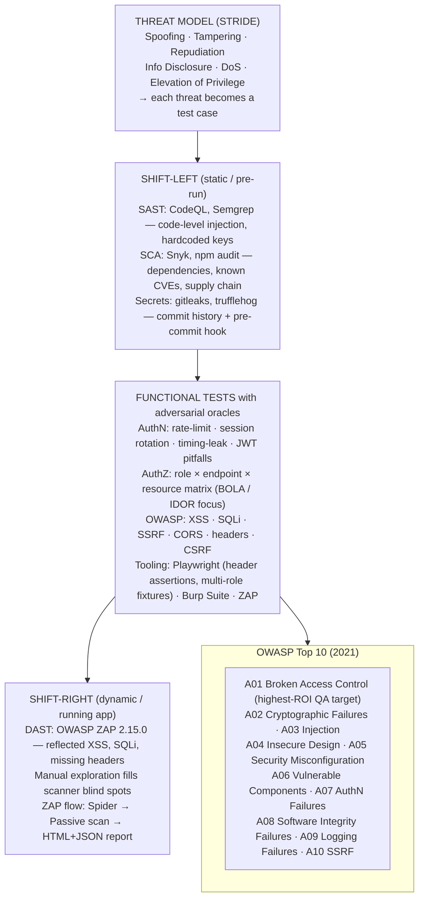

import Diagram from '../../../src/components/mdx/Diagram.astro';
import Prompt from '../../../src/components/mdx/Prompt.astro';
import PracticeTask from '../../../src/components/mdx/PracticeTask.astro';
import Feynman from '../../../src/components/mdx/Feynman.astro';
import Maintain from '../../../src/components/mdx/Maintain.astro';

## Core Idea

Security testing is the practice of asking "what could an adversary do to this system, and would we catch them?" — before a real adversary answers the question. It is **not** penetration testing on a budget; it is functional testing with adversarial oracles. A login test that asserts "valid credentials work" is functional QA. The same test expanded with "invalid credentials are rejected · brute force is rate-limited · session tokens rotate · timing differences don't leak account existence" is security QA. The discrimination is the *oracle*, not the test mechanism.

The five disciplines: **threat modelling** (STRIDE — convert threats to test cases), **AuthN/AuthZ verification** (the wrong user cannot reach the wrong resource), **OWASP Top 10 coverage** (the well-known classes every team must verify), **secrets hygiene** (nothing secret leaks via code, logs, or CI), and **SAST/DAST/SCA** (overlapping layers at different cost points). No single layer catches everything; the value is in the overlap.

> Security tests are functional tests with adversarial oracles. The tester's value lies in the attack classes they hold in their head — the tools are scaffolding around that knowledge.

<Diagram caption="Security testing layers: five overlapping disciplines, their primary tooling, and the OWASP categories each targets — plus the STRIDE threat-model cycle that feeds them all">



</Diagram>

## 1. Set up

Everything from a clean machine to a first passing ZAP baseline scan against a local target.

**Prerequisites:** Docker Desktop (or Docker Engine on Linux), Node ≥ 22.12.0, a terminal.

> This runbook uses OWASP Juice Shop as the scan target — it is a deliberately-vulnerable Node app maintained by OWASP specifically for security tool practise. Never point a DAST scanner at a system you do not own or have written permission to test.

### Pull ZAP and start Juice Shop

```bash
# Pull ZAP stable image (pinned to 2.15.0)
docker pull zaproxy/zap-stable:2.15.0

# Start OWASP Juice Shop locally on port 3000 — legal practice target
docker pull bkimminich/juice-shop:v17.1.1
docker run -d --name juice-shop -p 3000:3000 bkimminich/juice-shop:v17.1.1
```

Verify Juice Shop is up:

```bash
curl -s -o /dev/null -w "%{http_code}" http://localhost:3000
# Expected: 200
```

### Create the project folder

```bash
mkdir zap-runbook && cd zap-runbook && mkdir reports
```

### Run the ZAP baseline scan (passive only)

```bash
docker run --rm \
  --network host \
  -v "$(pwd)/reports:/zap/wrk:rw" \
  zaproxy/zap-stable:2.15.0 \
  zap-baseline.py \
    -t http://localhost:3000 \
    -g gen.conf \
    -r report.html \
    -J report.json \
    -I
```

Expected output (abbreviated):

```
WARN-NEW: Cookie No HttpOnly Flag [10010]
WARN-NEW: Cookie Without SameSite Attribute [10054]
WARN-NEW: Content Security Policy (CSP) Header Not Set [10038]
PASS: X-Content-Type-Options Header [10021]
...
FAIL-NEW: 0
WARN-NEW: 14
PASS: 36
```

The scan completes with exit 0 when using `-I` (ignore warnings as failures). The HTML report lands in `./reports/report.html`. Open it in a browser to inspect each finding.

> The `-I` flag treats `WARN` as informational, not a failure. Remove it in CI to fail the build on new warnings.

### Folder layout after setup

```
zap-runbook/
  reports/
    report.html      ← human-readable findings
    report.json      ← machine-readable for CI parsing
    gen.conf         ← generated rule configuration (edit to tune thresholds)
```

If the report is present and the scan returned exit 0, setup is complete. Move on.

## 2. Implement + best practice

### STRIDE walkthrough on an authentication endpoint

Apply each STRIDE category to `POST /auth/login` to produce threat → test mappings:

| STRIDE | Threat | Test |
|---|---|---|
| **Spoofing** | Login as a different user | Attempt login with another user's session token; verify server rejects it |
| **Tampering** | Modify `role` claim in JWT after issuance | Alter payload to `"isAdmin": true`; verify server rejects the tampered token |
| **Repudiation** | No audit log of failed login attempts | Check audit log after 10 failed attempts; verify events are written with timestamp + IP |
| **Info Disclosure** | Error message leaks whether username exists | Compare responses for `"user not found"` vs `"wrong password"`; they must be identical |
| **DoS** | Brute force with no rate limit | Send 20 requests in 5 seconds; verify 429 is returned before attempt 20 |
| **Elevation of Privilege** | Token issued with higher role than user has | Inspect token claims post-login; verify role matches DB row, not request body |

**Timing-leak variant (Info Disclosure):** measure mean response time for valid-user-invalid-password vs invalid-user-invalid-password. If the gap exceeds ~20 ms consistently, the server performs a password hash check only for known users — leaking account existence via timing. The structural fix is constant-time comparison regardless of whether the user was found.

### AuthZ matrix for `GET /orders/:id`

The highest-ROI test pattern for A01 (Broken Access Control):

| Caller | Resource owner | Expected | Actual (test result) |
|---|---|---|---|
| User A (auth) | User A | 200 — allowed | ✓ |
| User A (auth) | User B | 403 — forbidden | ← test this |
| Unauthenticated | User A | 401 — unauthorized | ← test this |
| Admin role | User A | 200 — allowed by policy | ← test this |
| User A (auth) | non-existent ID | 404 | ← test this |

Most teams test only the first row. BOLA/IDOR lives in row 2. The unauthenticated row catches missing middleware. The admin row verifies role elevation works correctly.

### Security headers in Playwright

Security headers are cheap to test once you wire a [[playwright]] response listener:

```ts
test('security headers are present and configured', async ({ page }) => {
  const response = await page.goto('/');
  const headers = response!.headers();

  expect(headers['strict-transport-security']).toMatch(/max-age=\d+/);
  expect(headers['x-content-type-options']).toBe('nosniff');
  expect(headers['x-frame-options']).toMatch(/DENY|SAMEORIGIN/);
  expect(headers['content-security-policy']).toBeDefined();
  // Verify CSP isn't trivially bypassed:
  expect(headers['content-security-policy']).not.toContain('unsafe-inline');
});
```

This runs alongside functional tests in [[cicd-for-testing]] with no extra infra — a single Playwright spec covers the entire security headers surface.

### Tuning the ZAP rule configuration

The generated `gen.conf` file controls per-rule thresholds. Edit it to silence known false positives without hiding real issues:

```
# gen.conf — ZAP rule tuning
# Format: rule-id  IGNORE|WARN|FAIL  reason
10054  IGNORE  # SameSite=None intentional for OAuth cross-site cookie
10038  WARN    # CSP not yet deployed — track as warning, not failure
10021  FAIL    # x-content-type-options must always be set
```

Re-run with the config applied:

```bash
docker run --rm \
  --network host \
  -v "$(pwd)/reports:/zap/wrk:rw" \
  zaproxy/zap-stable:2.15.0 \
  zap-baseline.py \
    -t http://localhost:3000 \
    -c /zap/wrk/gen.conf \
    -r report.html \
    -J report.json
```

### CI integration (GitHub Actions fragment)

```yaml
- name: Start Juice Shop
  run: docker run -d --name juice-shop -p 3000:3000 bkimminich/juice-shop:v17.1.1

- name: Wait for Juice Shop
  run: |
    for i in $(seq 1 30); do
      curl -sf http://localhost:3000 && break || sleep 2
    done

- name: ZAP baseline scan
  run: |
    docker run --rm --network host \
      -v "${{ github.workspace }}/reports:/zap/wrk:rw" \
      zaproxy/zap-stable:2.15.0 \
      zap-baseline.py -t http://localhost:3000 \
        -c /zap/wrk/gen.conf \
        -r report.html -J report.json

- name: Upload ZAP report
  uses: actions/upload-artifact@v4
  if: always()
  with:
    name: zap-report
    path: reports/
```

Remove `-I` from the scan command once your rule configuration is stable — from that point, any new `FAIL`-level finding breaks the build.

## 3. Common pitfalls

- **Running a ZAP scan and calling it "security tested."** Scanners find reflected XSS, missing headers, default credentials — and miss business-logic flaws, complex auth flows, and chained exploits. Fix: treat DAST output as *one layer* of coverage; pair it with an AuthZ matrix, a STRIDE walkthrough, and manual exploration of high-risk flows. This happens because automated output is visible, countable, and reportable — manual security work is not, so it gets skipped.

- **Using `-I` indefinitely in CI.** The flag suppresses `WARN`-level findings from failing the build. It is useful during initial integration while false positives are being triaged, but leaving it permanently means real new warnings are silently swallowed. Fix: triage `gen.conf` until known warnings are either `IGNORE` (documented false positives) or `FAIL` (must not regress), then remove `-I`. Any new finding then breaks the build by default.

- **Trusting the framework to escape XSS.** React escapes `{content}` — but `dangerouslySetInnerHTML`, server-rendered templates, and third-party rich-text libraries can re-introduce the class. Fix: test the actual rendered output for user-controlled content; run `` in every text input that renders to the DOM. Frameworks' defaults erode quietly across refactors.

- **Forgetting AuthZ on new endpoints.** A01 (Broken Access Control) is OWASP #1. The failure pattern is a new route added without a role check because "it's internal" or "we forgot." Fix: for every new endpoint, answer explicitly: which roles can call it? Which resource IDs can each role access? Document and test before the PR merges. The AuthZ matrix is not bureaucracy — it is the test design for the most critical bug class.

- **Treating `npm audit` output as binary signal.** 47 findings do not mean 47 vulnerabilities that must be patched tonight. Many CVEs are theoretical for your code paths (vulnerable function never called; only exploitable server-side and your use is client-side). Fix: triage by exploitability — trace the vulnerable code path, assess whether user input reaches it, and rank: patch-now · patch-next-sprint · accept with documentation · no exposure. Alert fatigue from untriaged audit output causes teams to ignore it entirely, which means they also ignore the real ones.

- **Hardcoding test credentials in code.** Test credentials end up in commit history. When the same credential pattern is reused for a real environment, or when the repo is later made public, the exposure is historical. Fix: use environment-injected fixtures; add a `gitleaks` pre-commit hook that catches password-shaped strings in test files before they are committed.

- **Not testing logout.** "Log in" gets tested; "log out" rarely does. The gap is where session-fixation lives: if the session token is not invalidated server-side on logout, and the token is stolen after the user logs out, the attacker holds a valid session indefinitely. Fix: verify server-side token invalidation, session destruction, and refresh-token revocation as part of the AuthN test suite — not just that the UI redirects.

## 4. Maintain

<div role="list" aria-label="Maintenance triggers and responses">
<Maintain trigger="OWASP ZAP ships a new stable release">
  1. Check the ZAP release notes for deprecated or renamed rule IDs — `gen.conf` entries referencing old IDs become no-ops silently.
  2. Update the `zaproxy/zap-stable` image tag in CI and in local `docker pull` commands.
  3. Re-run the baseline scan against Juice Shop. Compare the new `report.json` against the previous one — new `WARN-NEW` entries need triage.
  4. Update `gen.conf` for any new rule IDs that need custom thresholds.
  5. Update `verified.versions.zaproxy` and `verified.date` in this file's frontmatter.
</Maintain>

<Maintain trigger="A new WARN or FAIL appears in CI after a code change">
  1. Open the uploaded `zap-report` artefact from the CI run.
  2. Find the rule ID and description in the HTML report. Look up the rule at `https://www.zaproxy.org/docs/alerts/`.
  3. Determine whether it is a true positive (fix the app), a false positive (add an `IGNORE` entry to `gen.conf` with a comment), or a risk-accepted exception (add a `WARN` entry with documented rationale).
  4. Never raise the global threshold (`-I`) to make a CI run green — triage per-rule.
</Maintain>

<Maintain trigger="ZAP scan times out or fails to connect to the target">
  1. Verify the target is up before ZAP runs — add a readiness check loop to CI (curl with retry).
  2. Check Docker network mode. On Linux CI runners `--network host` works; on macOS Docker Desktop, use `host.docker.internal` instead of `localhost` as the target URL.
  3. If using a named Docker network, ensure both containers are on the same network: `docker network create zap-net`, then pass `--network zap-net` to both.
  4. Increase the spider timeout with `-m 5` (minutes) if the target is slow to crawl.
</Maintain>

<Maintain trigger="gen.conf entries stop matching (rules silently ignored)">
  1. Run the scan with `-d` (debug) to see which rules are loaded and whether `gen.conf` entries are parsed.
  2. Cross-reference rule IDs against the current ZAP release — IDs occasionally change between major versions.
  3. Check `report.json` for rule IDs present in the scan output; update `gen.conf` to match.
  4. Treat an `IGNORE` entry for a non-existent rule ID as a lint error — remove stale entries to keep the config auditable.
</Maintain>

<Maintain trigger="Juice Shop version is outdated (new CVE classes not present in challenges)">
  1. Check the Juice Shop release page for new challenge categories covering recently-added OWASP Top 10 patterns.
  2. Update the `bkimminich/juice-shop` image tag in the setup commands and CI workflow.
  3. Verify the new version still starts on port 3000 and responds 200 on `/`.
  4. Re-run the full baseline scan — Juice Shop updates sometimes introduce new intentional findings that need triage in `gen.conf`.
</Maintain>
</div>

## Retrieval Prompts

<Prompt id="sec-1">
  What is OWASP Top 10 A01:2021? Why did it move from #5 in 2017 to #1 in 2021? Give one concrete example of the bug class and one test that detects it.
</Prompt>

<Prompt id="sec-2">
  Distinguish AuthN and AuthZ. For each, name one specific bug (not just "it broke") and the test that reveals it. Then explain why AuthZ testing produces higher ROI for QA than AuthN testing.
</Prompt>

<Prompt id="sec-3">
  Name three JWT-specific vulnerabilities. For each: (a) what the attacker does, (b) the test in ≤2 sentences, (c) the structural fix.
</Prompt>

<Prompt id="sec-4">
  A user-content form accepts `&lt;img src=x onerror=alert(1)&gt;`. The framework escapes `&lt;script&gt;` tags. Does the test find an XSS bug? Explain why or why not, and name the two-layer structural defence.
</Prompt>

<Prompt id="sec-5" requiresDiagram>
  Apply STRIDE to an authentication endpoint. For each of the six categories, name one threat and the test case derived from it.
</Prompt>

<Prompt id="sec-6">
  Define SSRF. Name the AWS metadata endpoint used as the canonical SSRF test target. What class of feature must always be tested for SSRF, and why?
</Prompt>

<Prompt id="sec-7">
  A team runs `npm audit` and sees 47 findings. Describe your triage process. What four decisions can you make for each finding? Which one is most commonly skipped and why?
</Prompt>

<Prompt id="sec-8">
  Distinguish SAST, DAST, and SCA. For each: one tool, one bug class it catches, and one bug class it misses that another layer would catch.
</Prompt>

<Prompt id="sec-9">
  What does `Content-Security-Policy: unsafe-inline` mean for the policy's effectiveness? How do you test whether a deployed CSP is actually restrictive, rather than just present?
</Prompt>

<Prompt id="sec-10">
  A login endpoint takes 250 ms for a non-existent user and 450 ms for an existing user with the wrong password. Name the vulnerability class, explain the mechanism, and describe the structural fix.
</Prompt>

## Practice Task

<PracticeTask id="sec-task-1" rubric="sec-rubric-v1">
  Produce a security threat model and test plan for one feature. Suggested feature: the login flow of any app you have access to (the QA Learning site's `better-auth` login is a good candidate — it covers a frontend form, an API endpoint, session storage, and an audit-log surface).

  **Deliverable 1 — STRIDE threat model:**
  Walk the feature's components (at minimum: input form, API endpoint, session/token storage, error handling). For each component × STRIDE category, name one threat. Target: 15–30 threats total. Format as a table: Component | STRIDE category | Threat | Severity (High/Med/Low).

  **Deliverable 2 — Test plan derived from threats:**
  For each threat, name the test that detects it. Classify each test: Playwright (functional with adversarial oracle) · DAST (ZAP/Burp) · SAST (Semgrep rule) · Manual exploration. Aim for coverage across all four types.

  **Deliverable 3 — Three tests actually run:**
  Pick three high-priority threats and run the tests. Produce evidence: request/response captures, test output, or screenshots. For each: did it pass or fail? If failed, what is the remediation?

  **Deliverable 4 — AuthZ matrix:**
  For the feature, build the role × endpoint × resource-owner matrix. Test (or document as N/A) every cell. Include the unauthenticated role and at least one wrong-tenant or cross-user row.

  **Deliverable 5 — ZAP baseline scan:**
  Run `zap-baseline.py` against Juice Shop locally (follow Section 1 of this lesson). Produce the `report.json`. For each `WARN-NEW` or `FAIL-NEW` finding: name the OWASP category it maps to, decide whether it is a true positive or false positive, and write the `gen.conf` entry that correctly categorises it with a one-line rationale comment.

  Rubric (revealed after submission):
  - Does the STRIDE model produce ≥3 distinct threats per component, or does it repeat "injection" for every row? Repetition fails.
  - Does every threat map to a *specific* test (verb + parameter + expected response), not "test the auth"? Vague tests fail.
  - Does the AuthZ matrix include the unauthenticated role and at least one cross-user row? Missing either fails.
  - Did the candidate distinguish "tested and passed," "tested and failed," and "not testable from QA" honestly? Claiming "all pass" without evidence fails.
  - Did the ZAP triage produce per-rule `gen.conf` entries with rationale comments, or just a blanket IGNORE? Blanket ignores fail.
  - Did the three run tests produce real evidence (request/response capture or test output), not just assertions about what would happen? No evidence fails.
</PracticeTask>

## Feynman Prompt

<Feynman id="sec-feynman-1" wordTarget={150}>
  Explain security testing to a developer who thinks "we use HTTPS so we're secure." Cover: why transport encryption is one layer, not the whole picture; what the OWASP Top 10 represents and why A01 (Broken Access Control) is #1; and why a ZAP scan alone is insufficient. Give one concrete example of a bug that ZAP would miss and that an AuthZ matrix test would catch. Rubric (revealed after submit): Did you explain OWASP in terms of *bug classes*, not just a list? Did you name a specific, testable AuthZ scenario (not just "access control")? Did you avoid describing security testing as "pentesting" or "hacking"? Did your ZAP-missed example involve a business-logic or role-based flaw rather than a generic injection example?
</Feynman>
