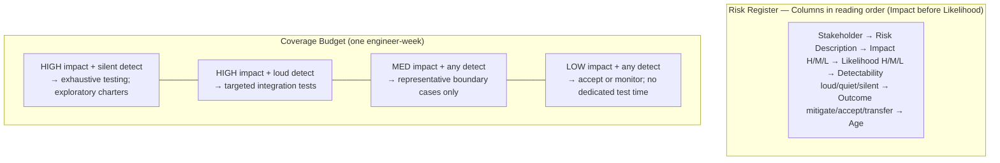

import Diagram from '../../../src/components/mdx/Diagram.astro';
import Prompt from '../../../src/components/mdx/Prompt.astro';
import Feynman from '../../../src/components/mdx/Feynman.astro';
import PracticeTask from '../../../src/components/mdx/PracticeTask.astro';

## Core Idea

Risk-based testing (RBT) is the explicit allocation of finite testing effort to where the cost of being wrong is highest. It is not a separate testing technique — it is the discipline of admitting that exhaustive testing is impossible and that the alternative to a deliberate allocation is an accidental one.

Two equations drive the practice. The base form: **Risk = Impact × Likelihood** — score each axis on a small scale, rank by the product. The FMEA-aware extension: **Risk = Impact × Likelihood × Detectability⁻¹** — a silent corruption is far more dangerous than a loud crash of equal impact because the user never notices the wrong answer.

The defining move: **read Impact before Likelihood**. A rare catastrophe outranks a frequent annoyance. Without this inversion, likelihood dominates discussion and high-stakes rare events get under-invested.

> RBT turns coverage from "what the spec lists" into "what would hurt the most if it broke" — and produces a written, ranked map to prove it.

## Diagram

<Diagram caption="Risk register structure: the three-axis model and column order that prevents likelihood-first bias">

</Diagram>

## Worked Example

A small product has six features: auth, quiz flow, payment, admin CSV export, marketing opt-in, and profile avatar upload. A sprint starts with a budget of 12 engineer-hours of test work.

**Without a risk register**, a tester walks the spec in document order. Auth and quiz get the first 8 hours — they're chapter 1 and 2. Payment gets 2 hours. Admin CSV export, marketing opt-in, and profile avatar share the remaining 2. Payment is under-invested; admin CSV export (which manipulates database records directly) gets 20 minutes.

**With a risk register**, the team fills in the columns for each feature, naming the learner as the primary stakeholder:

| Stakeholder | Risk | Impact | Likelihood | Detectability | Outcome |
|---|---|---|---|---|---|
| learner | payment double-charge | H | L | silent | mitigate via test |
| learner | quiz answer corrupted silently | H | L | silent | mitigate via test |
| learner | session expires mid-quiz | H | H | loud | mitigate via test |
| site owner | admin CSV overwrites wrong rows | H | L | silent | mitigate via test |
| learner | marketing opt-in ignored | M | L | quiet | mitigate via design |
| learner | avatar upload fails | L | L | loud | accept |

Reading Impact before Likelihood surfaces a reordering: payment double-charge and quiz silent corruption — both rare but catastrophic and silent — jump to the top despite low likelihood. The 12-hour budget flows there first.

**The diff between the two allocations is the lesson.** Without the register, quiet-corruption risks get 20 minutes of coverage because likelihood anchors the decision. With the register, they get proportional investment because impact, then detectability, anchor it.

One entry is deliberately marked "accept" — avatar upload. Accepting is a legitimate outcome. A register where every risk is mitigated reveals overcaution, not rigour; the budget must have a drain.

## Common Pitfalls

- **Likelihood-first scoring.** Likelihood is the easier number to guess, so it quietly dominates when it appears first in a table or in discussion. Fix: place the Impact column to the left of Likelihood — physically. The column order forces the conversation. Why it happens: "how likely is this to break?" is the intuitive first question, but the more actionable one is "how bad if it does?"
- **False-precision numerical scores.** Debates about whether a risk is 6 or 7 on a 1–10 scale consume time without changing the decision. Fix: use low / medium / high (or 1–3) unless you have historical data that earns finer granularity. Why it happens: spreadsheet tools default to wide numeric ranges and they *look* precise.
- **Skipping the stakeholder column.** A risk score without a named stakeholder is an opinion wearing a number. Fix: require every row to name whose impact is being measured before scoring. Why it happens: the stakeholder feels implied ("obviously the user"), but the same event scores differently for different stakeholders.
- **Forgetting detectability.** Silent-corruption bugs — the system returns plausible-looking wrong output — are the highest-severity class and they hide from impact-only scoring. Fix: add a detectability column (loud / quiet / silent) and make "silent" a flag for escalated test investment. Why it happens: loud failures are memorable; silent ones are, by definition, not.
- **No decay management.** A three-month-old risk register is full of mitigated risks crowding out new ones. Fix: add an "age" column; at each sprint start, retire rows that have been mitigated, transferred, or feature-flagged off. Why it happens: creating the register is visible work; maintaining it is not.
- **Treating the workshop output as the only input.** Workshop-elicited risks reflect what the team *expects* to go wrong, anchored to what went wrong recently. Fix: pair the workshop with the operational profile from access logs whenever logs exist — a feature used in 35% of sessions justifies more investment than one used in 0.05%, regardless of workshop opinion. Why it happens: logs require effort to query; workshops happen in the room.
- **Confusing risk register with bug list.** A bug is a realised problem; a risk is a hypothetical one. Mixing them in the same table makes both less useful. Fix: keep separate tables. Why it happens: both items feel like "things that could go wrong."

## Retrieval Prompts

<Prompt id="rbt-1">
  State the two-axis and three-axis formulations of risk in your own words. Give a concrete example where the third axis (detectability) changes which risk gets the most testing investment compared with the two-axis score alone.
</Prompt>

<Prompt id="rbt-2">
  Why does reading Impact before Likelihood matter? Name the cognitive bias this column order interacts with, and describe what happens to rare-but-catastrophic risks when Likelihood is read first.
</Prompt>

<Prompt id="rbt-3">
  A risk register has 47 entries, 12 added last sprint. You open it at the start of the current sprint. What is the first audit question you ask, and what does the answer tell you about register health?
</Prompt>

<Prompt id="rbt-4">
  A teammate says "every risk in our register must have a mitigating test." How do you reply? Give the name of the outcome column value that directly contradicts this claim, and explain why that outcome is legitimate.
</Prompt>

<Prompt id="rbt-5">
  Explain in one paragraph what an operational profile is and why it converts likelihood from opinion to evidence. Name the primary source most associated with the concept.
</Prompt>

<Prompt id="rbt-6">
  A team's likelihood score for "session expires mid-form" is 4/5 and for "database is unreachable" is 2/5. Are these numbers trustworthy as decision inputs? What evidence would you want before staking test budget on them?
</Prompt>

<Prompt id="rbt-7" requiresDiagram>
  Sketch a risk register as a table. Include all columns you would require on a real team — in the order that prevents likelihood-first bias — and circle the one column most teams omit.
</Prompt>

## Practice Task

<PracticeTask id="rbt-task-1" rubric="rbt-rubric-v1">
  Pick one feature of one real product — this site's quiz flow, a public open-source app's checkout, or your own side project. Produce a risk-based coverage plan.

  Submit:

  1. A risk register with at least 8 rows. Required columns (in this order): stakeholder, risk description, impact (low/med/high), likelihood (low/med/high), detectability (loud/quiet/silent), proposed outcome (mitigate via test / mitigate via design / accept / transfer), and age (date added).
  2. For each row marked "mitigate via test": one paragraph describing the test concretely enough that someone else could write it.
  3. A coverage plan: given a budget of one engineer-week, which rows get tested, which are accepted, and which are transferred? Justify each accepted or transferred row in one sentence.
  4. A 200-word reflection on which rows would have been missed without the register, and which elicitation input (workshop impact scoring, pre-mortem narrative, operational profile from logs) surfaced them.

  Rubric (revealed after submission):
  - Did you name the stakeholder on every row? Un-stakeholdered scores are a fail.
  - Do at least 2 rows score "silent" on detectability? If none do, you didn't look hard enough — silent-corruption bugs exist in almost every system.
  - Is at least 1 row marked "accepted" with honest reasoning? A register where everything is mitigated reveals overcaution, not rigour.
  - Does the coverage plan match the budget? "Test everything in the register" is a fail — the whole point is allocation under constraint.
  - Does the reflection identify one elicitation input you almost skipped? The pre-mortem is the most-skipped and the most generative.
</PracticeTask>

## Feynman Prompt

<Feynman id="rbt-feynman-1" wordTarget={150}>
  Explain risk-based testing to a developer who currently tests features in spec-order. Why is spec-order testing a problem, and what does a risk register change about how effort is distributed? Make sure your explanation names the impact × likelihood formula, explains why Impact is read before Likelihood, and gives one concrete example of a risk that spec-order testing would under-invest in. Rubric (revealed after submit): Did you name the specific failure mode spec-order testing produces (uniform or chapter-order coverage)? Did you explain the Impact-first rule with a reason, not just a label? Did your concrete example include a stakeholder?
</Feynman>
