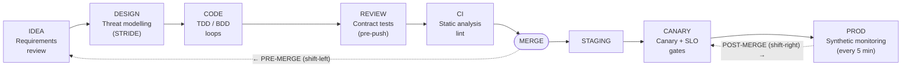

import Diagram from '../../../src/components/mdx/Diagram.astro';
import Prompt from '../../../src/components/mdx/Prompt.astro';
import Feynman from '../../../src/components/mdx/Feynman.astro';

## Core Idea

"Shift-left" and "shift-right" are not opposites — they are complementary halves of one idea: **compress the latency between introducing a defect and noticing it**, from both ends of the lifecycle. Shift-left means testing earlier than tradition: requirements review, static analysis, threat modelling, contract tests, TDD. Shift-right means testing later than tradition: feature flags, canary releases, synthetic monitoring, chaos engineering, observability dashboards.

The operational frame that makes this actionable is the **merge boundary**. Every test belongs on one side of it. Pre-merge tests catch bugs that are cheapest to fix on the developer's branch. Post-merge instrumentation catches bugs that are only visible under real load, real data, and real usage patterns — conditions no test environment reproduces. As [[sdlc-delivery-models]] establishes, the cost of a defect is mostly the cost of the time between introducing and noticing it.

> Ask not "are we shift-left or shift-right?" — ask "what evidence do we want before merge, what evidence do we want after deploy, and what is the cheapest source of each?"

## Diagram

<Diagram caption="SDLC timeline: pre-merge and post-merge test activities placed concretely">

</Diagram>

## Worked Example

A team ships a new export feature — "users can export account history as CSV."

**Pre-merge (shift-left) moves they apply:**

1. **Requirements review** (left-most): a tester reads the draft spec and asks "what delimiter does Excel use in German locale?" The answer reveals a locale bug before any code exists. Cost: 15 minutes.
2. **Threat modelling (STRIDE)**: 30-minute session produces three findings — missing rate limit (denial of service), no audit log (repudiation), unbounded row export (info disclosure). Each becomes a test case before implementation starts.
3. **TDD**: the export formatter is written test-first; the red/green loop forces the developer to handle the empty-history case, which the spec did not mention.
4. **Static analysis**: TypeScript strict catches a `string | undefined` passed where `string` is required, surfacing a null-reference path.
5. **Contract test**: the export endpoint is covered by a consumer-driven contract test that runs on every branch push.

**Post-merge (shift-right) moves they apply:**

6. **Feature flag rollout**: export is shipped behind a flag, turned on for 1% of users. Error rate on the `/export` endpoint is watched on the SLO dashboard.
7. **Canary gate**: at 1% the team sees a 3× spike in 429 responses — rate limit too tight for power users. Flag rolled back automatically. Fix deployed; rollout resumes.
8. **Synthetic monitoring**: a Playwright script runs against production every 5 minutes, signs in as a test account, and triggers a 10-row export. A dependency outage at 02:14 fires an alert before any user reports it.

Without the pre-merge moves the team ships locale bugs and security gaps. Without the post-merge moves they learn about the rate-limit issue from support tickets three days later.

## Common Pitfalls

- **"Shift-left" as a slogan without a named gate.** "Test earlier" is aspiration. The version that pays is naming the specific pre-merge gate — lint, contract test, threat-model session — and declaring what bug class it catches. Fix: for each shift-left move, record the gate name and the bug class in the team's Definition of Done. Reason: unfunded aspirations produce meeting slides, not caught bugs.
- **Treating the two shifts as rivals.** "We're shift-left now, we don't need canaries" leaves production-only bugs undetected. Fix: build both pre-merge and post-merge muscles; ask per-change which side catches each bug class cheapest. Reason: some defects are only observable under real load and real data — no pre-merge technique reaches them.
- **Under-investing in static analysis.** Teams that feel under-tested often have under-configured TypeScript strict and ESLint, not too few test cases. Fix: spend one engineer-week on strict config before adding new test files. Reason: static rules catch per-keystroke at zero marginal cost; the marginal test has much higher upkeep.
- **Feature flags without observability.** Toggling a flag without a pre-declared SLO dashboard is toggling blind. Fix: before enabling a flag in production, define the two or three metrics that constitute "this is safe." Reason: [[verification-vs-validation]] — you cannot validate what you cannot observe.
- **Canaries without auto-rollback.** A canary with a human rollback decision fails at 2 a.m. Fix: define the SLO threshold that triggers rollback; automate the trigger. Reason: manual processes require someone awake and paying attention — production outages don't schedule themselves.
- **Synthetic monitoring you don't watch.** Synthetics that fire into a dead alert channel produce false confidence. Fix: every synthetic script must have a live on-call destination before it runs against production. Reason: an un-observed alarm is indistinguishable from no alarm.
- **Requirements review unclaimed by QA.** The cheapest bug to fix is the requirement that was never written. Testers who read draft requirements before code prevent more cost than testers who test code after — but no dashboard credits it. Fix: make requirements review a named, time-boxed activity in every sprint ceremony. Reason: what doesn't appear on a velocity chart doesn't get prioritised.

## Retrieval Prompts

<Prompt id="slsr-1">
  Re-state shift-left and shift-right using only the pre-merge / post-merge axis. What does each side of the merge boundary catch cheapest, and what does each side miss?
</Prompt>

<Prompt id="slsr-2">
  Name three concrete shift-left moves and three concrete shift-right moves available in a modern web-app team. For each, state one bug class it reliably catches and one it cannot.
</Prompt>

<Prompt id="slsr-3">
  A team has strong pre-merge gates (TypeScript strict, unit tests, code review) but no post-merge instrumentation. What is the first reliable failure mode they will encounter, and what is the smallest single move to fix it?
</Prompt>

<Prompt id="slsr-4">
  Explain feature flags as a testing tool — not as a delivery tool. What are the two preconditions that make a flagged rollout a safe production test rather than a gamble?
</Prompt>

<Prompt id="slsr-5">
  Why is requirements review a shift-left activity testers should claim? Why does almost no QA dashboard credit it, and what does that mean for how teams fund the activity?
</Prompt>

<Prompt id="slsr-6" requiresDiagram>
  Draw the software lifecycle as a timeline and mark the merge boundary. Place these seven activities on it: static analysis, TDD, threat modelling, contract test, code review, canary release, synthetic monitoring. For each, label the bug class it primarily catches.
</Prompt>

<Prompt id="slsr-7">
  A colleague says: "We have canaries and feature flags — we don't need a test suite." Give a two-sentence rebuttal and name the specific bug class their current setup will miss first.
</Prompt>

## Feynman Prompt

<Feynman id="slsr-feynman-1" wordTarget={150}>
  Explain shift-left and shift-right to a developer who believes "testing happens before release." What is the merge boundary, and why does it matter more than the release boundary as a frame for deciding where to place a test? Name one concrete pre-merge move and one concrete post-merge move, and state the bug class each catches that the other cannot. Rubric (revealed after submit): Did you use "merge boundary" as the central frame rather than "release"? Did you name a concrete move on each side (not just "test earlier / test later")? Did you describe a bug class that pre-merge techniques cannot reach — proving why shift-right is necessary rather than optional?
</Feynman>
