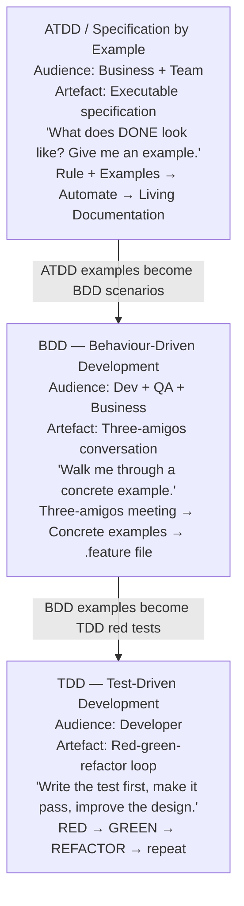

import Diagram from '../../../src/components/mdx/Diagram.astro';
import Prompt from '../../../src/components/mdx/Prompt.astro';
import Feynman from '../../../src/components/mdx/Feynman.astro';

## Core Idea

TDD, BDD, and ATDD all write the test before the code. They look alike on a workflow diagram and are constantly confused — but they serve three different audiences and produce three different artefacts.

**TDD** (Test-Driven Development) is for the **developer**. Its value is *design pressure*: writing a test first forces the developer to define the interface before the implementation, which produces decoupled, testable code. The artefact is a red-green-refactor history. **BDD** (Behaviour-Driven Development) is for the **whole team** — dev, QA, and business, talking before code. Its value is *shared understanding*. The artefact is the three-amigos conversation; the `.feature` file is its minutes. **ATDD** / Specification by Example is for the **business + team agreeing on done**. Its value is a *verifiable acceptance criterion* that doubles as living documentation.

> Ask who is in the room when the test is written. That is the practice you are doing — and the practice determines what the test ends up being for.

## Diagram

<Diagram caption="Three test-first practices: audience, feedback loop, and primary artefact">



</Diagram>

## Worked Example

A team is building a discount rule: *"Users receive a 10% discount on their second order within 30 days."*

**Step 1 — ATDD: nail done before code touches the keyboard.**

A business analyst drafts the rule. A tester triggers the three-amigos by asking for concrete examples. Five examples emerge from the conversation:

| # | Scenario | Expected |
|---|---|---|
| 1 | First order, no prior orders | No discount |
| 2 | Second order, 15 days after first | 10% discount |
| 3 | Second order, 31 days after first | No discount |
| 4 | Second order, first order was refunded | No discount |
| 5 | Third order within 30 days | No discount (only second) |

Row 4 came from a QA question. Row 5 came from the developer asking about the word "second." Neither appears in the original rule statement. Without the conversation, the implementation handles rows 1–3 and ships rows 4–5 as production bugs.

The team automates the table as a parameterised Vitest test — this is now both the acceptance test and the living documentation. If the rule changes, the table row changes; the test re-runs; the doc updates automatically (see [[test-design-techniques]] for the decision-table technique behind this).

**Step 2 — BDD: the conversation happens before code.**

The three-amigos session for example row 4 surfaces a design question: "what does 'first order' mean when it was refunded?" The answer is a business decision, not a code decision. BDD installs the discipline of making it *before* the developer writes a line. The `.feature` file, if written, is the minutes of this meeting — not the meeting itself.

**Step 3 — TDD: the developer implements using red-green-refactor.**

Taking example row 2 as the first red test:

```ts
// RED — test fails; function doesn't exist yet
test('should apply 10% discount on second order within 30 days', () => {
  const result = applyDiscount({ orderNumber: 2, daysSinceFirst: 15 });
  expect(result.discountPct).toBe(10);
});
```

Simplest green: return `{ discountPct: 10 }` as a constant. The test passes. Now write example row 1:

```ts
test('should not discount the first order', () => {
  const result = applyDiscount({ orderNumber: 1, daysSinceFirst: 0 });
  expect(result.discountPct).toBe(0);
});
```

The constant fails. The triangulation forces the real logic. The refactor step then extracts `isEligibleForDiscount` as a pure function — a design decision that *emerged from* the test-first loop, not from up-front design. Coverage of row 4 (refunded order) adds the `wasRefunded` parameter to the interface cleanly, because the function was designed to accept exactly what the test needs.

This composition — ATDD examples → BDD conversation → TDD loop — is how the three practices **compose without colliding**. Each adds something the others don't: ATDD verifies *what* to build, BDD surfaces *all the cases*, TDD shapes *how the code is structured*.

## Common Pitfalls

- **BDD = Cucumber.** Teams adopt Gherkin and call it BDD without ever holding a three-amigos conversation. The result is expensive unit tests written in English prose — verbose, slow, and carrying none of BDD's actual value. Fix: identify whether non-programmers read or write the `.feature` files. If not, plain test code with descriptive names (`given_orderIsFirst_when_discountApplied_then_zeroPercent`) beats Gherkin on every dimension. Reason: the conversation is the practice; Gherkin is one artefact the conversation can produce.
- **Red-green-stop (skipping the refactor).** Most TDD newcomers do red → green → commit. The refactor step is where design pressure becomes design *change*. Fix: budget time for the refactor in every cycle; treat a test that stays green through a meaningful rename, extraction, or inlining as the minimum evidence of design work. Reason: without refactor, TDD produces green tests on bad code, which is expensive to maintain and loses the practice's primary value.
- **Mock-heavy TDD by default.** Mocking every collaborator produces tests that re-encode the implementation — they break whenever the implementation moves, which is the opposite of what TDD should deliver. Fix: use real collaborators where affordable; mock at process boundaries (HTTP, filesystem, external APIs). Reason: the classicist school (Beck, Shore) produces decoupled code; the mockist-by-default school produces fragile test suites that slow refactoring.
- **Naming tests by sequence number.** A test named `test_foo_2` exerts no design pressure, because pressure requires a named behaviour to push toward. Fix: adopt `given_X_when_Y_then_Z` or `should_do_X_when_Y` naming conventions and refactor names alongside the code. Reason: the name is the specification — an unnamed test is an unspecified behaviour.
- **Treating Gherkin as a programming language.** Gherkin produces verbose step definitions, slow test runs, and coupling between step text and implementation. Fix: if the audience for the `.feature` file is developers only, write plain test code — it is faster to write, faster to run, and easier to refactor. Reason: Gherkin's verbosity is a feature only when non-programmers are the audience; otherwise it is pure cost.
- **Acceptance tests outside CI.** An ATDD table that does not run in CI is decoration. Fix: wire every acceptance test to the build pipeline; failing acceptance tests block merge. Reason: a specification that can drift from the implementation is not a specification — it is a document.
- **AI-generated tests claimed as TDD.** An LLM writing a green test for code that already exists skips the red step entirely. The design-pressure value of TDD depends on the red step — the test that fails is the specification the code is written to satisfy. Fix: use AI-generated tests for characterisation of existing behaviour (valuable for legacy code); do not call them TDD. Reason: post-hoc tests describe what the code does; TDD tests specify what the code should do — the distinction is the entire practice.

## Retrieval Prompts

<Prompt id="tba-1">
  Map TDD, BDD, and ATDD onto "who is in the room when the test is written." For each practice, state the primary audience, the primary artefact, and the primary value delivered — in one sentence each.
</Prompt>

<Prompt id="tba-2">
  A team is writing Gherkin `.feature` files and calling it BDD. No three-amigos conversations happen. Are they doing BDD? Explain why or why not, and name the one thing they are producing instead of the one thing BDD is supposed to produce.
</Prompt>

<Prompt id="tba-3">
  Explain the TDD refactor step in one paragraph. Why is red-green-stop not TDD? What design change should the refactor step produce, and what does "design pressure" mean in concrete terms?
</Prompt>

<Prompt id="tba-4">
  State the classicist vs mockist disagreement in TDD. Which approach would you pick by default for application code, and why? Name the failure mode of the approach you did not choose.
</Prompt>

<Prompt id="tba-5">
  A teammate writes a test for code that already exists using an LLM, then says "look — I just did TDD." What is wrong with the claim? What is the name for what they actually produced, and where is that type of test genuinely useful?
</Prompt>

<Prompt id="tba-6" requiresDiagram>
  Sketch the composition of ATDD → BDD → TDD on a single feature. Show what artefact each step produces, which audience owns each artefact, and which artefact survives as living documentation after the feature ships.
</Prompt>

<Prompt id="tba-7">
  Why does "Specification by Example" describe ATDD more precisely than "Acceptance Test-Driven Development"? What does the precision buy the team — name one specific failure mode the more precise label prevents.
</Prompt>

## Feynman Prompt

<Feynman id="tba-feynman-1" wordTarget={150}>
  Explain TDD, BDD, and ATDD to a developer who thinks they are three names for "writing tests before code." What is the single most important distinguishing question you would ask to identify which practice is happening — and why does it matter? Name one concrete failure mode each practice prevents that the other two cannot. Rubric (revealed after submit): Did you identify "who is in the room" as the distinguishing question, not the syntax or tooling? Did you name a distinct failure mode per practice — not just "catches bugs earlier"? Did you avoid claiming that Gherkin or Cucumber is synonymous with BDD?
</Feynman>
