import Diagram from '../../../src/components/mdx/Diagram.astro';
import Prompt from '../../../src/components/mdx/Prompt.astro';
import Feynman from '../../../src/components/mdx/Feynman.astro';

## Core Idea

A **test shape** is a chosen distribution of effort across cost/feedback tiers — not a count of tests. Each tier has a different cost to write, cost to run, and signal strength when green. The pyramid (Cohn, 2009) prescribes many cheap fast tests at the base and few slow expensive tests at the top. The trophy (Dodds, 2018) extends that insight to modern frontend: add a static tier at the base and push the bulge to integration tests, because in component-composed systems most bugs live at the seams between modules, not inside any single one.

Neither shape is universally correct. The right shape is a function of *where bugs live in this architecture* — and that answer changes as the architecture changes.

> The test pyramid tells you what to count; the cost/feedback trade-off tells you what to think about. Choose the shape that buys the most confidence per dollar per second for this system.

## Diagram

```mermaid
flowchart TD
    subgraph PY["PYRAMID (Cohn) — backend-heavy systems, deep logic"]
        PE2E["E2E (few)"]
        PI["Integration"]
        PU["Unit (many)"]
        PE2E --> PI --> PU
    end
    subgraph TR["TROPHY (Dodds) — frontend/API, logic lives in module composition"]
        TE2E["E2E (few)"]
        TI["Integration (bulge)"]
        TU["Unit"]
        TS["Static (base)"]
        TE2E --> TI --> TU --> TS
    end
    subgraph IC["ICE CREAM CONE (anti-pattern) — legacy/untested systems"]
        IE2E["E2E (many)"]
        IM["Manual"]
        II["Integration"]
        IU["Unit (few)"]
        IE2E --> IM --> II --> IU
    end
    subgraph INV["INVERTED (data pipelines) — bugs live at seams and production data shapes"]
        NI["Integration (many)"]
        NU["Unit (few)"]
        NI --> NU
    end
```

<Diagram caption="Four test shapes and when each fits">

</Diagram>

## Worked Example

A `<QuizRunner>` React island has the following suite:

- 12 unit tests on its internal state reducer (fast, green)
- 0 render-and-click integration tests on the composed island
- 1 Playwright E2E that exercises the full quiz flow end-to-end (slow, sometimes flaky)

The team adds a feature: when the user answers all questions, the final score re-renders with an animation class. The reducer correctly updates state. The E2E is non-deterministic — it retries until green.

A regression is introduced: the score element conditionally unmounts and remounts, breaking the animation. The reducer unit tests pass (state is correct). The E2E passes on the third retry.

**Diagnosis using the trophy:** the test shape has a hollow middle. The missing tier is an integration test: render the island, click through questions, assert the score element appears with the right class. That test would have caught the regression in milliseconds, without needing a browser, and without the E2E flake budget.

**The shape conversation becomes an architecture conversation.** If integration tests of the island are hard to write because everything is coupled to a global data store with no injection seam — that is not a testing problem. It is an architecture problem the test shape made visible.

**Wall-clock reality check:** plotting the current suite on three axes — run time, maintenance hours per month, bugs caught per quarter — nearly always surprises teams. A 1,200-test unit suite that runs in 4 seconds and catches no bugs that E2E misses is lighter than it looks. A 40-test E2E suite that takes 18 minutes and flakes 8% of the time is heavier than it looks. The shape emerges from those three numbers, not from the count.

## Common Pitfalls

- **Counting tests instead of measuring cost.** The pyramid is a picture of effort distribution, not a count. Fix: plot wall-clock run time and maintenance hours per tier rather than test counts. Reason: counts hide the real variable — one slow flaky Playwright spec costs more than 5,000 unit tests.
- **Treating the pyramid as a rule rather than a model.** The pyramid was written in 2009 for backend monoliths. Fix: match the shape to the architecture and the bug distribution; expect both to evolve when the architecture changes. Reason: different coupling profiles (microservices, data pipelines, frontend islands) move the bug-seam to a different tier.
- **Removing E2E coverage of critical flows in the name of "shape."** Reading "few E2E" as "E2E is bad" leads teams to delete valuable end-to-end coverage. Fix: keep at least one E2E per critical user journey (login, checkout, payment) per release; the pyramid is not a knife. Reason: some flows require full-stack confirmation and no lower tier can substitute.
- **Tolerating an E2E flake rate above 5%.** Once a suite passes below 95% reliably, teams re-run until green — which is gambling, not testing. Fix: either fix the flake or move the assertion down to an integration tier where it is stable. Reason: re-runs destroy the suite's credibility and corrode the team's habit of trusting the signal.
- **Mock-heavy unit tests that re-encode the implementation.** Heavy mocking makes the unit tier expensive to maintain and weak in signal. Fix: apply "test the contract not the implementation" — test public interfaces and let internal details change freely. Reason: a test that breaks whenever the implementation moves provides no protection and high friction.
- **Ignoring the static tier.** TypeScript strict mode, lint with `no-floating-promises`, type-narrowed nullability — these are tests that run in milliseconds and catch real bug classes. Fix: treat the static tier as the base of the trophy; count it in the shape conversation. Reason: most teams under-invest in static analysis because it doesn't feel like "testing."
- **Declaring the hourglass intentional.** Some teams end up with many unit tests and many E2E tests and nothing in the middle, then rationalise it. Fix: invest in test infrastructure (containers, factories, seeded data) to make integration tests viable. Reason: integration tests are hard to set up, so teams avoid them — but that avoidance is a cost, not a strategy.

## Retrieval Prompts

<Prompt id="tpt-1">
  Explain in one paragraph why Kent C. Dodds proposed the testing trophy as an extension of the pyramid, not a contradiction. What property of modern frontend systems makes the integration tier disproportionately valuable?
</Prompt>

<Prompt id="tpt-2">
  Your team's E2E suite passes 88% of the time on main. Name the practical cost of that 12% failure rate and state two actions you take in order — and one action you explicitly refuse to take.
</Prompt>

<Prompt id="tpt-3">
  A microservice with three internal modules and four downstream HTTP dependencies. Sketch the test shape you would propose and justify it in two sentences.
</Prompt>

<Prompt id="tpt-4">
  Why is "100% unit-test coverage" a weaker quality signal than "the top 10 critical user flows have at least one E2E test per release"? Give a concrete example where the first metric passes while the second would have caught a bug.
</Prompt>

<Prompt id="tpt-5" requiresDiagram>
  Draw the test shape for a data-pipeline system. Label one bug class each tier catches and one bug class each tier misses.
</Prompt>

<Prompt id="tpt-6">
  A teammate proposes adding 60 Playwright tests to cover edge cases of the search filter. What is the first question you ask before agreeing, and what shape-level move is more likely to be the right answer?
</Prompt>

<Prompt id="tpt-7">
  The test pyramid is described as a picture of effort distribution, not a count. Restate this distinction using wall-clock time and maintenance hours as your units instead of test counts. What changes about how you evaluate a suite's shape?
</Prompt>

## Feynman Prompt

<Feynman id="tpt-feynman-1" wordTarget={150}>
  Explain the test pyramid and the testing trophy to a developer who believes that "more unit tests are always better." What is the actual variable the pyramid asks you to optimise — and why is it not test count? Describe the specific failure mode the trophy's integration bulge is designed to catch that a heavy unit suite misses. Rubric (revealed after submit): Did you name cost/feedback tier rather than count as the core variable? Did you identify where bugs live in component-composed systems (at the seams, not inside modules)? Did you avoid saying one shape is universally superior to the other?
</Feynman>
