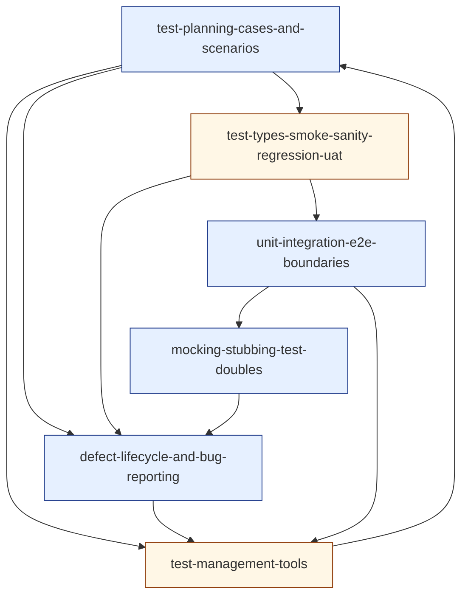

# Cluster 3 — Functional Execution & Test Management (research overview)

> Cluster-level synthesis sitting on top of the six topic-research files in `./cluster-3-functional-execution-test-management/`.
> Purpose: capture the **cluster as a unit** — positioning, recurring threads, interleaving rules, prerequisite ordering, depth-gate notes — so the author can hold the whole cluster in their head before authoring any single topic.
> Source taxonomy in `revamp-doc/clusters-and-topics.md`; per-topic research in the sibling directory. Companion to [`cluster-1-foundations.md`](./cluster-1-foundations.md) and [`cluster-2-test-design-strategy.md`](./cluster-2-test-design-strategy.md).

---

## 1. What this cluster does

Cluster 3 installs the **artefact discipline of day-to-day testing** — the records testers produce that *make the work legible to everyone who isn't a tester*. None of its topics is an idea or a strategy; all of them are *the things a tester ships on a Tuesday*: a test plan, a numbered case, a bug report, a regression-suite addition, a row in a TMT dashboard. The cluster's success criterion is that a learner who finishes it can produce these artefacts in *the cheapest viable form* — and can defend, in writing, why a heavier form would have been wasted.

This is the cluster where the curriculum's **execution layer** is set. Cluster 1 installed the posture; Cluster 2 installed the strategy; Cluster 3 installs *the operational artefacts those strategies materialise as*:

- **Plans are negotiations, not documents** — the value is the conversation the plan forces, the out-of-scope it pins, the stopping criteria it commits to. *(See [`test-planning-cases-and-scenarios`](./cluster-3-functional-execution-test-management/test-planning-cases-and-scenarios.md).)*
- **Smoke, sanity, regression, UAT are *roles*, not suites** — same test code playing different roles at different moments. *(See [`test-types-smoke-sanity-regression-uat`](./cluster-3-functional-execution-test-management/test-types-smoke-sanity-regression-uat.md).)*
- **Test levels are *seams*, not labels** — the right question is which boundaries the test crosses, not which folder it lives in. *(See [`unit-integration-e2e-boundaries`](./cluster-3-functional-execution-test-management/unit-integration-e2e-boundaries.md).)*
- **Test doubles are five named tools, not synonyms** — and "don't mock what you don't own" is the load-bearing architectural rule. *(See [`mocking-stubbing-test-doubles`](./cluster-3-functional-execution-test-management/mocking-stubbing-test-doubles.md).)*
- **A bug report is a sales pitch** — its job is to convince a developer to spend their next 30 minutes; everything in its structure serves that purpose. *(See [`defect-lifecycle-and-bug-reporting`](./cluster-3-functional-execution-test-management/defect-lifecycle-and-bug-reporting.md).)*
- **Test management tools are leverage when readers of the records are outside engineering** — and overhead otherwise. *(See [`test-management-tools`](./cluster-3-functional-execution-test-management/test-management-tools.md).)*

A learner who finishes Cluster 3 with these six framings internalised is *operationally fluent* — equipped for Cluster 4 (automation toolbelt — where the cases become Playwright specs, the bug reports become Sentry alerts, the runs stream to dashboards), Cluster 5 (non-functional specialisations — which all consume Cluster 3's artefact vocabulary), and Cluster 6 (AI/LLM QA — which requires every Cluster 3 artefact to be re-derived for non-deterministic systems). Cluster 3 is the **execution** cluster; everything before it is theory, everything after it is variation.

---

## 2. Recurring threads across the cluster (the interleaving fuel)

Per `best-way-to-build-learning-webapp.md` §5 and `content-template-and-mechanics-map.md` §2, **interleaving inside the cluster is the highest-leverage move the platform makes**. Interleaving works only when the cluster's topics genuinely *share concepts*. Cluster 3's topics share four threads, each rich enough to fuel a multi-card retrieval session.

### Thread A — *the artefact-economy thread*

Every Cluster 3 topic produces *records* with a *maintenance cost paid forever*. The recurring question is the same:

- `test-planning-cases-and-scenarios` — what's the cheapest artefact that does the *visibility job*?
- `test-types-smoke-sanity-regression-uat` — what's the cheapest *role-assignment* that names the right question?
- `unit-integration-e2e-boundaries` — what's the cheapest *level* that catches this bug class?
- `mocking-stubbing-test-doubles` — what's the cheapest *double* that lets the test pass for the right reason?
- `defect-lifecycle-and-bug-reporting` — what's the cheapest *report* that gets fixed by lunch?
- `test-management-tools` — what's the cheapest *tooling surface* that satisfies non-engineering readers?

A retrieval set that pulls cards from any four of these forces the learner to **discriminate the artefact-economy axis** — exactly the cognitive move §3.1 of `best-way-to-learn.md` calls out as the point of interleaving. This is the cluster's primary interleaving fuel.

### Thread B — *the seam thread*

Inherited from Cluster 2's `[[test-pyramid-and-trophy]]` and `[[test-design-techniques]]`. Every Cluster 3 topic engages it:

- Cases live at boundaries — a case that crosses too many seams is smell-positive.
- Test types (smoke/sanity/etc.) correlate with the seams they cross.
- The boundary topic *is* the seam topic, named.
- Doubles are placed *at* seams; the kind-of-double decision is the seam-policy decision.
- Bug reports must name the seam where the failure was observed — the evidence triple (console, network, DB) is *evidence at three different seams*.
- TMT integrations cross the engineering / non-engineering seam — and the tool's value sits on that boundary.

The thread argues, across the cluster, that **the seam where the artefact lives shapes everything about it** — cost, fragility, audience, maintenance. It sets up Cluster 4 (Automation & CI/CD) as the cluster about *collapsing the cost of crossing seams* with tooling.

### Thread C — *the audience thread*

Each cluster artefact has a *primary audience* — and designing for the wrong audience is the dominant failure mode in this cluster:

- A plan written for testers is residue; a plan written for the business is leverage.
- A case written for the case author is unrepeatable; a case written for the *next* tester is automatable.
- A test-type label written for engineering is meaningful; the same label exported to the business is misleading.
- A boundary chosen for ideology is academic; a boundary chosen for the *bug class the team is shipping* is operational.
- A bug report written for the tester's records is unread; a report written for the developer is fixed.
- A TMT chosen because QA likes spreadsheets is overhead; a TMT chosen because regulators read records is leverage.

This is the cluster's hidden curriculum: the learner is being trained, repeatedly, to **name the audience before they pick the artefact's shape**. Cross-references in the topic files enforce this — every artefact is paired with the audience it's primarily for.

### Thread D — *the falsification thread* (back-link to Cluster 1 mindset)

Every Cluster 3 topic operationalises Cluster 1's *"what would have to be true for this to be wrong?"* prompt:

- The plan's *out of scope* section is structural falsification: the things we are choosing not to know about.
- A case's *expected result* is a falsifiable claim; "looks fine" is a non-falsifiable cop-out.
- A regression test exists precisely because *we have been wrong before*.
- A seam choice is a *commitment to a class of bugs we are willing to miss at this level*.
- A double is a *codified assumption* that can later be proven false.
- A bug report is *evidence that our prior model of the system was wrong*.

This thread keeps Cluster 3 a continuation of `[[qa-mindset]]`, not a departure from it. Without the thread, the cluster looks like a how-to list; with the thread, every artefact is a way of *operationalising the mindset's daily disposition*.

---

## 3. Interleaving rules for `src/lib/srs/interleave.ts`

`best-way-to-build-learning-webapp.md` §5 specifies: *"Within a session, never serve two consecutive cards from the same concept tag."* Within Cluster 3 the tag granularity is the topic. Additional rules the platform should honour for this cluster specifically:

1. **No two consecutive cards from the same topic** (the default rule).
2. **Mix the artefact-economy thread (Thread A):** within any 6-card session that includes a card from any one Cluster 3 topic, prefer to include at least two cards whose source-topics produce *different artefacts* (plan, role, level, double, report, tool). The cross-reinforcement is the point — the discrimination is *between artefacts*, not within one.
3. **Preserve Cluster 1 and Cluster 2 cards in Cluster 3 sessions.** Per build-doc §11, layer-1 facts continue forever even after the learner is working at layer 2/3. A Cluster 3 retrieval session should typically include 1–2 cards from Clusters 1–2 — particularly from `[[qa-mindset]]`, `[[test-oracles-and-prioritization]]`, `[[risk-based-testing]]`, and `[[test-pyramid-and-trophy]]`, which feed Threads B and D here directly.
4. **After encoding a new Cluster 3 topic, the immediate practice set should be ~70% prior topics, ~30% the new one** — the platform-wide rule from build-doc §5, anchored to this cluster.
5. **Cross-cluster reach-forward:** Cluster 3's cards continue surfacing during Cluster 4/5/6 work. The execution cluster is *foundational to specialisation*; the platform should not "graduate" a learner out of Cluster 3 once Cluster 4 starts. Cluster 4's automation cards specifically *consume* Cluster 3 vocabulary (cases, doubles, levels) — keep those warm.
6. **Sister-topic pairs.** The platform should occasionally pair *adjacent* Cluster 3 topics within a session, against the no-adjacent rule, for *contrastive* sets — e.g., one card on solitary-vs-sociable unit tests followed by one card on stub-vs-mock, to install the discrimination by force. Use sparingly (≤ 1 such pair per 6-card session).

---

## 4. Authoring order (prerequisite-resolved)

The topic-research files name their `prerequisites` only implicitly (via wikilink density). Below is the explicit ordering the author should follow when filling the `content-template-and-mechanics-map.md` template:

1. **`test-planning-cases-and-scenarios`** *(pilot for Cluster 3; layer: systems)* — Recommended cluster-3 pilot. The most foundational artefact in the cluster; everything else either feeds it or is graded against it. Validates the rubric-driven feedback again after the Cluster 2 pilot. Establishes the plan-scenario-case altitude vocabulary the next five topics use.
2. **`defect-lifecycle-and-bug-reporting`** *(layer: systems)* — Pairs naturally with planning. The bug report is the *output* artefact when a case fails; teaching cases without teaching reports leaves the cluster incomplete. Re-validates the rubric on a *very different* artefact (case → report) and proves the cluster's authoring pattern is robust.
3. **`test-types-smoke-sanity-regression-uat`** *(layer: patterns)* — Vocabulary layer; depends on understanding plans + cases. Authored third because its rubric-gradable artefact is *thin* (a pipeline audit, not a produced artefact) but its vocabulary is upstream of the next three topics.
4. **`unit-integration-e2e-boundaries`** *(layer: systems)* — The seam framing; depends on test-types vocabulary and feeds doubles. Authored fourth because its worked examples lean on the test-type vocabulary from #3 and its practice task feeds directly into #5.
5. **`mocking-stubbing-test-doubles`** *(layer: systems)* — Most code-adjacent topic; depends on the boundary framing from #4 (the kind-of-double decision *is* the seam-policy decision). Authored fifth so its worked examples can lean on the seam vocabulary.
6. **`test-management-tools`** *(layer: patterns)* — Most abstract / surveying topic; depends on understanding the *artefacts* the tool stores. Authored last because its critique only makes sense once the cluster's artefacts are familiar — and its "tool-vs-spreadsheet hinge" framing requires the case-count and audience signals from the prior five topics.

Author one topic end-to-end (`test-planning-cases-and-scenarios`) **before** authoring topic #2. Walk it through the lint, seeder, retrieval queue, Feynman route, and depth gate per content-template §5. Only then start on topic #2.

### Layer assignments at a glance

| Topic | Recommended layer | Surfaces required |
|---|---|---|
| `test-planning-cases-and-scenarios` | systems | encoding · retrieval · Feynman · projects |
| `defect-lifecycle-and-bug-reporting` | systems | encoding · retrieval · Feynman · projects |
| `unit-integration-e2e-boundaries` | systems | encoding · retrieval · Feynman · projects |
| `mocking-stubbing-test-doubles` | systems | encoding · retrieval · Feynman · projects |
| `test-types-smoke-sanity-regression-uat` | patterns | encoding · retrieval · Feynman |
| `test-management-tools` | patterns | encoding · retrieval · Feynman |

If the cluster shipped today with these layer assignments it would emit roughly **30–36 spaced-repetition cards** (5–6 prompts per topic × 6 topics), **4 hands-on practice tasks** (one per `systems` topic, each tied to a rubric), and **4 self-explanation surfaces** at minimum (one per `systems` topic, plus optional Feynman for the two `patterns` topics). That is a healthy cluster-shape — matched in density to Cluster 2, because Cluster 3's `systems` topics each produce a *code-adjacent or document-adjacent* artefact gradable against a rubric.

---

## 5. Depth-gate notes (per `content-template-and-mechanics-map.md` §3)

Each topic was research-tested against the depth gate. Findings:

- All six topics generate **≥ 5 genuinely distinct retrieval prompts** without padding. The cluster passes the most important gate.
- All six produced **meaningful diagram seeds**: artefact-altitude diagrams (plans/scenarios/cases/charters), CI-stage role maps, seam diagrams, double-placement diagrams, lifecycle state machines, tool data-flow diagrams. No topic should declare `<Diagram skip="atomic-fact" />`.
- All four `systems`-layer topics produced a **hands-on practice task** that is genuinely productive (real artefact, rubric-gradable). The case-authoring task, the bug-report rewrite, the seam classification, and the mock-heavy refactor are all *substantive*.
- **One topic — `test-management-tools` — risks becoming a survey** rather than a deep topic (analogous to `shift-left-and-shift-right` in Cluster 2). Mitigation: enforce the *decision-frame* artefact (the "buy if / skip if / hidden cost / best paired with" card) as the topic's practice task. The topic earns its slot if it produces these decision cards; without them the topic should be cut and folded into `[[test-planning-cases-and-scenarios]]` (the artefacts side) and `[[ci-cd-for-testing]]` (Cluster 4, the integration side). Re-evaluate at the end of the authoring pass.
- **One topic deliberately bundles four concepts** — `test-types-smoke-sanity-regression-uat` bundles four named roles. The pedagogical value is precisely in *discriminating* them — these four are routinely conflated in industry conversation, and splitting would lose the discrimination practice. Depth-gate verdict: **keep paired.**
- **One topic deliberately bundles five concepts** — `mocking-stubbing-test-doubles` bundles five Meszaros doubles. Splitting would produce five thin topics; keeping paired produces one substantial topic whose unifying frame is *"each double answers a different question; pick by the question."* Depth-gate verdict: **keep paired.** Re-evaluate if the encoding budget exceeds 30 minutes.
- **No topic is a candidate for merge or cut otherwise.** Each occupies distinct conceptual ground.

---

## 6. Wikilink graph (Cluster 3 internal)



Incoming edges (back-references to Clusters 1 & 2):

- ← `qa-mindset` *(C1)* — every Cluster 3 artefact is the mindset materialised as a record.
- ← `test-oracles-and-prioritization` *(C1)* — a case's expected result *is* an oracle; the link is operational.
- ← `what-is-qa-quality` *(C1)* — the audience thread (Thread C) reuses C1's "quality is value-to-whom" framing.
- ← `verification-vs-validation` *(C1)* — V&V is the test-type discrimination ("right thing" = UAT; "thing right" = smoke/regression).
- ← `test-design-techniques` *(C2)* — techniques produce the *inputs* that cases bind to steps.
- ← `test-pyramid-and-trophy` *(C2)* — the shape this cluster operationalises in boundary choices.
- ← `risk-based-testing` *(C2)* — the plan's prioritisation; the severity field's audit trail.
- ← `exploratory-testing` *(C2)* — charters are the lightweight planning alternative.
- ← `tdd-bdd-atdd` *(C2)* — the London/Chicago debate resolves in this cluster's mocking topic.
- ← `shift-left-and-shift-right` *(C2)* — early-vs-late artefact placement; ATDD = early UAT.

Outgoing edges (forward-references to later clusters):

- → Cluster 4: `playwright`, `selenium-cypress-playwright`, `api-testing`, `ci-cd-for-testing`, `frontend-prereqs-for-testers`, `mobile-testing-overview`.
- → Cluster 5: `observability-for-testers`, `database-testing`, `security-testing`, `accessibility-testing`, `performance-testing`, `chaos-and-resilience-testing`.
- → Cluster 6: `ai-fundamentals-for-testers`, `eval-design-llm`, `rag-testing`, `prompt-engineering-and-regression`, `ai-safety-testing`.

The density of outgoing edges from Cluster 3 to *every* later cluster is itself evidence that the cluster is doing the cross-cutting operational work it claims. Cluster 3 is the curriculum's **execution backbone** — every later cluster either automates a Cluster 3 artefact or specialises a Cluster 3 artefact for a non-functional concern.

---

## 7. What this research pass deliberately did not produce

- **No lesson text.** The research files are inputs for the template, not the template fill. Per `content-template-and-mechanics-map.md` §4, the author re-encodes from this research into Core Idea, Worked Example, Pitfalls, Retrieval Prompts, Practice Task, and Feynman — they do not transcribe.
- **No card IDs.** `<Prompt id="...">` stable IDs are the author's responsibility per template §1.2; the prompt *seeds* in the research files are draftable but unsigned.
- **No diagram artefacts.** Each topic file describes the diagrams the lesson should contain; producing the SVG/Mermaid belongs in the authoring pass. Cluster 3 will be diagram-heavy (artefact-altitude pyramids, CI stage maps, seam diagrams, double-placement decision trees, lifecycle state machines, tool data-flow diagrams) — budget time accordingly.
- **No tooling endorsements.** TestRail, Xray, Zephyr, Pact, MSW, Testcontainers, Mockito, etc. are *named*; specific endorsements belong in `[[playwright]]`, `[[api-testing]]`, and `[[ci-cd-for-testing]]` (Cluster 4) where the tooling has a home.
- **No verification of citations beyond URL plausibility.** Several primary sources (Bettenburg 2008, Kaner 2002, Meszaros 2007, Freeman & Pryce 2009) have been re-edited and re-hosted. The author should re-verify any source they quote directly before publication.
- **No clusters beyond #3.** This is a deliberate scope per `conversation-summary.md` §6 and `content-template-and-mechanics-map.md` §5. Cluster 4 research begins after Cluster 3 is authored end-to-end or after the user explicitly requests it.

---

## 8. Open questions to resolve before authoring starts

Inherited from earlier clusters (still open):

1. **MDX component status.** `<Diagram>`, `<Prompt>`, `<Feynman>`, `<PracticeTask>` are unimplemented (per content-template §6 decision log). Cluster 3 authoring assumes they exist or that the pilot uses fallback markup.
2. **Seeder behaviour.** `scripts/seed-cards.ts` must honor `<Prompt id="...">` and fail the build below minimum prompt count.
3. **`/explain/<slug>` route.** Required for `systems`-layer topics (four of six in this cluster).

New to Cluster 3:

4. **Pilot topic.** Recommendation: `test-planning-cases-and-scenarios`. Most foundational artefact in the cluster; everything else either feeds it or is graded against it. Confirm before starting authoring.
5. **IEEE 829 vs ISO 29119 status.** IEEE 829 was withdrawn in 2014; ISO/IEC/IEEE 29119 is the active successor — and itself controversial (the 2014 Kaner-led petition). The lesson must teach both vocabularies *honestly*: use the standards for *vocabulary alignment*, refuse them as procedural prescription.
6. **Bettenburg et al. 2008 numbers.** "Steps to Reproduce" being the top-rated bug-report section is the strongest empirical claim in the cluster. Verify exact percentages and survey size from the original paper before quoting figures.
7. **Meszaros taxonomy adoption.** Some practitioners use a 4-kind taxonomy (merging spy/mock or dummy/stub). The lesson should teach Meszaros' five but acknowledge field variance.
8. **"Don't mock what you don't own" attribution.** Universally attributed to Freeman & Pryce *GOOS* (2009); verify before quoting verbatim.
9. **Zephyr Squad vs Scale ownership.** Both are now SmartBear-owned but had different origins; the field's most common naming confusion. Disambiguate at publication date — vendor lineages shift.
10. **The "engineering-first" generation gap claim.** Folkloric but plausible. Soften language; don't quote unsourced percentages.
11. **Survey-risk on `test-management-tools`.** Re-evaluate the topic's depth-gate verdict after authoring: if the decision-card practice task isn't producing rubric-gradable output, fold the topic into `[[test-planning-cases-and-scenarios]]` and `[[ci-cd-for-testing]]` and drop it from Cluster 3.
12. **AI-assisted artefact tooling.** Several 2025-era tools auto-generate bug reports (from Sentry / FullStory / Replay.io traces), case scaffolds (from spec/Jira tickets), and even refactor mock-heavy tests. Name the *category* — auto-evidence, auto-case, auto-double — without endorsing products; deep treatment belongs in Cluster 6.
13. **Manual-case era status.** Manual cases are declining in pure-engineering teams but very much alive in regulated industries. The lesson must teach this honestly without ideology — regulated-industry QA is a legitimate field where the heavy artefacts are correct.

---

## 9. File map

```
revamp-doc/revamp-knowledge/
├── cluster-1-foundations.md
├── cluster-2-test-design-strategy.md
├── cluster-3-functional-execution-test-management.md                # this file
├── cluster-1-foundations/
│   └── ... (six topic-research files)
├── cluster-2-test-design-strategy/
│   └── ... (six topic-research files)
└── cluster-3-functional-execution-test-management/
    ├── test-planning-cases-and-scenarios.md                         # pilot
    ├── defect-lifecycle-and-bug-reporting.md
    ├── test-types-smoke-sanity-regression-uat.md
    ├── unit-integration-e2e-boundaries.md
    ├── mocking-stubbing-test-doubles.md
    └── test-management-tools.md
```

Six topic files, one cluster overview, no other artefacts. Ready as inputs to the authoring loop in `content-template-and-mechanics-map.md` §4.
