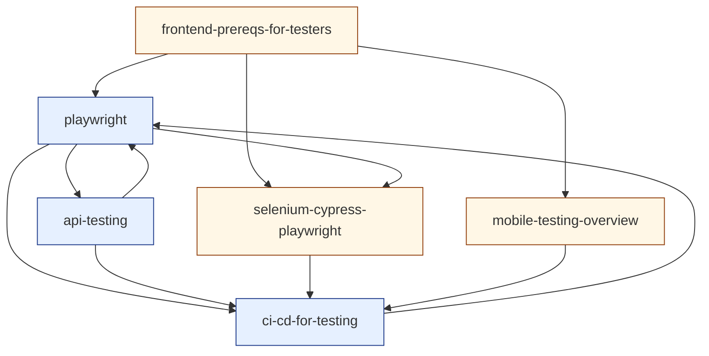

# Cluster 4 — Automation & CI/CD (research overview)

> Cluster-level synthesis sitting on top of the six topic-research files in `./cluster-4-automation-and-cicd/`.
> Purpose: capture the **cluster as a unit** — positioning, recurring threads, interleaving rules, prerequisite ordering, depth-gate notes — so the author can hold the whole cluster in their head before authoring any single topic.
> Source taxonomy in `revamp-doc/clusters-and-topics.md`; per-topic research in the sibling directory. Companion to [`cluster-1-foundations.md`](./cluster-1-foundations.md), [`cluster-2-test-design-strategy.md`](./cluster-2-test-design-strategy.md), and [`cluster-3-functional-execution-test-management.md`](./cluster-3-functional-execution-test-management.md).

---

## 1. What this cluster does

Cluster 4 installs **the practitioner toolbelt** — the concrete software and disciplines a tester deploys when the artefact discipline of Cluster 3 needs to *execute at scale, repeatably, and in CI*. None of its topics is an idea or an artefact or a strategy; all of them are *running code* — a Playwright spec, an API contract, a CI pipeline, an Appium suite, a Docker image. The cluster's success criterion is that a learner who finishes it can *take a Cluster-3 artefact (a case, a plan, a bug report) and turn it into running, repeatable, signal-producing automation* — and can defend, in writing, why a heavier setup would have been over-engineering.

This is the cluster where the curriculum's **operationalisation layer** is set. Cluster 1 installed the posture; Cluster 2 installed the strategy; Cluster 3 installed the artefacts those strategies produce; Cluster 4 installs *the running infrastructure that materialises those artefacts as continuous quality signals*:

- **Frontend prereqs are *the substrate* — not a tool.** Every later Cluster-4 tool assumes the learner understands DOM vs source HTML, hydration timing, the accessibility tree, network panels, and SPA navigation. *(See [`frontend-prereqs-for-testers`](./cluster-4-automation-and-cicd/frontend-prereqs-for-testers.md).)*
- **Playwright is *a system of orthogonal primitives*, not a feature checklist.** Locators, fixtures, traces, auth state, parallelism, web-first assertions — internalising the primitives prevents most of the flake class. *(See [`playwright`](./cluster-4-automation-and-cicd/playwright.md).)*
- **Selenium · Cypress · Playwright are *three architectural bets* — protocol stability vs in-browser ergonomics vs out-of-process control + isolation.** The lesson is the decision frame, not the endorsement. *(See [`selenium-cypress-playwright`](./cluster-4-automation-and-cicd/selenium-cypress-playwright.md).)*
- **API tests are *a layered practice*: ad-hoc → scripted → contract — and the highest-leverage cost-saving move in the entire automation stack.** *(See [`api-testing`](./cluster-4-automation-and-cicd/api-testing.md).)*
- **Mobile testing is *its own discipline* — the "one tool, two platforms" promise structurally underdelivers; the emulator/real-device distinction is not optional.** *(See [`mobile-testing-overview`](./cluster-4-automation-and-cicd/mobile-testing-overview.md).)*
- **CI/CD is *the production environment for tests* — hermeticity, artefacts, reporting, flake budget, parallelism, TIA, build-once-test-many are all consequences of that framing.** *(See [`ci-cd-for-testing`](./cluster-4-automation-and-cicd/ci-cd-for-testing.md).)*

A learner who finishes Cluster 4 with these six framings internalised is *automation-fluent* — equipped for Cluster 5 (non-functional specialisations — where the toolbelt extends with K6, axe-core, OWASP ZAP, Grafana, Sentry, Testcontainers-for-DB) and Cluster 6 (AI/LLM QA — which reuses the toolbelt for non-deterministic systems where every primitive in this cluster must be re-derived). Cluster 4 is the **toolbelt** cluster; everything before it produces the artefacts the toolbelt runs, and everything after it specialises the toolbelt for a non-functional or non-deterministic concern.

The cluster also delivers the single most important *capability* the curriculum needs: a learner who completes it can **review another tester's PR** with substantive technical opinion — which locator to use, which double to apply, which CI block to insist on, which flake-policy to enforce. Without Cluster 4 the curriculum is theoretical; with it, the learner becomes operationally useful to a team.

---

## 2. Recurring threads across the cluster (the interleaving fuel)

Per `best-way-to-build-learning-webapp.md` §5 and `content-template-and-mechanics-map.md` §2, **interleaving inside the cluster is the highest-leverage move the platform makes**. Interleaving works only when the cluster's topics genuinely *share concepts*. Cluster 4's topics share five threads, each rich enough to fuel a multi-card retrieval session.

### Thread A — *the flakiness-economy thread*

Every Cluster 4 topic produces *running code that can flake* — and the cluster's recurring question is the same:

- `frontend-prereqs-for-testers` — which substrate-level timing (hydration, SPA navigation, SW cache) is producing the flake?
- `playwright` — which of the five auto-wait conditions tripped? Which assertion family was used?
- `selenium-cypress-playwright` — which architectural choice is amplifying the flake (Cypress's iframe model? Selenium's eager-handle model? Playwright's misused fixture scope?)
- `api-testing` — JWT expiry · third-party rate limit · contract drift?
- `mobile-testing-overview` — animation race · system dialog · OEM theme · device-specific timing?
- `ci-cd-for-testing` — retry policy · quarantine policy · runner provisioning · network jitter?

A retrieval set that pulls flake-diagnosis cards from any four of these forces the learner to **discriminate the flake-cause axis** — exactly the cognitive move §3.1 of `best-way-to-learn.md` calls out as the point of interleaving. This is the cluster's primary interleaving fuel.

### Thread B — *the boundary thread* (inherited from Cluster 3)

Inherited from Cluster 3's `[[unit-integration-e2e-boundaries]]` and Cluster 2's `[[test-pyramid-and-trophy]]`. Every Cluster 4 topic engages it:

- Frontend-prereqs is *the boundary literacy* — knowing where the DOM / network / SW seams live.
- Playwright operates at the *E2E* seam — the lesson teaches *why* to stay shallow there.
- Cypress / Selenium / Playwright differ in *which seams* they cross cheaply.
- API tests are the *middle-of-pyramid* seam — and the topic argues for moving more tests there.
- Mobile tests have *additional seams*: app/system, app/store, app/sensor, app/notification.
- CI is *the seam where every other tool's output is observed* — and the boundary at which evidence becomes shared.

The thread argues, across the cluster, that **the seam at which a tool operates determines its cost, its catch rate, and its flake profile** — and that good QA work moves tests *down the pyramid* whenever possible. This is the operational meaning of Cluster 2's pyramid.

### Thread C — *the signal-to-cost thread* (inherited from Cluster 3 artefact economy)

Every Cluster 4 topic has a tool-or-discipline cost and a signal-quality payoff:

- Frontend literacy costs hours of DevTools study; pays back in *all* later topics being legible.
- Playwright costs author-discipline (primitives, fixtures, traces); pays back in suite reliability and diagnostic speed.
- Tool-comparison work costs migration effort; pays back when the chosen tool fits the constraints.
- API tests cost upfront discipline (schema generation, contract publishing); pay back in test-pyramid arithmetic (~70% bug catch at ~10% cost).
- Mobile testing costs device-farm bills and complexity; pays back in production stability or fails to.
- CI costs configuration time and runner spend; pays back in PR-feedback latency and team merge throughput.

A learner pulling cards from any four of these is **forced to discriminate cost-from-signal** — the cluster's hidden curriculum is "every tool is a trade-off; the wrong trade-off is more expensive than the absent tool."

### Thread D — *the audience thread* (inherited from Cluster 3)

Each cluster output has a *primary audience* — and designing for the wrong audience is the dominant failure mode:

- A Playwright test written for the test author is unreadable; a test written for the next maintainer is durable.
- A tool-choice decision made for cargo-cult reasons is theatre; a decision made for the team's actual constraints is leverage.
- An API test that mocks the third party tests the consumer's *assumption*; one that hits the sandbox tests the *reality*.
- A mobile test that runs only on emulator tests *an idealised mobile*; one with a real-device tier tests *user reality*.
- A CI artefact uploaded for the test author alone is incidental; one annotated for the PR reviewer is leverage.

This is the cluster's continuation of Cluster 3's audience thread: **name the audience before you pick the tool's shape**. Cross-references in the topic files enforce this — every tool is paired with the audience it's primarily for.

### Thread E — *the falsification thread* (back-link to Cluster 1 mindset)

Every Cluster 4 topic operationalises Cluster 1's *"what would have to be true for this to be wrong?"* prompt:

- A locator is a *commitment to a class of structural assumptions* about the SUT — and the test is wrong when the assumption is wrong.
- A tool choice is a *commitment to a set of architectural bets* — and is wrong when project constraints flip.
- An API contract is *a falsifiable claim* — and the contract test is the falsification mechanism.
- A real-device tier is *evidence the emulator's idealised world isn't enough* — falsification by environment.
- A CI artefact is *the evidence-on-which-falsification-rests* — without artefacts, the test is faith-based.

This thread keeps Cluster 4 a continuation of `[[qa-mindset]]`, not a departure from it. Without the thread, the cluster looks like a tutorial; with the thread, every running line of test code is *a falsification mechanism operationalised*.

---

## 3. Interleaving rules for `src/lib/srs/interleave.ts`

`best-way-to-build-learning-webapp.md` §5 specifies: *"Within a session, never serve two consecutive cards from the same concept tag."* Within Cluster 4 the tag granularity is the topic. Additional rules the platform should honour for this cluster specifically:

1. **No two consecutive cards from the same topic** (the default rule).
2. **Mix the flakiness-economy thread (Thread A):** within any 6-card session that includes any flake-diagnosis card, prefer to include at least two cards whose source-topics surface *different* flake causes (substrate · primitive · architecture · API · mobile · pipeline). The cross-reinforcement is the point — the discrimination is *between flake causes*, not within one.
3. **Preserve Cluster 1, 2, and 3 cards in Cluster 4 sessions.** Per build-doc §11, layer-1 facts continue forever even after the learner is working at layer 2/3. A Cluster 4 retrieval session should typically include 1–2 cards from Clusters 1–3 — particularly from `[[qa-mindset]]`, `[[test-oracles-and-prioritization]]`, `[[risk-based-testing]]`, `[[test-pyramid-and-trophy]]`, `[[mocking-stubbing-test-doubles]]`, `[[unit-integration-e2e-boundaries]]`, and `[[defect-lifecycle-and-bug-reporting]]`, which feed Threads B, C, D, and E here directly.
4. **After encoding a new Cluster 4 topic, the immediate practice set should be ~70% prior topics, ~30% the new one** — the platform-wide rule from build-doc §5, anchored to this cluster. Especially important here because the tools are temptingly fascinating; the platform must counter the new-toy bias by force.
5. **Cross-cluster reach-forward:** Cluster 4's cards continue surfacing during Cluster 5/6 work. The toolbelt cluster is *foundational to specialisation* and *foundational to AI/LLM QA*; the platform should not "graduate" a learner out of Cluster 4 once Cluster 5 starts. Cluster 5's cards specifically *consume* Cluster 4 vocabulary (Playwright, CI, API contracts) — keep those warm.
6. **Sister-topic pairs.** The platform should occasionally pair *adjacent* Cluster 4 topics within a session, against the no-adjacent rule, for *contrastive* sets — e.g., one card on a Playwright web-first assertion followed by one card on a Selenium explicit wait, to install the discrimination by force. Or one card on Cypress's `cy.intercept` followed by one card on Playwright's `page.route`. Use sparingly (≤ 1 such pair per 6-card session).
7. **Substrate-first ordering for new learners.** A learner who has not yet retained `[[frontend-prereqs-for-testers]]` should *not* be shown advanced Playwright cards (auto-wait conditions, trace inspection) until substrate retention reaches stability threshold. The interleaver should respect a prerequisite gate inside Cluster 4 itself, not just across clusters.

---

## 4. Authoring order (prerequisite-resolved)

The topic-research files name their `prerequisites` only implicitly (via wikilink density). Below is the explicit ordering the author should follow when filling the `content-template-and-mechanics-map.md` template:

1. **`frontend-prereqs-for-testers`** *(layer: patterns)* — Authored first. The substrate every later topic assumes. Cannot be authored later without leaving every Playwright / tool-comparison / mobile-web reference unanchored. Also serves as a *bridge* topic from Cluster 3's artefact discipline into Cluster 4's tooling.
2. **`playwright`** *(pilot for Cluster 4; layer: systems)* — **Recommended cluster-4 pilot.** Most foundational tool topic; this site's primary stack; everything in `[[selenium-cypress-playwright]]` and most of `[[ci-cd-for-testing]]` references it. Authored second because its examples assume the substrate from #1, and re-validates the cluster's authoring pattern on a *running-code* topic (a different artefact-shape from Cluster 3's document-heavy topics).
3. **`api-testing`** *(layer: systems)* — Parallel to Playwright in importance; the test-pyramid arithmetic argues for moving more tests here. Authored third because it can be authored without `[[selenium-cypress-playwright]]` and without `[[ci-cd-for-testing]]` — its examples are self-contained — and because authoring it early lets later CI examples reference contract-test workflows.
4. **`ci-cd-for-testing`** *(layer: systems)* — Authored fourth because its examples *integrate* the prior three topics (Playwright sharding, API contract publishing, fixture-based hermetic envs). Authoring it earlier would require forward-referencing the tools the pipeline runs. Authoring it later would mean the cluster lacks a *runtime* before its synthesis topics.
5. **`selenium-cypress-playwright`** *(layer: patterns)* — Survey-prone; mitigated by the decision-card practice task. Authored fifth because its comparison is only meaningful once Playwright is deeply known and once CI cost / parallelism / reporting differences are understood (#4). Authoring earlier risks the topic becoming a feature-list comparison without operational grounding.
6. **`mobile-testing-overview`** *(layer: patterns)* — Most peripheral; depth deliberately deferred per cluster taxonomy. Authored last because it can be authored independently of the prior topics, but landing it last lets it cross-reference the substrate, the primary tool, the CI integration, and the comparison frame — making the lesson denser by virtue of its position. Also lets the lesson explicitly say "go deeper into mobile only if your project demands it" without competing for attention with the in-cluster systems topics.

Author one topic end-to-end (`frontend-prereqs-for-testers` followed by `playwright`) **before** authoring topic #3. Walk both through the lint, seeder, retrieval queue, Feynman route, and depth gate per content-template §5. Only then start on topic #3.

### Layer assignments at a glance

| Topic | Recommended layer | Surfaces required |
|---|---|---|
| `playwright` | systems | encoding · retrieval · Feynman · projects |
| `api-testing` | systems | encoding · retrieval · Feynman · projects |
| `ci-cd-for-testing` | systems | encoding · retrieval · Feynman · projects |
| `frontend-prereqs-for-testers` | patterns | encoding · retrieval · Feynman *(projects optional)* |
| `selenium-cypress-playwright` | patterns | encoding · retrieval · Feynman |
| `mobile-testing-overview` | patterns | encoding · retrieval · Feynman |

If the cluster shipped today with these layer assignments it would emit roughly **30–36 spaced-repetition cards** (5–6 prompts per topic × 6 topics), **3 hands-on practice tasks** (one per `systems` topic: a Playwright flake diagnosis with trace, a layered API test suite, a production-shaped CI pipeline), and **3 self-explanation surfaces** at minimum (one per `systems` topic). That is a healthy cluster-shape — and the `patterns`-layer practice tasks (devtools audit · tool decision card · mobile strategy card) are *artefact-producing* even though they're not code, so the cluster's *gradable output count* effectively rises to **6 rubric-gradable artefacts**, matching Cluster 3.

---

## 5. Depth-gate notes (per `content-template-and-mechanics-map.md` §3)

Each topic was research-tested against the depth gate. Findings:

- All six topics generate **≥ 5 genuinely distinct retrieval prompts** without padding. The cluster passes the most important gate.
- All six produced **meaningful diagram seeds**: the three-trees diagram (DOM · render · accessibility), the Locator lifecycle, the three architectures of WebDriver / iframe / contexts, the microservice + Pact-broker diagram, the tiered execution ladder, the hermetic-CI pipeline. No topic should declare `<Diagram skip="atomic-fact" />`.
- All three `systems`-layer topics produced a **hands-on practice task** that is genuinely productive (real artefact, rubric-gradable). The trace-driven flake diagnosis, the layered API test suite, and the production-shaped CI pipeline are all *substantive*.
- The three `patterns`-layer topics produced **artefact-producing practice tasks** even at the lower layer: a DevTools audit page, a tool-decision card, a mobile strategy card. The cluster's `patterns` layer is denser than Cluster 3's because the tools are concrete enough to demand operational thinking.
- **One topic — `selenium-cypress-playwright` — risks becoming a survey** (analogous to `shift-left-and-shift-right` in Cluster 2 and `test-management-tools` in Cluster 3). Mitigation: enforce the *decision-card artefact* (buy if / skip if / hidden cost / migration cost) as the topic's practice task. The topic earns its slot if it produces these decision cards; without them the topic should be cut and folded into `[[playwright]]` (the "default tool" framing) and `[[ci-cd-for-testing]]` (the "parallel orchestration cost" framing). Re-evaluate at the end of the authoring pass.
- **One topic — `mobile-testing-overview` — is deliberately shallow per cluster taxonomy.** "High-level only, depth deferred" is stated in `clusters-and-topics.md`. The depth-gate verdict for this topic is *intentional patterns-layer depth, not systems-layer depth*; the lesson must teach the *map and the trade-offs* without pretending to give mobile-automation mastery. If the topic cannot be kept honest at this depth, the alternative is to *cut it from Cluster 4 entirely* and let it surface as a Cluster-5 specialisation if the project later demands it.
- **One topic — `frontend-prereqs-for-testers` — is a substrate topic with no fully bounded scope.** A learner could spend a year on DOM internals alone. The depth-gate mitigation: scope the topic to *what changes a Playwright test author's behaviour* (three trees, hydration timing, network panel, application state, SPA navigation, shadow DOM, iframes). Anything beyond that delays the cluster without payoff.
- **No topic is a candidate for merge or cut otherwise.** Each occupies distinct conceptual ground.

---

## 6. Wikilink graph (Cluster 4 internal)



Incoming edges (back-references to Clusters 1, 2, 3):

- ← `qa-mindset` *(C1)* — every Cluster 4 running line is the mindset materialised as code.
- ← `test-oracles-and-prioritization` *(C1)* — a Playwright assertion *is* an oracle; the link is operational.
- ← `verification-vs-validation` *(C1)* — automation can verify (the build is right); only humans + UAT validate (the right thing is built).
- ← `test-pyramid-and-trophy` *(C2)* — the shape this cluster operationalises; API tests move work to the middle.
- ← `risk-based-testing` *(C2)* — the test matrix and tier ladder both materialise risk-based prioritisation.
- ← `test-design-techniques` *(C2)* — BVA / EP feed the parameter generation for API tests and Playwright data tables.
- ← `exploratory-testing` *(C2)* — Playwright `--ui` mode and `page.pause()` turn the tool into an exploration harness.
- ← `tdd-bdd-atdd` *(C2)* — Playwright + Vitest patterns inherit the London/Chicago debate from `[[mocking-stubbing-test-doubles]]`.
- ← `shift-left-and-shift-right` *(C2)* — CI's enforcement is "shift left"; observability and chaos drills are "shift right."
- ← `test-planning-cases-and-scenarios` *(C3)* — the case becomes a Playwright spec; the scenario becomes a `test.describe` block.
- ← `test-types-smoke-sanity-regression-uat` *(C3)* — the test-type role drives Playwright project configurations and CI tier ladders.
- ← `unit-integration-e2e-boundaries` *(C3)* — the seam framing every Cluster 4 topic engages.
- ← `mocking-stubbing-test-doubles` *(C3)* — `page.route` and `cy.intercept` and contract testing are the operational answers.
- ← `defect-lifecycle-and-bug-reporting` *(C3)* — CI artefacts are the evidence layer of bug reports; failing Playwright traces are pre-built reproduction packets.
- ← `test-management-tools` *(C3)* — TMTs consume JUnit XML and screenshots from Cluster 4 pipelines.

Outgoing edges (forward-references to later clusters):

- → Cluster 5: `performance-testing` (Lighthouse-CI · K6 in pipelines), `security-testing` (OWASP ZAP · dependency scanning · contract auth), `accessibility-testing` (axe-core · Playwright a11y integration · mobile accessibility scanners), `database-testing` (Testcontainers per-worker DB), `observability-for-testers` (CI metrics · test logs · trace correlation), `chaos-and-resilience-testing` (CI-orchestrated chaos drills · GameDay scheduling).
- → Cluster 6: `ai-fundamentals-for-testers` (LLM API testing reuses Cluster-4 API patterns), `eval-design-llm` (eval pipelines live in CI), `rag-testing` (retrieval eval suites), `prompt-engineering-and-regression` (prompt-version CI), `ai-safety-testing` (red-team suites in pipelines), `ai-observability-and-drift` (eval-in-prod consumes the observability story this cluster sets up).

The density of outgoing edges from Cluster 4 to *every* later cluster is itself evidence that the cluster is doing the cross-cutting operational work it claims. Cluster 4 is the curriculum's **automation backbone** — every later cluster either specialises a Cluster 4 tool for a non-functional concern (Cluster 5) or re-derives the toolbelt for non-deterministic systems (Cluster 6).

---

## 7. What this research pass deliberately did not produce

- **No lesson text.** The research files are inputs for the template, not the template fill. Per `content-template-and-mechanics-map.md` §4, the author re-encodes from this research into Core Idea, Worked Example, Pitfalls, Retrieval Prompts, Practice Task, and Feynman — they do not transcribe.
- **No card IDs.** `<Prompt id="...">` stable IDs are the author's responsibility per template §1.2; the prompt *seeds* in the research files are draftable but unsigned.
- **No diagram artefacts.** Each topic file describes the diagrams the lesson should contain; producing the SVG/Mermaid belongs in the authoring pass. Cluster 4 will be diagram-heavy (three-trees diagram, locator lifecycle, three-architectures comparison, microservice + Pact broker, tiered execution ladder, hermetic CI pipeline) — budget time accordingly.
- **No tooling endorsements beyond context.** Playwright is *named as this site's stack* (per `CLAUDE.md`) but the comparison topic deliberately stays neutral. BrowserStack, Sauce Labs, Pact Broker, Allure, Lighthouse-CI, etc. are *named*; specific commercial endorsements belong in project-specific decision documents, not in the curriculum.
- **No verification of citations beyond URL plausibility.** Several primary sources (Pact's evolution, Playwright version-specific behaviour, GHA marketplace action security guidance) shift quickly. The author should re-verify any source they quote directly before publication. Especially: Playwright `1.59.1`-specific API references, GHA reusable workflow syntax, Pact v3/v4 format.
- **No clusters beyond #4.** This is a deliberate scope per `conversation-summary.md` §6 and `content-template-and-mechanics-map.md` §5. Cluster 5 research begins after Cluster 4 is authored end-to-end or after the user explicitly requests it.

---

## 8. Open questions to resolve before authoring starts

Inherited from earlier clusters (still open):

1. **MDX component status.** `<Diagram>`, `<Prompt>`, `<Feynman>`, `<PracticeTask>` are unimplemented (per content-template §6 decision log). Cluster 4 authoring assumes they exist or that the pilot uses fallback markup.
2. **Seeder behaviour.** `scripts/seed-cards.ts` must honor `<Prompt id="...">` and fail the build below minimum prompt count.
3. **`/explain/<slug>` route.** Required for `systems`-layer topics (three of six in this cluster).

New to Cluster 4:

4. **Pilot topic.** Recommendation: `frontend-prereqs-for-testers` (substrate) followed by `playwright` (flagship). Pilot pair, not single pilot, because the substrate topic is meaningless without the application and the application topic is unfounded without the substrate. Confirm before starting authoring.
5. **Playwright version pinning.** `@playwright/test@1.59.1` (per `CLAUDE.md`). Every Playwright code example and every screenshot of the trace viewer must match this version. The lesson must commit to *the pinned version* and re-verify on bumps.
6. **Visual baseline workflow integration.** The site's `workflow_dispatch update_visual_baselines=true` workflow exists; the `[[playwright]]` and `[[ci-cd-for-testing]]` topics reference it. Confirm the workflow remains functional before publishing references; if rewritten, update both topic files.
7. **CI provider choice in examples.** Default to GitHub Actions (site's CI provider per `CLAUDE.md`); Jenkins is the named alternative. Confirm before authoring; if a different CI provider becomes the default in the org, swap.
8. **Cypress recommendation neutrality.** The comparison topic must avoid "Cypress is dying" framing. Cypress 13+ has shipped meaningful improvements (`cy.origin`, component testing, parallel without Cloud licensing in some configurations). Verify the current state before publishing.
9. **Mobile depth deferral.** The cluster taxonomy explicitly defers depth on mobile. The lesson must teach the *map* and *trade-offs* without claiming mastery. If a project ever demands deep mobile coverage, surface it as a Cluster 5 specialisation, not as a Cluster 4 expansion.
10. **Pact v3 vs v4 migration status.** Pact v4 (Plug-in architecture, support for gRPC/GraphQL) has been GA for some time but adoption lags. The lesson should teach v3 patterns with v4 awareness; verify the current recommendation.
11. **Real-device cloud cost neutrality.** Vendor pricing changes. The mobile topic explicitly avoids dollar figures; the lesson must remain price-agnostic.
12. **The "AI co-pilot in test authoring" question.** GitHub Copilot, Cursor, Claude — all routinely generate Playwright code. The lesson must teach the *quality bar for accepting AI-generated tests* (does it use role-based locators? web-first assertions? proper fixture scope?) without endorsing or rejecting the tools. Deep treatment belongs in Cluster 6; awareness belongs here.
13. **Survey-risk on `selenium-cypress-playwright`.** Re-evaluate the topic's depth-gate verdict after authoring: if the decision-card practice task isn't producing rubric-gradable output, fold the topic into `[[playwright]]` and `[[ci-cd-for-testing]]` and drop it from Cluster 4.
14. **Frontend prereqs scope creep.** The substrate topic risks unbounded growth (DOM internals, V8 quirks, web platform deep dives). The lesson must scope to *what changes a tester's daily behaviour*. Re-evaluate after authoring: if the topic balloons past 30-minute encoding time, prune ruthlessly.

---

## 9. File map

```
revamp-doc/revamp-knowledge/
├── cluster-1-foundations.md
├── cluster-2-test-design-strategy.md
├── cluster-3-functional-execution-test-management.md
├── cluster-4-automation-and-cicd.md                                # this file
├── cluster-1-foundations/
│   └── ... (six topic-research files)
├── cluster-2-test-design-strategy/
│   └── ... (six topic-research files)
├── cluster-3-functional-execution-test-management/
│   └── ... (six topic-research files)
└── cluster-4-automation-and-cicd/
    ├── frontend-prereqs-for-testers.md                             # pilot — substrate
    ├── playwright.md                                               # pilot — flagship
    ├── selenium-cypress-playwright.md
    ├── api-testing.md
    ├── mobile-testing-overview.md
    └── ci-cd-for-testing.md
```

Six topic files, one cluster overview, no other artefacts. Ready as inputs to the authoring loop in `content-template-and-mechanics-map.md` §4.
