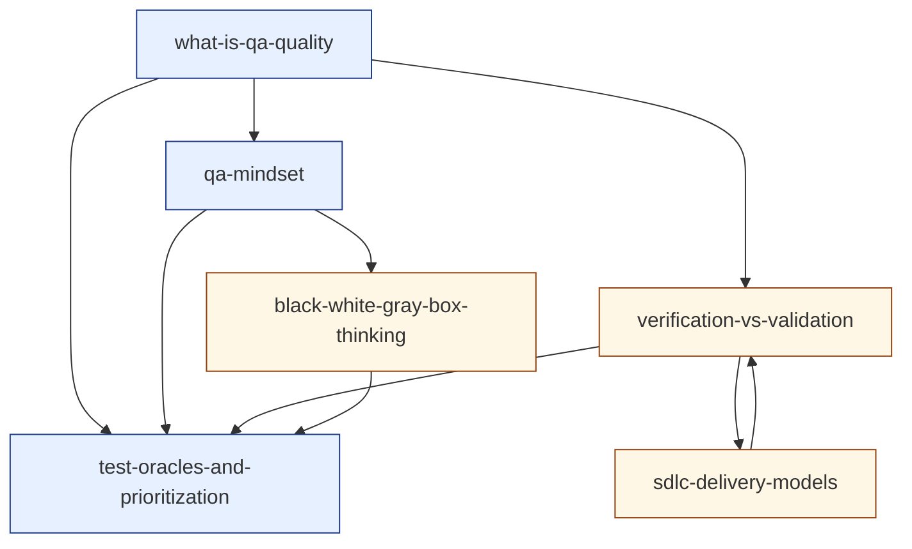

# Cluster 1 — QA Foundations & Mindset (research overview)

> Cluster-level synthesis sitting on top of the six topic-research files in `./cluster-1-foundations/`.
> Purpose: capture the **cluster as a unit** — positioning, recurring threads, interleaving rules, prerequisite ordering, depth-gate notes — so the author can hold the whole cluster in their head before authoring any single topic.
> Source taxonomy in `revamp-doc/clusters-and-topics.md`; per-topic research in the sibling directory.

---

## 1. What this cluster does

Cluster 1 installs the **conceptual vocabulary** every other cluster will assume. None of its topics is a *technique*; all of them are *lenses* for thinking about technique. The cluster's success criterion is that, after a learner completes it, they can read a piece of testing literature, identify its definition of *quality*, *oracle*, *box-lens*, *delivery model*, and *V/V stance*, and judge whether the literature's claims are situated or universal.

This is the cluster where the curriculum's **posture** is set:

- **Quality is relational** — value to some person who matters at some time. *(See [`what-is-qa-quality`](./cluster-1-foundations/what-is-qa-quality.md).)*
- **Mindset over technique** — context-driven, oracle-aware, disconfirmation-biased. *(See [`qa-mindset`](./cluster-1-foundations/qa-mindset.md).)*
- **Models are choices** — feedback latency decides defect cost; no model is universally correct. *(See [`sdlc-delivery-models`](./cluster-1-foundations/sdlc-delivery-models.md).)*
- **V&V is a triangle, not a pair** — verification, validation, and operational validation. *(See [`verification-vs-validation`](./cluster-1-foundations/verification-vs-validation.md).)*
- **Every test has an oracle and a priority** — name them or you are guessing. *(See [`test-oracles-and-prioritization`](./cluster-1-foundations/test-oracles-and-prioritization.md).)*
- **Box-lenses are tools, not categories** — chosen per test. *(See [`black-white-gray-box-thinking`](./cluster-1-foundations/black-white-gray-box-thinking.md).)*

A learner who finishes Cluster 1 with these six framings internalised is *unblocked* for Cluster 2 (Test Design & Strategy), regardless of where their prior experience starts.

---

## 2. Recurring threads across the cluster (the interleaving fuel)

Per `best-way-to-build-learning-webapp.md` §5 and `content-template-and-mechanics-map.md` §2, **interleaving inside the cluster is the highest-leverage move the platform makes**. Interleaving works only when the cluster's topics genuinely *share concepts* — otherwise mixing them is noise. The threads below are what make interleaving *productive* here:

### Thread A — *the oracle thread*

Five of the six topics invoke the oracle question:

- **`what-is-qa-quality`** — "quality to *whom*?" is an oracle-selection question.
- **`qa-mindset`** — FEW HICCUPPS is an oracle heuristic; "how would I know if this were wrong?" is the mindset version.
- **`verification-vs-validation`** — V vs V is, mechanically, a question about *which oracle is authoritative*.
- **`test-oracles-and-prioritization`** — the explicit treatment; Barr et al. taxonomy.
- **`black-white-gray-box-thinking`** — the lens choice and the oracle choice are paired per test.

A retrieval set that pulls from these five topics in the same session forces the learner to **discriminate** the oracle question across contexts — exactly the cognitive move §3.1 of `best-way-to-learn.md` calls out as the point of interleaving.

### Thread B — *the lenses-not-categories thread*

The cluster repeatedly converts apparent taxonomies into deliberate choices:

- Definitions of quality (Crosby / Juran / Weinberg / ISO 25010) are *frames* a tester picks for a given conversation.
- SDLC models are *situations*, not destinations.
- Black / white / gray are *lenses*, not roles.

This is the cluster's hidden curriculum: the learner is being trained, repeatedly, to refuse premature categorisation. The cluster will fail at its job if any one topic delivers the lens-not-category framing without the others reinforcing it. Cross-references in the topic files already enforce this.

### Thread C — *the relational thread*

Quality, risk, V&V, and oracle choice are all **relational** properties — they depend on a *who* and a *when*. The cluster repeatedly forces the learner to name the stakeholder. This is the seed for `[[risk-based-testing]]` and `[[exploratory-testing]]` (Cluster 2) where the *who* shows up as test charter and risk register.

### Thread D — *the feedback-latency thread*

`sdlc-delivery-models` makes feedback latency explicit; `verification-vs-validation` describes how late validation arrives in regulated work; `test-oracles-and-prioritization` decides where finite testing effort flows. Together, the cluster argues that **the cost of a defect is mostly the cost of the latency between introducing it and noticing it** — which sets up Cluster 4 (Automation & CI/CD) as the cluster about *collapsing* that latency.

---

## 3. Interleaving rules for `src/lib/srs/interleave.ts`

`best-way-to-build-learning-webapp.md` §5 specifies: "Within a session, never serve two consecutive cards from the same concept tag." Within Cluster 1 the tag granularity is the topic. Additional rules the platform should honour for this cluster specifically:

1. **No two consecutive cards from the same topic** (the default rule).
2. **Mix the oracle thread:** within any 6-card session that includes any card from `test-oracles-and-prioritization`, prefer to include at least one other card whose source-topic is on Thread A (above). The cross-reinforcement is the point.
3. **After encoding a new Cluster 1 topic, the immediate practice set should be ~70% prior Cluster 1 topics, ~30% the new one** — i.e., the platform-wide rule from build-doc §5, anchored to this cluster.
4. **Cluster 1 cards should continue surfacing during Cluster 2/3 work**, per build-doc §11 (layer-1 facts continue forever even after the learner is working at layer 2/3). The platform should not "graduate" a learner out of Cluster 1.

---

## 4. Authoring order (prerequisite-resolved)

The topic-research files name their `prerequisites` only implicitly (via wikilink density). Below is the explicit ordering the author should follow when filling the `content-template-and-mechanics-map.md` template:

1. **`qa-mindset`** *(pilot; recommended by content-template §5)* — `layer: systems`. Validates every platform surface. Establishes context-driven posture all later topics inherit.
2. **`what-is-qa-quality`** *(layer: systems candidate)* — Defines the field the cluster is in. Earns the ISO 25010 vocabulary every later cluster references.
3. **`black-white-gray-box-thinking`** *(layer: patterns)* — Short, foundational lens; clears taxonomy debt before V&V and Oracles land.
4. **`verification-vs-validation`** *(layer: patterns)* — Depends on the quality/oracle vocabulary above.
5. **`test-oracles-and-prioritization`** *(layer: systems candidate)* — The cluster's intellectual climax. Pulls from all prior topics.
6. **`sdlc-delivery-models`** *(layer: patterns)* — Authored last because, although foundational in any curriculum tree, it benefits enormously from the prior five framings (e.g., "feedback latency" is more concrete once V&V and oracle are in place).

Author one topic end-to-end (qa-mindset) **before** authoring topic #2. Walk it through the lint, seeder, retrieval queue, Feynman route, and depth gate per content-template §5. Only then start on topic #2.

### Layer assignments at a glance

| Topic | Recommended layer | Surfaces required |
|---|---|---|
| `qa-mindset` | systems | encoding · retrieval · Feynman · projects |
| `what-is-qa-quality` | systems | encoding · retrieval · Feynman · projects |
| `test-oracles-and-prioritization` | systems | encoding · retrieval · Feynman · projects |
| `verification-vs-validation` | patterns | encoding · retrieval · Feynman |
| `black-white-gray-box-thinking` | patterns | encoding · retrieval · Feynman |
| `sdlc-delivery-models` | patterns | encoding · retrieval · Feynman |

If the cluster shipped today with these layer assignments it would emit roughly **30–36 spaced-repetition cards** (5–6 prompts per topic × 6 topics) and **4 self-explanation surfaces** (one per `systems` topic plus optionally one per `patterns` topic). That is a healthy cluster-shape: enough to sustain a fortnight of daily review without saturating.

---

## 5. Depth-gate notes (per `content-template-and-mechanics-map.md` §3)

Each topic was research-tested against the depth gate. Findings:

- All six topics generate **≥ 5 genuinely distinct retrieval prompts** without padding. The cluster passes the most important gate.
- All six produced a **meaningful diagram** in the worked-example seeds. No topic should declare `<Diagram skip="atomic-fact" />`.
- All `systems`-layer topics produced a **hands-on practice task** that is genuinely productive (not pure trivia).
- **No topic was a candidate for merge or cut.** Each occupies distinct conceptual ground.
- **One topic — `test-oracles-and-prioritization` — deliberately pairs two ideas** (oracles + prioritization). The depth-gate question is: should this be split? Recommendation: **keep paired**. Both ideas answer the same higher question ("where should the next unit of testing effort go?") and splitting them would produce two slightly-thin topics rather than one substantial one. Revisit after authoring if the topic visibly bulges past 25-minute encoding budget.

---

## 6. Wikilink graph (Cluster 1 internal)



Outgoing edges (forward-references to later clusters):

- → Cluster 2: `risk-based-testing`, `exploratory-testing`, `test-design-techniques`, `shift-left-and-shift-right`, `tdd-bdd-atdd`
- → Cluster 3: `unit-integration-e2e-boundaries`, `test-types-smoke-sanity-regression-uat`, `defect-lifecycle-and-bug-reporting`, `test-planning-cases-and-scenarios`
- → Cluster 4: `playwright`, `ci-cd-for-testing`
- → Cluster 5: `non-functional-testing-overview`, `accessibility-testing`, `observability-for-testers`, `security-testing`
- → Cluster 6: `eval-design-llm`

The density of outgoing edges from Cluster 1 to *every* later cluster is itself evidence that the foundational framing is doing the work the cluster claims.

---

## 7. What this research pass deliberately did not produce

- **No lesson text.** The research files are inputs for the template, not the template fill. Per `content-template-and-mechanics-map.md` §4, the author re-encodes from this research into Core Idea, Worked Example, Pitfalls, Retrieval Prompts, Practice Task, and Feynman — they do not transcribe.
- **No card IDs.** `<Prompt id="...">` stable IDs are the author's responsibility per template §1.2; the prompt *seeds* in the research files are draftable but unsigned.
- **No diagram artefacts.** Each topic file describes the diagram the lesson should contain; producing the SVG/Mermaid belongs in the authoring pass.
- **No clusters beyond #1.** This is a deliberate pilot scope per `conversation-summary.md` §6 and `content-template-and-mechanics-map.md` §5. Cluster 2–6 research begins after Cluster 1 is authored end-to-end and the template/mechanics validated.
- **No verification of citations beyond URL plausibility.** The author should re-verify any source they quote directly before publication. The research files name authoritative sources but do not pre-verify quotations.

---

## 8. Open questions to resolve before authoring starts

1. **MDX component status.** `<Diagram>`, `<Prompt>`, `<Feynman>`, `<PracticeTask>` are unimplemented (per content-template §6 decision log). Cluster 1 authoring assumes they exist. Confirm implementation precedes lesson #1 or that the pilot uses fallback markup.
2. **Seeder behaviour.** `scripts/seed-cards.ts` must honor `<Prompt id="...">` and fail the build below minimum prompt count. Confirm before pilot.
3. **`/explain/<slug>` route.** Required for `systems`-layer topics. Confirm before `qa-mindset` is finalised.
4. **ISO 25010:2023 subcharacteristic list.** Cross-check the second source on one specific point (placement of "self-descriptiveness" — possibly under Interaction Capability vs Maintainability). Note flagged in `what-is-qa-quality.md` §10.
5. **Royce 1970 quotation.** Verify the exact wording in the primary source before quoting in `sdlc-delivery-models`.
6. **Scrum Guide and SAFe versions.** Re-verify currency immediately before authoring `sdlc-delivery-models`.

---

## 9. File map

```
revamp-knowledge/
├── cluster-1-foundations.md                                    # this file
└── cluster-1-foundations/
    ├── what-is-qa-quality.md
    ├── qa-mindset.md                                            # pilot
    ├── sdlc-delivery-models.md
    ├── verification-vs-validation.md
    ├── test-oracles-and-prioritization.md
    └── black-white-gray-box-thinking.md
```

Six topic files, one cluster overview, no other artefacts. Ready as inputs to the authoring loop in `content-template-and-mechanics-map.md` §4.
