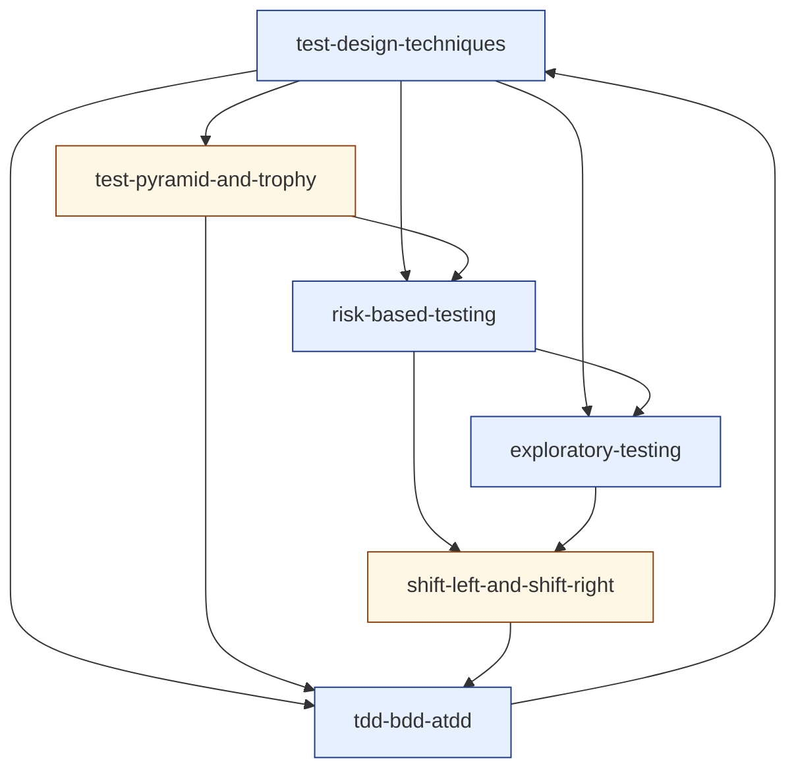

# Cluster 2 — Test Design & Strategy (research overview)

> Cluster-level synthesis sitting on top of the six topic-research files in `./cluster-2-test-design-strategy/`.
> Purpose: capture the **cluster as a unit** — positioning, recurring threads, interleaving rules, prerequisite ordering, depth-gate notes — so the author can hold the whole cluster in their head before authoring any single topic.
> Source taxonomy in `revamp-doc/clusters-and-topics.md`; per-topic research in the sibling directory. Companion to [`cluster-1-foundations.md`](./cluster-1-foundations.md).

---

## 1. What this cluster does

Cluster 2 installs the **craft of deciding what to test, where to invest, when to invest it, and whose mental model the tests encode**. None of its topics is a tool or a product; all of them are *decisions a tester has to make every day*. The cluster's success criterion is that, after a learner completes it, they can take a feature spec or a real repository and produce a *defensible* test plan — one whose every line answers a question of the form "why did you choose to spend testing effort here rather than there?"

This is the cluster where the curriculum's **method** is set. Cluster 1 installed the *posture*; Cluster 2 installs *the operational moves the posture authorises*:

- **Tests are chosen, not stumbled into** — explicit techniques exist for compressing infinite input spaces. *(See [`test-design-techniques`](./cluster-2-test-design-strategy/test-design-techniques.md).)*
- **Test effort has shape** — the cost/feedback tier each test lives at is an architectural choice, not a count. *(See [`test-pyramid-and-trophy`](./cluster-2-test-design-strategy/test-pyramid-and-trophy.md).)*
- **Coverage is a finite budget** — read impact first, likelihood second, detectability third. *(See [`risk-based-testing`](./cluster-2-test-design-strategy/risk-based-testing.md).)*
- **Designed tests miss the unknown-unknowns** — charter-driven exploration is how the team learns the product faster than the spec teaches it. *(See [`exploratory-testing`](./cluster-2-test-design-strategy/exploratory-testing.md).)*
- **Testing happens across the whole lifecycle, not in a phase** — pre-merge and post-merge are the practical axes, not "left" and "right" as slogans. *(See [`shift-left-and-shift-right`](./cluster-2-test-design-strategy/shift-left-and-shift-right.md).)*
- **Test-first practices serve different audiences** — TDD is design, BDD is conversation, ATDD is acceptance. They compose; they do not collide. *(See [`tdd-bdd-atdd`](./cluster-2-test-design-strategy/tdd-bdd-atdd.md).)*

A learner who finishes Cluster 2 with these six framings internalised is *equipped* — for Cluster 3 (the day-to-day operationalisation), for Cluster 4 (the automation toolbelt), and for Cluster 5 (the non-functional specialisations). Cluster 2 is the **strategy** cluster; everything after is its execution.

---

## 2. Recurring threads across the cluster (the interleaving fuel)

Per `best-way-to-build-learning-webapp.md` §5 and `content-template-and-mechanics-map.md` §2, **interleaving inside the cluster is the highest-leverage move the platform makes**. Interleaving works only when the cluster's topics genuinely *share concepts* — otherwise mixing them is noise. Cluster 2's topics share four threads, each rich enough to fuel a multi-card retrieval session.

### Thread A — *the discrimination thread*

All six topics are answers to the same higher question: **of the infinite tests you could write, which ones are worth writing?**

- `test-design-techniques` — discriminate by *input-space partition*.
- `test-pyramid-and-trophy` — discriminate by *cost/feedback tier*.
- `risk-based-testing` — discriminate by *impact × likelihood × detectability*.
- `exploratory-testing` — discriminate *as you go*, by what you're learning.
- `shift-left-and-shift-right` — discriminate by *where on the lifecycle* the evidence is cheapest.
- `tdd-bdd-atdd` — discriminate by *whose mental model* the test encodes.

A retrieval set that pulls from any four of these in the same session forces the learner to **discriminate the discrimination axis** — exactly the cognitive move §3.1 of `best-way-to-learn.md` calls out as the point of interleaving. This is the cluster's primary interleaving fuel.

### Thread B — *the feedback-latency thread*

Inherited from Cluster 1's `[[sdlc-delivery-models]]` and `[[verification-vs-validation]]`. Every Cluster 2 topic engages it:

- Pyramid/Trophy: cheap-fast tests live at the base for a reason.
- Risk-based: invest where the consequence of *late* detection is largest.
- Exploratory: ET's session-cap and debrief are latency-management tools.
- Shift-left/right: the topic *is* the latency conversation, named.
- TDD/BDD/ATDD: pull testing earliest-possible into design, before code.

The thread argues, across the cluster, that **the cost of a defect is mostly the cost of the latency between introducing it and noticing it** — which sets up Cluster 4 (Automation & CI/CD) as the cluster about *collapsing* that latency in tools.

### Thread C — *the model thread* (continuing C1's "lenses, not categories")

Each technique imposes a *model* on the system:

- EP/BVA model the input space; state transition models the state space; decision tables model the rule space.
- The pyramid models the test stack as a cost/coverage curve.
- The risk register models the failure surface as impact × likelihood × detectability.
- A charter models the question the tester is *currently asking the product*.
- TDD makes the test the *model of the design*; BDD makes Given/When/Then the *model of the behaviour*.

This is the continuation of Cluster 1's hidden curriculum: the learner is being trained, repeatedly, to **refuse premature application of a method until they have named the model the method assumes**. Cross-references in the topic files enforce this — every technique is paired with the *assumption it makes about the system*.

### Thread D — *the falsification thread* (back-link to Cluster 1 mindset)

Every topic operationalises Cluster 1's *"what would have to be true for this to be wrong?"* prompt:

- BVA finds where the system fails *at the boundary it cannot defend*.
- Risk-based asks *where would it hurt most if it broke?*
- Exploratory testing intentionally seeks *surprises* — disconfirmations of the team's mental model.
- Shift-left's threat-modelling explicitly enumerates failure modes.
- TDD's red step is a *structural falsification*: write a test that fails, then make it pass.

This thread is what makes Cluster 2 a continuation of `[[qa-mindset]]`, not a departure from it. Without the thread, the cluster looks like a tool-list; with the thread, every tool is a way of operationalising the mindset's daily disposition.

---

## 3. Interleaving rules for `src/lib/srs/interleave.ts`

`best-way-to-build-learning-webapp.md` §5 specifies: *"Within a session, never serve two consecutive cards from the same concept tag."* Within Cluster 2 the tag granularity is the topic. Additional rules the platform should honour for this cluster specifically:

1. **No two consecutive cards from the same topic** (the default rule).
2. **Mix the discrimination thread (Thread A):** within any 6-card session that includes a card from any one Cluster 2 topic, prefer to include at least two cards whose source-topics are from *different* axes of Thread A (input-space, tier, risk, charter, lifecycle, audience). The cross-reinforcement is the point — the discrimination is *between* axes.
3. **Preserve Cluster 1 cards in Cluster 2 sessions.** Per build-doc §11, layer-1 facts continue forever even after the learner is working at layer 2/3. A Cluster 2 retrieval session should typically include 1–2 Cluster 1 cards (especially from `[[qa-mindset]]` and `[[test-oracles-and-prioritization]]`, which directly feed Threads A and D here).
4. **After encoding a new Cluster 2 topic, the immediate practice set should be ~70% prior topics, ~30% the new one** — the platform-wide rule from build-doc §5, anchored to this cluster.
5. **Cross-cluster reach-forward:** Cluster 2's cards continue surfacing during Cluster 3/4/5 work. The strategy cluster is *foundational to execution*; the platform should not "graduate" a learner out of Cluster 2 once Cluster 3 starts.

---

## 4. Authoring order (prerequisite-resolved)

The topic-research files name their `prerequisites` only implicitly (via wikilink density). Below is the explicit ordering the author should follow when filling the `content-template-and-mechanics-map.md` template:

1. **`test-design-techniques`** *(pilot for Cluster 2; layer: systems)* — Recommended cluster-2 pilot. Most concrete topic; produces the strongest hands-on artefact; establishes the technique-vocabulary the next four topics use. Validates the template's project-surface a second time after `qa-mindset`.
2. **`test-pyramid-and-trophy`** *(layer: patterns)* — Depends on the technique vocabulary above (techniques live at tiers; the tier conversation is shallow without the techniques).
3. **`risk-based-testing`** *(layer: systems)* — Budget allocator over techniques and tiers; needs both as inputs.
4. **`exploratory-testing`** *(layer: systems)* — Depends on `[[qa-mindset]]` (Cluster 1), `[[test-oracles-and-prioritization]]` (Cluster 1), and `risk-based-testing` (this cluster, for charter-seeding).
5. **`tdd-bdd-atdd`** *(layer: systems)* — Concrete test-first practices; refers back to techniques, pyramid, and risk. Authored fifth so the worked examples can reference vocabulary from all four prior topics.
6. **`shift-left-and-shift-right`** *(layer: patterns)* — Most abstract; operates *over* the rest of the cluster. Authored last because its lifecycle-map exercise depends on having a vocabulary of testing practices to *place on* the timeline.

Author one topic end-to-end (`test-design-techniques`) **before** authoring topic #2. Walk it through the lint, seeder, retrieval queue, Feynman route, and depth gate per content-template §5. Only then start on topic #2.

### Layer assignments at a glance

| Topic | Recommended layer | Surfaces required |
|---|---|---|
| `test-design-techniques` | systems | encoding · retrieval · Feynman · projects |
| `risk-based-testing` | systems | encoding · retrieval · Feynman · projects |
| `exploratory-testing` | systems | encoding · retrieval · Feynman · projects |
| `tdd-bdd-atdd` | systems | encoding · retrieval · Feynman · projects |
| `test-pyramid-and-trophy` | patterns | encoding · retrieval · Feynman |
| `shift-left-and-shift-right` | patterns | encoding · retrieval · Feynman |

If the cluster shipped today with these layer assignments it would emit roughly **30–36 spaced-repetition cards** (5–6 prompts per topic × 6 topics), **4 hands-on practice tasks** (one per `systems` topic, each tied to a rubric), and **4 self-explanation surfaces** at minimum (one per `systems` topic, plus optional Feynman for the two `patterns` topics). That is a healthy cluster-shape — denser than Cluster 1, because Cluster 2's practice tasks are concrete enough to grade against a rubric on every `systems` topic.

---

## 5. Depth-gate notes (per `content-template-and-mechanics-map.md` §3)

Each topic was research-tested against the depth gate. Findings:

- All six topics generate **≥ 5 genuinely distinct retrieval prompts** without padding. The cluster passes the most important gate.
- All six produced a **meaningful diagram seed** in the worked-example sections. No topic should declare `<Diagram skip="atomic-fact" />`.
- All four `systems`-layer topics produced a **hands-on practice task** that is genuinely productive (real artefact, rubric-gradable).
- **Two topics deliberately bundle multiple ideas.** Both were depth-gated and recommended kept:
  - `test-design-techniques` bundles six named techniques (EP, BVA, decision tables, state transition, pairwise, error guessing). Splitting would produce six thin topics; keeping paired produces one substantial topic whose unifying frame is *"every technique is a model of the system."* Depth-gate verdict: **keep paired.** Re-evaluate if the encoding budget exceeds 30 minutes.
  - `tdd-bdd-atdd` bundles three practices. The pedagogical value is precisely in *discriminating* them — these three are the most commonly conflated practices in modern QA discourse. Splitting would lose the discrimination. Depth-gate verdict: **keep paired.**
- **One topic — `shift-left-and-shift-right` — risks becoming a survey** rather than a deep topic. Mitigation: enforce the *pre/post-merge* axis as the focusing frame. The topic earns its slot if it produces the **lifecycle-map exercise** (the practice task seed); without that artefact the topic should be cut and absorbed into `[[ci-cd-for-testing]]` (Cluster 4) and `[[observability-for-testers]]` (Cluster 5). Re-evaluate at the end of the authoring pass.
- **No topic is a candidate for merge or cut otherwise.** Each occupies distinct conceptual ground.

---

## 6. Wikilink graph (Cluster 2 internal)



Incoming edges (back-references to Cluster 1):

- ← `qa-mindset` — every Cluster 2 topic is the mindset operationalised.
- ← `test-oracles-and-prioritization` — RBT, ET charters, and TDD assertions all reduce to "what is the oracle?"
- ← `what-is-qa-quality` — risk register's stakeholder column re-uses Cluster 1's *value-to-whom* framing.
- ← `sdlc-delivery-models` — feedback-latency framing (Thread B).
- ← `black-white-gray-box-thinking` — the box-lens choice constrains technique applicability.
- ← `verification-vs-validation` — V&V's "right thing vs thing right" maps to ATDD's acceptance vs TDD's design.

Outgoing edges (forward-references to later clusters):

- → Cluster 3: `unit-integration-e2e-boundaries`, `mocking-stubbing-test-doubles`, `test-planning-cases-and-scenarios`, `defect-lifecycle-and-bug-reporting`, `test-types-smoke-sanity-regression-uat`.
- → Cluster 4: `frontend-prereqs-for-testers`, `playwright`, `ci-cd-for-testing`, `api-testing`.
- → Cluster 5: `observability-for-testers`, `security-testing`, `chaos-and-resilience-testing`, `database-testing`, `performance-testing`, `accessibility-testing`.
- → Cluster 6: `ai-fundamentals-for-testers`, `eval-design-llm`.

The density of outgoing edges from Cluster 2 to *every* later cluster is itself evidence that the cluster is doing the cross-cutting work it claims. Cluster 2 is the curriculum's **strategic spine**.

---

## 7. What this research pass deliberately did not produce

- **No lesson text.** The research files are inputs for the template, not the template fill. Per `content-template-and-mechanics-map.md` §4, the author re-encodes from this research into Core Idea, Worked Example, Pitfalls, Retrieval Prompts, Practice Task, and Feynman — they do not transcribe.
- **No card IDs.** `<Prompt id="...">` stable IDs are the author's responsibility per template §1.2; the prompt *seeds* in the research files are draftable but unsigned.
- **No diagram artefacts.** Each topic file describes the diagrams the lesson should contain; producing the SVG/Mermaid belongs in the authoring pass. Cluster 2 will be more diagram-heavy than Cluster 1 (pyramids, decision tables, state diagrams, timeline maps, three-amigos triangles) — budget time accordingly.
- **No tooling endorsements.** PICT, ACTS, Cucumber, LaunchDarkly, etc. are *named*; specific recommendations belong in `[[playwright]]` and `[[ci-cd-for-testing]]` (Cluster 4) where the tooling has a home.
- **No verification of citations beyond URL plausibility.** Many primary sources (Cohn 2009, Beck 2002, Adzic 2011, Bach SBTM 1999) have been re-edited and re-hosted. The author should re-verify any source they quote directly before publication.
- **No clusters beyond #2.** This is a deliberate scope per `conversation-summary.md` §6 and `content-template-and-mechanics-map.md` §5. Cluster 3 research begins after Cluster 2 is authored end-to-end or after the user explicitly requests it.

---

## 8. Open questions to resolve before authoring starts

Inherited from Cluster 1 (still open):

1. **MDX component status.** `<Diagram>`, `<Prompt>`, `<Feynman>`, `<PracticeTask>` are unimplemented (per content-template §6 decision log). Cluster 2 authoring assumes they exist or that the pilot uses fallback markup.
2. **Seeder behaviour.** `scripts/seed-cards.ts` must honor `<Prompt id="...">` and fail the build below minimum prompt count.
3. **`/explain/<slug>` route.** Required for `systems`-layer topics (four of six in this cluster).

New to Cluster 2:

4. **Pilot topic.** Recommendation: `test-design-techniques`. Concrete, hands-on, exercises every surface, validates the project-surface a second time after `qa-mindset`. Confirm before starting authoring.
5. **Combinatorial/pairwise hit-rate numbers.** The "67% / 93%" Kuhn-NIST figures are widely repeated; the author should re-read NIST IR 7681 before quoting and quote the *spread*, not a single figure (see `test-design-techniques.md` §10).
6. **Test-pyramid attribution.** Verify Cohn's wording in *Succeeding with Agile* (2009). Many secondary sources misquote it.
7. **Capers Jones cost ratios.** The 1:10:100 multiplier is widely quoted; the exact numbers vary across his books. Prefer the *directional* claim over specific multipliers (see `shift-left-and-shift-right.md` §10).
8. **STRIDE primary source.** Shostack 2014; verify before any quotation.
9. **`tdd-bdd-atdd` worked-example choice.** Beck's money example is the canonical TDD demo, but the cluster might benefit from a *single* feature carried through all three practices (the practice task seed). Decide whether to keep money as the TDD demo and run a separate composed example.
10. **AI-assisted testing framing.** Three of the six topics touch AI-assisted practice (exploratory testing, TDD-with-LLMs, test generation). Phrase generically — name the *category*, not a current product — since the space moves fast. Pin the deep treatment in `[[ai-fundamentals-for-testers]]` (Cluster 6).
11. **Survey-risk on `shift-left-and-shift-right`.** Re-evaluate the topic's depth-gate verdict after authoring: if the lifecycle-map exercise isn't producing rubric-gradable output, fold the topic into Clusters 4 and 5 and drop it from Cluster 2.

---

## 9. File map

```
revamp-knowledge/
├── cluster-1-foundations.md
├── cluster-2-test-design-strategy.md                            # this file
├── cluster-1-foundations/
│   └── ... (six topic-research files)
└── cluster-2-test-design-strategy/
    ├── test-design-techniques.md                                # pilot
    ├── test-pyramid-and-trophy.md
    ├── risk-based-testing.md
    ├── exploratory-testing.md
    ├── shift-left-and-shift-right.md
    └── tdd-bdd-atdd.md
```

Six topic files, one cluster overview, no other artefacts. Ready as inputs to the authoring loop in `content-template-and-mechanics-map.md` §4.
