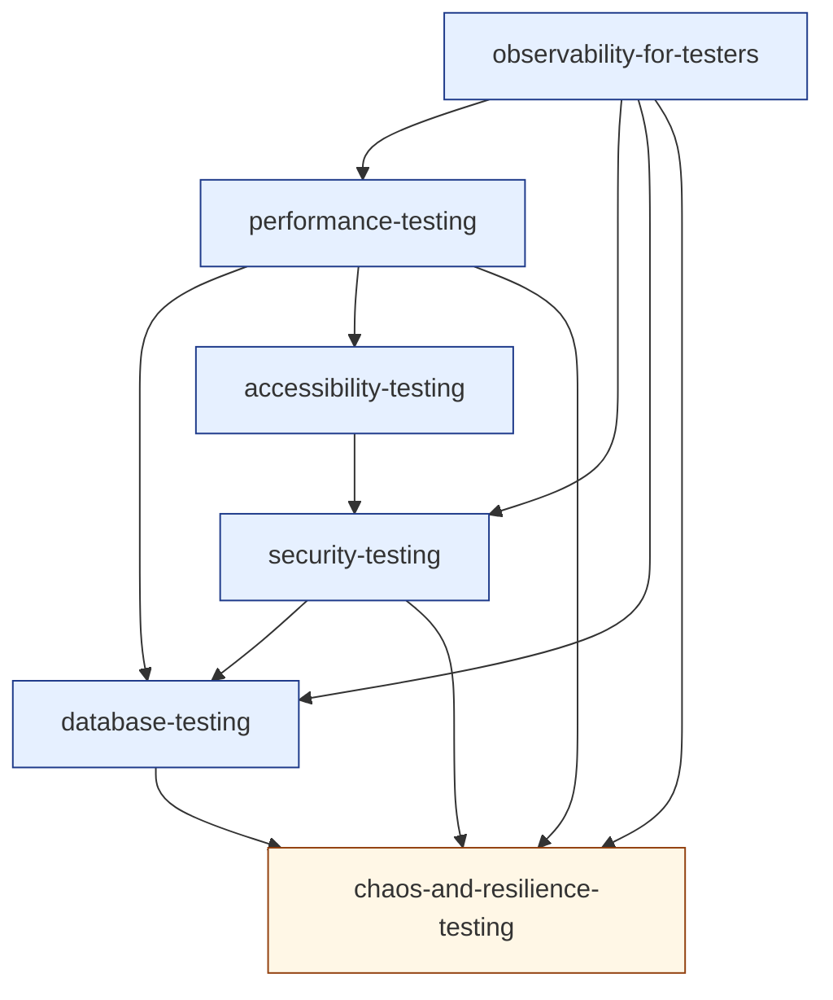

# Cluster 5 — Non-Functional & Specialized Testing (research overview)

> Cluster-level synthesis sitting on top of the six topic-research files in `./cluster-5-non-functional-and-specialized/`.
> Purpose: capture the **cluster as a unit** — positioning, recurring threads, interleaving rules, prerequisite ordering, depth-gate notes — so the author can hold the whole cluster in their head before authoring any single topic.
> Source taxonomy in `revamp-doc/clusters-and-topics.md`; per-topic research in the sibling directory. Companion to [`cluster-1-foundations.md`](./cluster-1-foundations.md), [`cluster-2-test-design-strategy.md`](./cluster-2-test-design-strategy.md), [`cluster-3-functional-execution-test-management.md`](./cluster-3-functional-execution-test-management.md), and [`cluster-4-automation-and-cicd.md`](./cluster-4-automation-and-cicd.md).

---

## 1. What this cluster does

Cluster 5 installs **the specialised non-functional concerns that decide whether systems survive in production** — performance under load, security against adversaries, accessibility for all users, data integrity across migrations and concurrency, observability into running systems, and resilience under failure. None of its topics is about "does the feature work"; all of them are about *under what conditions does the working feature continue to work* — at scale, under attack, for excluded users, during schema change, when a dependency fails, when a query plan flips. The cluster's success criterion is that a learner who finishes it can *take the Cluster-4 toolbelt and apply it to the production concerns that decide whether software is shippable*, and can defend, in writing, *which non-functional gates a project needs and which it can defer*.

This is the cluster where the curriculum's **specialisation layer** is set. Cluster 1 installed the posture; Cluster 2 installed the strategy; Cluster 3 installed the artefact discipline; Cluster 4 installed the running infrastructure; Cluster 5 installs *the categories of testing that decide whether the system is fit for the production environment it will live in*:

- **Performance testing is *workload-modelling-plus-percentile-reading*, not "is it fast?"** Four canonical workload shapes (load · stress · soak · spike), SLO-derived oracles, the average-vs-percentile habit, the closed-vs-open workload distinction, coordinated omission as a named hazard. *(See [`performance-testing`](./cluster-5-non-functional-and-specialized/performance-testing.md).)*
- **Security testing is *adversarial oracles applied to functional tests*, not pentesting on a budget.** Threat modelling as test-design input, OWASP Top 10 / API Top 10 categories as test fodder, AuthZ as the highest-ROI bug class, SAST/DAST/SCA as overlapping defences, supply-chain integrity. *(See [`security-testing`](./cluster-5-non-functional-and-specialized/security-testing.md).)*
- **Accessibility testing is *WCAG conformance plus the limits of automation*, not "axe passes."** POUR principles, A/AA/AAA conformance levels, the four testing modalities (automated, keyboard-only, screen-reader, real-user), the ~30–40% automation ceiling, the accessibility-tree-as-test-target framing. *(See [`accessibility-testing`](./cluster-5-non-functional-and-specialized/accessibility-testing.md).)*
- **Database testing is *the inverted pyramid*: most tests at the integration seam against a real database.** Schema-as-contract, migration-safety as expand-contract discipline, query-plan literacy, transaction-isolation correctness, Testcontainers as the default, the unique stakes of data (correctness errors are irreversible). *(See [`database-testing`](./cluster-5-non-functional-and-specialized/database-testing.md).)*
- **Observability for testers is *production-truth feedback*, not "we use Datadog."** Three signals (logs, metrics, traces) plus the wide-event modernisation, cardinality discipline, four golden signals, SLO-derived alerts, OpenTelemetry as the convergence point. *(See [`observability-for-testers`](./cluster-5-non-functional-and-specialized/observability-for-testers.md).)*
- **Chaos and resilience testing is *hypothesis-driven failure injection*, not Chaos Monkey turned on.** Steady-state → hypothesis → blast radius → run → learn → harden, the four failure classes, retry storms and circuit breakers, GameDay as a recurring practice, observability as a prerequisite. *(See [`chaos-and-resilience-testing`](./cluster-5-non-functional-and-specialized/chaos-and-resilience-testing.md).)*

A learner who finishes Cluster 5 with these six framings internalised is *production-fluent* — equipped to argue for the right non-functional gates at the right cost, to detect the bug classes that matter at scale, and to understand why "the tests pass" is not the same as "the system is ready." Cluster 5 is the **specialisation** cluster; everything before it produced the foundations to apply these specialisations on, and Cluster 6 (AI/LLM QA) inherits this discipline for non-deterministic systems where every Cluster-5 concern must be re-derived.

The cluster also delivers a critical *capability* shift: a learner who completes it can **make architecture-adjacent quality calls** — "we need a perf budget before launch," "we cannot ship without an AuthZ matrix," "this migration must be expand-contract not single-step," "we have no observability for this feature; that's blocking." Without Cluster 5 the learner ships features; with it, the learner ships *production-ready* features and knows the difference.

---

## 2. Recurring threads across the cluster (the interleaving fuel)

Per `best-way-to-build-learning-webapp.md` §5 and `content-template-and-mechanics-map.md` §2, **interleaving inside the cluster is the highest-leverage move the platform makes**. Cluster 5's six topics share six threads, each rich enough to fuel a multi-card retrieval session.

### Thread A — *the asymmetric-blast-radius thread*

Every Cluster 5 topic addresses concerns where the cost of a missed bug is *asymmetric* — a missed functional bug costs a sprint; a missed Cluster-5 bug costs a company:

- `performance-testing` — a missed regression hits all users at peak.
- `security-testing` — a missed AuthZ bug exposes every account.
- `accessibility-testing` — a missed a11y bug excludes users permanently; legal exposure compounds.
- `database-testing` — a missed migration bug corrupts data irreversibly.
- `observability-for-testers` — the absence of observability extends every incident.
- `chaos-and-resilience-testing` — an untested failover is no failover.

A retrieval set pulling cards from any four of these forces the learner to discriminate *what kind of damage each non-functional concern prevents* — exactly the discrimination Cluster 5 is for. This is the cluster's primary interleaving fuel.

### Thread B — *the SLO/oracle thread* (back-link to Cluster 1 mindset)

Every Cluster 5 topic operationalises Cluster 1's oracle problem:

- `performance-testing` — SLO (latency, throughput, error rate) is the perf oracle.
- `security-testing` — the threat model is the security oracle.
- `accessibility-testing` — WCAG conformance level is the a11y oracle.
- `database-testing` — schema constraints + transactional guarantees are data oracles.
- `observability-for-testers` — steady state is the production oracle; SLO budgets are the alert oracle.
- `chaos-and-resilience-testing` — steady state holding under injected failure is the resilience oracle.

The thread argues, across the cluster, that **every non-functional concern needs an oracle written down before testing begins**. Without it, "fast enough" / "secure enough" / "accessible enough" / "fault-tolerant enough" are arguments, not measurements. This is the cluster's continuation of `[[test-oracles-and-prioritization]]`.

### Thread C — *the percentile/distribution thread*

Cluster 5 is the cluster where *averages stop working*. Every topic engages this:

- `performance-testing` — p50, p95, p99, p99.9; averages lie about tail.
- `security-testing` — most attacks succeed on the long-tail edge case; the median request is safe.
- `accessibility-testing` — automation catches the ~30–40% bulk; the long tail needs human judgement.
- `database-testing` — query plans flip on data-volume; the rare slow query dominates user pain.
- `observability-for-testers` — histograms beat gauges; tail sampling beats head sampling.
- `chaos-and-resilience-testing` — failures are rare-but-expensive events; the test is "do we survive the tail."

The thread installs *distribution-thinking* as a Cluster-5 prerequisite. This is the cluster where the learner converts "average user experience" into "p95 user experience" by force.

### Thread D — *the cost-of-coverage thread* (inherited from Cluster 4 signal-to-cost)

Every Cluster 5 topic has a cost-of-coverage curve that the team must place itself on:

- `performance-testing` — synthetic perf in CI (cheap, regression-only) vs production-shadow load tests (expensive, ground truth).
- `security-testing` — SAST/SCA in CI (cheap, false positives) vs pentest (expensive, complete).
- `accessibility-testing` — axe-core (cheap, ~30%) vs manual SR + real-user testing (expensive, complete).
- `database-testing` — in-memory tests (cheap, false confidence) vs Testcontainers (medium) vs production-shape data (expensive).
- `observability-for-testers` — three pillars at low cardinality (cheap) vs wide-event at high cardinality (expensive, more answer-able).
- `chaos-and-resilience-testing` — chaos in CI (cheap, regression-only) vs production GameDays (expensive, ground truth).

The thread argues that **every Cluster-5 concern is solved by *multiple overlapping layers at different cost points*** — never one tool, never one cost tier. The QA contribution is choosing the layer mix.

### Thread E — *the legal-and-ethical floor thread*

Cluster 5 is the cluster where *external standards bind*. Every topic engages it differently:

- `performance-testing` — soft floor (user expectations, business SLAs, contractual penalties).
- `security-testing` — hard floor (SOC2, ISO 27001, PCI-DSS, sector-specific regulations).
- `accessibility-testing` — hard floor (EU EAA 2025, ADA, EN 301 549, jurisdiction-specific).
- `database-testing` — hard floor (data-protection regulations, retention, deletion, residency).
- `observability-for-testers` — soft floor (audit trail expectations, SLA reporting).
- `chaos-and-resilience-testing` — soft floor (uptime commitments, recovery time obligations).

The thread argues that **non-functional concerns have *external accountability* in ways functional bugs don't.** A functional bug is a quality issue; an a11y bug is a quality issue *and* a legal one in the EU. The QA contribution: name the external standard for every Cluster-5 concern.

### Thread F — *the production-environment thread*

Cluster 5 is where *the test environment becomes structurally insufficient*. Every topic engages this:

- `performance-testing` — staging perf ≠ production perf (data volume, cache state, traffic patterns).
- `security-testing` — staging security ≠ production security (real attackers test prod, not staging).
- `accessibility-testing` — local a11y ≠ deployed a11y (CSP, HTTPS contexts, real assistive tech on real OS).
- `database-testing` — test DB ≠ production DB (size, statistics, plans, lock contention).
- `observability-for-testers` — staging telemetry ≠ production telemetry (no real users, no real load).
- `chaos-and-resilience-testing` — staging failover ≠ production failover (different topology, different timing).

The thread argues that **Cluster 5 testing inherently requires bridges to production**: production-shape data in test, production-mirror perf environment, production observability that feeds back to QA, production-region chaos with constrained blast radius. The cluster is the bridge between "we tested it" and "we'll know if it breaks in prod."

---

## 3. Interleaving rules for `src/lib/srs/interleave.ts`

`best-way-to-build-learning-webapp.md` §5 specifies: *"Within a session, never serve two consecutive cards from the same concept tag."* Within Cluster 5 the tag granularity is the topic. Additional rules the platform should honour for this cluster specifically:

1. **No two consecutive cards from the same topic** (the default rule).
2. **Mix the distribution-thinking thread (Thread C):** within any 6-card session that includes any percentile/oracle card, prefer to include at least two cards whose source-topics surface distribution-thinking in *different* domains (latency · threat · user-impact · data · alert · failure). The cross-reinforcement is the point — the discrimination is *between distribution applications*, not within one.
3. **Preserve Cluster 1, 2, 3, and 4 cards in Cluster 5 sessions.** Per build-doc §11, layer-1 facts continue forever. A Cluster 5 retrieval session should typically include 1–2 cards from earlier clusters — particularly from `[[qa-mindset]]`, `[[test-oracles-and-prioritization]]`, `[[risk-based-testing]]`, `[[shift-left-and-shift-right]]`, `[[unit-integration-e2e-boundaries]]`, `[[mocking-stubbing-test-doubles]]`, `[[playwright]]`, `[[api-testing]]`, `[[ci-cd-for-testing]]`, which feed Threads B, D, E, and F here directly.
4. **After encoding a new Cluster 5 topic, the immediate practice set should be ~70% prior topics, ~30% the new one** — the platform-wide rule from build-doc §5, anchored to this cluster. Especially important here because the topics are temptingly specialised and easy to over-index on; the platform must counter the new-specialisation bias.
5. **Cross-cluster reach-forward into Cluster 6.** Cluster 5's discipline is the substrate for Cluster 6 (AI/LLM QA): *eval design* inherits perf percentile-thinking; *AI safety* inherits security-testing oracles; *RAG testing* inherits database-testing data-correctness; *AI observability* inherits this cluster's observability framing wholesale; *eval-in-prod* inherits chaos's "production GameDay" framing. The platform should not "graduate" a learner out of Cluster 5 once Cluster 6 starts; Cluster 6 cards specifically *consume* Cluster 5 vocabulary.
6. **Sister-topic pairs.** Pair adjacent Cluster 5 topics within a session, against the no-adjacent rule, for *contrastive* sets — e.g., one card on a perf SLO followed by one card on a chaos steady-state (both are "what does healthy look like, quantitatively?"). Or one card on AuthZ matrix and one card on schema constraints (both are "test the data boundary"). Use sparingly (≤ 1 such pair per 6-card session).
7. **Substrate-first ordering inside Cluster 5.** A learner who has not yet retained `[[observability-for-testers]]` should *not* be shown advanced chaos engineering cards (blast-radius design, GameDay run-of-show) until observability retention reaches stability threshold. Observability is the prerequisite for chaos; the interleaver should respect this gate.
8. **The "specialisation triangle" pattern.** Cluster 5 has three pairs with deep cross-references: (perf ↔ observability), (security ↔ database), (a11y ↔ chaos has the weakest tie — the others are stronger). Within a session, the platform should occasionally pair a topic with its strongest sister, against the no-adjacent rule, to install the cross-coupling.

---

## 4. Authoring order (prerequisite-resolved)

The topic-research files name their `prerequisites` only implicitly (via wikilink density). Below is the explicit ordering the author should follow when filling the `content-template-and-mechanics-map.md` template:

1. **`observability-for-testers`** *(layer: systems)* — **Authored first.** Observability is the *prerequisite* for chaos, the *target medium* for perf budgets, the *audit layer* for security incidents, the *production analogue* of database query-plan capture. Authoring it first lets every later topic reference its vocabulary (signals, percentiles, SLO budgets, structured events) without forward-referencing.
2. **`performance-testing`** *(pilot for Cluster 5; layer: systems)* — **Recommended cluster-5 pilot.** Most concretely actionable, most directly applicable to the site (Lighthouse-CI is already wired), and tightly coupled to observability (just authored). The performance topic's percentile-thinking establishes Thread C as a habit before later topics need it.
3. **`security-testing`** *(layer: systems)* — Authored third because (a) it is the highest-stakes non-functional concern; (b) it stands largely alone (its prerequisites are Cluster 1/2 mindset, not other Cluster 5 topics); (c) authoring it early lets later topics reference the security-adjacency (e.g., chaos for security incidents, database row-level security, accessibility's accessible-authentication overlap).
4. **`accessibility-testing`** *(layer: systems)* — Authored fourth because the site already has axe assertions in e2e specs (per `CLAUDE.md`), so the topic has immediate operational anchor. Pairs naturally with the now-established performance topic (both run in Lighthouse). Cluster 5's only "patterns-with-systems-ambition" subset is here (depending on the project's a11y maturity).
5. **`database-testing`** *(layer: systems)* — Authored fifth. Tightly coupled to the Drizzle + Neon stack (per `CLAUDE.md`); easier to teach after observability (slow-query logs, replica lag) and performance (data-volume → plan flip) have been authored. The expand-contract migration discipline benefits from the percentile/distribution and SLO-thinking already installed.
6. **`chaos-and-resilience-testing`** *(layer: patterns)* — **Authored last.** Inherently depends on observability (#1) and at least one of perf/security/database having been authored to provide concrete chaos scenarios. The least-mature category in most project contexts; landing it last lets it reference all the upstream cluster vocabulary. Also the topic most likely to surface "we cannot do this yet because we lack observability X / runbooks Y" — landing it last positions those gaps as cluster-completion artefacts.

Author one topic end-to-end (`observability-for-testers` followed by `performance-testing`) **before** authoring topic #3. Walk both through the lint, seeder, retrieval queue, Feynman route, and depth gate per content-template §5. Only then start on topic #3.

### Layer assignments at a glance

| Topic | Recommended layer | Surfaces required |
|---|---|---|
| `observability-for-testers` | systems | encoding · retrieval · Feynman · projects |
| `performance-testing` | systems | encoding · retrieval · Feynman · projects |
| `security-testing` | systems | encoding · retrieval · Feynman · projects |
| `accessibility-testing` | systems | encoding · retrieval · Feynman · projects |
| `database-testing` | systems | encoding · retrieval · Feynman · projects |
| `chaos-and-resilience-testing` | patterns | encoding · retrieval · Feynman *(projects optional)* |

If the cluster shipped today with these layer assignments it would emit roughly **30–36 spaced-repetition cards** (5–6 prompts per topic × 6 topics), **5 hands-on practice tasks** (one per `systems` topic: a perf budget defence, a STRIDE-driven security plan, an a11y audit, a migration safety harness, an observability story; plus a chaos `patterns`-task that is artefact-producing — a GameDay plan with one dry-run). The chaos `patterns`-task produces a substantive *artefact* (run-book + findings), so the cluster's *gradable output count* effectively rises to **6 rubric-gradable artefacts** — matching Clusters 3 and 4.

This is the **densest systems-layer cluster** in the curriculum (5 systems, 1 patterns). Authoring will take longer per topic than Clusters 1–4 (target 4–6 hours per systems topic, plus the dry-run for chaos). Budget realistically — Cluster 5 is the production-reality cluster.

---

## 5. Depth-gate notes (per `content-template-and-mechanics-map.md` §3)

Each topic was research-tested against the depth gate. Findings:

- All six topics generate **≥ 5 genuinely distinct retrieval prompts** without padding. The cluster passes the most important gate.
- All six produced **meaningful diagram seeds**: the four-workload-shapes plot, the latency-throughput knee curve, the STRIDE-per-element walkthrough, the three-trees diagram (DOM/render/a11y), the expand-contract migration timeline, the four-golden-signals dashboard, the distributed-trace shape, the retry-storm amplification. No topic should declare `<Diagram skip="atomic-fact" />`.
- All five `systems`-layer topics produced a **hands-on practice task** that is genuinely productive: the perf-budget defence, the STRIDE security threat model + test plan, the end-to-end a11y audit, the migration-safety harness, the observability story for a new feature — each is a *real artefact* the team can use.
- The one `patterns`-layer topic (`chaos-and-resilience-testing`) produced an artefact-producing practice task: the GameDay design + dry-run. This is denser than typical `patterns` tasks because the artefact (run-book + findings) is operational reality, not an exercise.
- **One topic — `chaos-and-resilience-testing` — risks being aspirational** for projects without observability or the operational capacity to run a real GameDay. Mitigation: scope the practice task to a *design document* plus a *single dry-run experiment* on a non-critical dependency. The topic earns its slot if it produces an executable GameDay plan even at limited scale. For projects that cannot run even a dry-run, the topic should remain at `patterns` layer and be re-evaluated.
- **One topic — `database-testing` — risks survey-shape** if the author tries to cover every DBMS. Mitigation: stay Postgres-centric (the site's stack); name MySQL/SQLite divergence in passing without depth. The topic earns its slot via the migration-safety practice task, which is concrete enough to discipline the lesson.
- **One topic — `security-testing` — risks scope-creep into pentesting.** Mitigation: keep the framing as "QA who notices security smells," not "QA-pentester crossover training." The depth-gate verdict: the topic teaches the *categories* and *test-design implications* deeply; specialised pentest techniques are referenced and not taught.
- **One topic — `observability-for-testers` — risks tool-survey shape.** Mitigation: name vendors by *category-of-value* (Sentry = error tracking; Honeycomb = wide events; Grafana = open-source dashboards), not by feature comparison. The practice task produces a tool-agnostic spec, anchoring the lesson.
- **No topic is a candidate for merge or cut.** Each occupies distinct conceptual ground; the cluster's six topics correspond to six different *failure-mode categories* in production.

---

## 6. Wikilink graph (Cluster 5 internal)



Incoming edges (back-references to Clusters 1, 2, 3, 4):

- ← `qa-mindset` *(C1)* — every Cluster 5 topic operationalises adversarial / failure-aware thinking.
- ← `test-oracles-and-prioritization` *(C1)* — SLO, threat model, WCAG, schema constraint, steady state are all oracles.
- ← `verification-vs-validation` *(C1)* — Cluster 5 verifies non-functional invariants; UAT validates the user experience of them.
- ← `black-white-gray-box-thinking` *(C1)* — security testing is the canonical adversarial gray-box exercise.
- ← `risk-based-testing` *(C2)* — every Cluster 5 concern is impact-likelihood-ranked; the cluster operationalises the risk register.
- ← `test-pyramid-and-trophy` *(C2)* — Cluster 5 inverts the pyramid for data (integration-heavy) and shifts it for perf (CI-heavy budgets).
- ← `shift-left-and-shift-right` *(C2)* — SAST/perf-CI/axe-in-CI are shift-left; chaos/observability/RUM are shift-right.
- ← `exploratory-testing` *(C2)* — security and a11y manual passes are charter-driven exploration.
- ← `test-design-techniques` *(C2)* — BVA/EP feed the AuthZ matrix and the perf workload model.
- ← `test-planning-cases-and-scenarios` *(C3)* — non-functional acceptance criteria become Cluster 5 test plans.
- ← `test-types-smoke-sanity-regression-uat` *(C3)* — perf-smoke, security-regression, a11y-regression are role-typed.
- ← `unit-integration-e2e-boundaries` *(C3)* — each Cluster 5 topic is testable at multiple seams; the boundary choice shapes the test.
- ← `mocking-stubbing-test-doubles` *(C3)* — database testing's "don't mock what you don't own" is the cluster's strongest application.
- ← `defect-lifecycle-and-bug-reporting` *(C3)* — non-functional bugs need oracle-anchored reports (SLO breach, WCAG criterion, CVE).
- ← `frontend-prereqs-for-testers` *(C4)* — substrate for a11y (accessibility tree), perf (rendering pipeline), observability (RUM).
- ← `playwright` *(C4)* — axe integration, perf metrics in traces, security header assertions all live in Playwright.
- ← `selenium-cypress-playwright` *(C4)* — perf and a11y plugins exist across stacks; the comparison's quality bar applies.
- ← `api-testing` *(C4)* — API security (OWASP API Top 10) and API perf are Cluster 5 specialisations of Cluster 4 mechanics.
- ← `mobile-testing-overview` *(C4)* — mobile a11y, mobile perf, mobile security are specialisation specialisations.
- ← `ci-cd-for-testing` *(C4)* — every Cluster 5 concern integrates with CI (Lighthouse-CI, SAST, axe budget, migration tests, chaos in CI).

Outgoing edges (forward-references to Cluster 6 — AI/LLM QA):

- → `ai-fundamentals-for-testers` — LLM perf has its own percentile vocabulary (TTFT, TPS); inherits this cluster's percentile-thinking.
- → `eval-design-llm` — eval design inherits SLO/oracle framing from this cluster wholesale.
- → `rag-testing` — RAG correctness is a data-integrity problem; inherits database-testing's "test the data" discipline.
- → `prompt-engineering-and-regression` — prompt regression is performance regression for non-deterministic systems.
- → `ai-safety-testing` — direct continuation of security testing (prompt injection, jailbreaks, data leakage).
- → `ai-observability-and-drift` — direct continuation of observability for non-deterministic systems; eval-in-prod is the chaos analogue.

The density of outgoing edges from Cluster 5 to *every* Cluster 6 topic is itself evidence that Cluster 5 is the curriculum's **specialisation substrate** for AI/LLM QA. The pattern: Cluster 4 provides the toolbelt; Cluster 5 provides the *production concerns*; Cluster 6 re-derives both for non-deterministic systems.

---

## 7. What this research pass deliberately did not produce

- **No lesson text.** The research files are inputs for the template, not the template fill. Per `content-template-and-mechanics-map.md` §4, the author re-encodes from this research into Core Idea, Worked Example, Pitfalls, Retrieval Prompts, Practice Task, and Feynman — they do not transcribe.
- **No card IDs.** `<Prompt id="...">` stable IDs are the author's responsibility per template §1.2; the prompt *seeds* in the research files are draftable but unsigned.
- **No diagram artefacts.** Each topic file describes the diagrams the lesson should contain; producing the SVG/Mermaid belongs in the authoring pass. Cluster 5 will be diagram-heavy (four-workload-shapes plot, latency-throughput knee, STRIDE walkthrough, three-trees, expand-contract timeline, four-signals dashboard, distributed-trace shape, retry-storm amplification). Budget time accordingly.
- **No vendor endorsements beyond context.** The cluster names category tools (k6, axe-core, Sentry, Honeycomb, Testcontainers, Gremlin) but does not endorse one over another except where the site's stack dictates (Lighthouse-CI, Drizzle, Neon, `@axe-core/playwright`). Other vendors are named to give the learner the recognition vocabulary, not the recommendation.
- **No verification of citations beyond URL plausibility.** Several primary sources (OWASP Top 10 2024 revision, WCAG 2.2 jurisdictional adoption, INP behaviour evolution, Postgres version-specific migration semantics, OpenTelemetry stability state) shift quickly. The author should re-verify any source they quote directly before publication.
- **No clusters beyond #5.** This is a deliberate scope per `conversation-summary.md` §6 and `content-template-and-mechanics-map.md` §5. Cluster 6 (AI/LLM Quality Engineering) research begins after Cluster 5 is authored end-to-end or after the user explicitly requests it.

---

## 8. Open questions to resolve before authoring starts

Inherited from earlier clusters (still open):

1. **MDX component status.** `<Diagram>`, `<Prompt>`, `<Feynman>`, `<PracticeTask>` are unimplemented (per content-template §6 decision log). Cluster 5 authoring assumes they exist or that the pilot uses fallback markup.
2. **Seeder behaviour.** `scripts/seed-cards.ts` must honor `<Prompt id="...">` and fail the build below minimum prompt count.
3. **`/explain/<slug>` route.** Required for `systems`-layer topics (five of six in this cluster).

New to Cluster 5:

4. **Pilot topic.** Recommendation: `observability-for-testers` (prerequisite) followed by `performance-testing` (cluster pilot). Pilot pair, not single pilot, because performance testing examples reference observability vocabulary, and observability without a concrete consumer-discipline is too abstract. Confirm before starting authoring.
5. **Standards version pinning.** WCAG 2.2 (Oct 2023), OWASP Top 10 (2021 — the next revision is in motion; verify), INP as the official Core Web Vital (Mar 2024). Every standards-cited example must match the version this curriculum commits to.
6. **Vendor neutrality vs project stack alignment.** The site's stack pins certain tools (Lighthouse-CI for perf-CI, `@axe-core/playwright` for a11y, Sentry for errors *if* installed, Neon-Postgres for DB, Drizzle for migrations). The lessons must reference these where they apply *and* teach the categories without lock-in. Confirm the alignment list before authoring.
7. **The "production access" gap.** Cluster 5 ideally references real production observability. The site is the author's project; the author can configure dashboards but cannot reference a production incident archive at scale. Decide whether the lessons reference a synthetic incident archive (made for the curriculum) or refer the learner outward (post-mortem archives like [github.com/danluu/post-mortems](https://github.com/danluu/post-mortems)).
8. **Lighthouse-CI integration.** Verify the site's `lighthouserc.json` / `lighthouserc.desktop.json` files are current and the perf topic can reference them concretely.
9. **The `@axe-core/playwright` integration.** Verify it's still operational; the a11y topic's worked examples should run against the site's existing axe assertions.
10. **Testcontainers in the site's `vitest.integration.config.ts`.** Verify the pattern; the database topic should reference the project's actual integration setup, not abstract examples.
11. **EU EAA enforcement (June 2025) and WCAG version implication.** Verify whether the site's EAA-relevance triggers a 2.2 conformance requirement; the a11y topic's framing depends on this.
12. **OpenTelemetry stability across signals.** Verify which OTel signals are GA at authoring time; the observability topic's instrumentation recommendation depends on this.
13. **Chaos tooling for the site's stack.** Vercel + Neon + Astro doesn't have a mature chaos story; the chaos topic should be honest about this. The pedagogical solution: chaos-in-CI via Toxiproxy + integration tests, plus design exercises for production chaos that the project may never run.
14. **Cluster 6 boundary clarity.** Several Cluster 5 topics flirt with AI-adjacencies (eval design extends perf testing; AI safety extends security testing). Define the boundary deliberately so Cluster 6 doesn't duplicate Cluster 5 and so Cluster 5 doesn't pre-empt Cluster 6.
15. **Survey-risk on `observability-for-testers`.** The topic is dense with tooling. Re-evaluate the depth-gate verdict after authoring: if the practice task isn't producing a tool-agnostic spec, the lesson has slipped into tool survey. Mitigation: enforce the *observability story* artefact (questions answered, structured log spec, metric labels with cardinality, SLO-derived alert, dashboard sketch, runbook) as the topic's practice task.
16. **The "authoring scale" question.** This cluster has 5 `systems`-layer topics. Per `content-template-and-mechanics-map.md` §4, that's 20–30 author-hours. Verify the author has the calendar — splitting the cluster across two authoring waves is acceptable (e.g., wave 1: observability + perf + security; wave 2: a11y + db + chaos).

---

## 9. File map

```
revamp-knowledge/
├── cluster-1-foundations.md
├── cluster-2-test-design-strategy.md
├── cluster-3-functional-execution-test-management.md
├── cluster-4-automation-and-cicd.md
├── cluster-5-non-functional-and-specialized.md                  # this file
├── cluster-1-foundations/
│   └── ... (six topic-research files)
├── cluster-2-test-design-strategy/
│   └── ... (six topic-research files)
├── cluster-3-functional-execution-test-management/
│   └── ... (six topic-research files)
├── cluster-4-automation-and-cicd/
│   └── ... (six topic-research files)
└── cluster-5-non-functional-and-specialized/
    ├── performance-testing.md
    ├── security-testing.md
    ├── accessibility-testing.md
    ├── database-testing.md
    ├── observability-for-testers.md                              # pilot — prerequisite
    └── chaos-and-resilience-testing.md
```

Six topic files, one cluster overview, no other artefacts. Ready as inputs to the authoring loop in `content-template-and-mechanics-map.md` §4.
