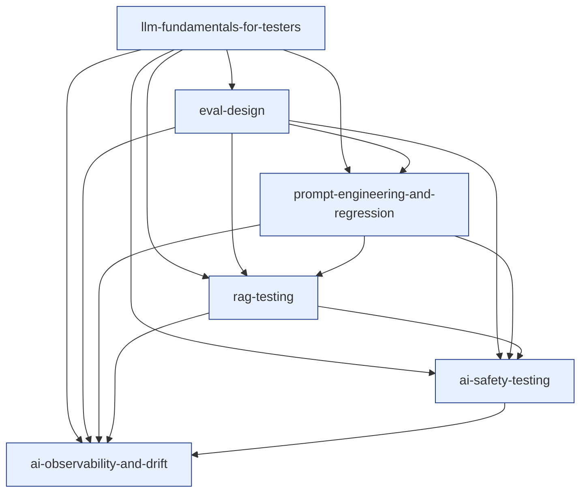

# Cluster 6 — AI / LLM Quality Engineering (research overview)

> Cluster-level synthesis sitting on top of the six topic-research files in `./cluster-6-ai-llm-quality-engineering/`.
> Purpose: capture the **cluster as a unit** — positioning, recurring threads, interleaving rules, prerequisite ordering, depth-gate notes — so the author can hold the whole cluster in their head before authoring any single topic.
> Source taxonomy in `revamp-doc/clusters-and-topics.md`; per-topic research in the sibling directory. Companion to [`cluster-1-foundations.md`](./cluster-1-foundations.md), [`cluster-2-test-design-strategy.md`](./cluster-2-test-design-strategy.md), [`cluster-3-functional-execution-test-management.md`](./cluster-3-functional-execution-test-management.md), [`cluster-4-automation-and-cicd.md`](./cluster-4-automation-and-cicd.md), and [`cluster-5-non-functional-and-specialized.md`](./cluster-5-non-functional-and-specialized.md).
>
> Slug note: the topic slugs settled in this cluster are `llm-fundamentals-for-testers`, `eval-design`, `rag-testing`, `prompt-engineering-and-regression`, `ai-safety-testing`, `ai-observability-and-drift`. Cluster 5's forward-references (which used `ai-fundamentals-for-testers` and `eval-design-llm`) should be reconciled to these on the next pass through Cluster 5.

---

## 1. What this cluster does

Cluster 6 installs **the QA discipline for non-deterministic, drifting, language-model-driven systems** — where every Cluster 1–5 assumption (deterministic outputs, stable specs, well-defined oracles, bounded inputs) is broken and must be re-derived. None of its topics is about *building* AI; all of them are about *testing* systems that integrate it. The cluster's success criterion is that a learner who finishes it can *take any LLM-integrated feature and answer, in writing, "how do you know it works, how will you know when it stops, and what happens when it does?"* — the LLM-era equivalent of the question Cluster 1 first posed for any software system.

This is the cluster where the curriculum's **paradigm-shift layer** is set. Cluster 1 installed the posture; Cluster 2 installed the strategy; Cluster 3 installed the artefact discipline; Cluster 4 installed the running infrastructure; Cluster 5 installed the production-survival concerns; Cluster 6 installs *the testing discipline for systems whose behaviour is sampled from a probability distribution that itself drifts*:

- **LLM fundamentals for testers is *the substrate* — tokens, sampling, context, fingerprint, cost, latency, why determinism dies and how to test anyway.** The lesson dislodges the "LLMs are just APIs" framing and installs the bounded-stochasticity discipline. *(See [`llm-fundamentals-for-testers`](./cluster-6-ai-llm-quality-engineering/llm-fundamentals-for-testers.md).)*
- **Eval design is *the spine of LLM QA* — datasets as fixtures, rubrics as assertions, statistical thresholds, judge calibration, eval-as-contract.** It is the LLM-era integration test, the regression suite, and the release decision tool, all in one. *(See [`eval-design`](./cluster-6-ai-llm-quality-engineering/eval-design.md).)*
- **RAG testing is *pipeline testing for grounded generation* — five testable stages (ingest, chunk, embed, retrieve, rerank, generate), per-stage metrics, the refusal eval, the lost-in-the-middle reality.** Most LLM products are RAG products; this is where most LLM bugs live. *(See [`rag-testing`](./cluster-6-ai-llm-quality-engineering/rag-testing.md).)*
- **Prompt engineering and regression is *prompts-as-code with the regression discipline to match* — versioning, structured outputs, A/B / shadow eval, model-pair regression, prompt-token budgets.** The lesson treats the prompt as the most-changed code in the system, with the test discipline that demands. *(See [`prompt-engineering-regression`](./cluster-6-ai-llm-quality-engineering/prompt-engineering-regression.md).)*
- **AI safety testing is *adversarial testing where every input is also an instruction* — OWASP LLM Top 10, prompt injection (direct and indirect), jailbreaks, the lethal trifecta, tool-call authZ, the layered-defence architecture.** It is the direct continuation of `[[security-testing]]` for systems where the model is not a security boundary. *(See [`ai-safety-testing`](./cluster-6-ai-llm-quality-engineering/ai-safety-testing.md).)*
- **AI observability and drift is *production-truth feedback for stochastic systems* — traces, prompt logs, eval signals, drift metrics, fingerprint logging, cost as a quality signal, eval-in-prod as the chaos analogue.** It closes the loop from production reality back to release decisions. *(See [`ai-observability-and-drift`](./cluster-6-ai-llm-quality-engineering/ai-observability-and-drift.md).)*

A learner who finishes Cluster 6 with these six framings internalised is *LLM-fluent* — equipped to embed an LLM in a product, to write the eval that defends shipping it, to test the RAG pipeline that grounds it, to version the prompt that runs it, to red-team the safety boundary around it, and to instrument the observability that catches its drift. Cluster 6 is the **paradigm-shift cluster**; without it, the rest of the curriculum's discipline does not transfer to the systems most teams will be building over the next decade.

The cluster also delivers a critical *vocabulary* shift: a learner who completes it can **disagree with AI hype on technical grounds** — "this is a RAG faithfulness problem, not a model problem," "your eval is 5 examples of vibe checks, not a regression suite," "your bot has the lethal trifecta and one indirect injection ships your data," "your refusal-rate dropped 4 points overnight; check `system_fingerprint`." This is the cluster that converts a Cluster 1–5 tester into someone who can *test the AI features the product team is shipping right now*.

---

## 2. Recurring threads across the cluster (the interleaving fuel)

Per `best-way-to-build-learning-webapp.md` §5 and `content-template-and-mechanics-map.md` §2, **interleaving inside the cluster is the highest-leverage move the platform makes**. Cluster 6's six topics share six threads, each rich enough to fuel a multi-card retrieval session.

### Thread A — *the bounded-stochasticity thread*

Every Cluster 6 topic is about *testing a system whose outputs vary even when inputs do not*. The discipline that recurs: assert on schema / invariants / distribution / rubric, never on exact strings:

- `llm-fundamentals-for-testers` — `temperature=0` is greedy, not deterministic; assert on schemas, not strings.
- `eval-design` — Wilson confidence intervals on noisy pass rates; never claim improvement inside the noise floor.
- `rag-testing` — retrieval recall@k is a distribution metric; per-stage variance is real.
- `prompt-engineering-and-regression` — few-shot example order shifts scores; runs must be statistically bounded.
- `ai-safety-testing` — refusal rate is a probability; safety eval reports rates with CIs.
- `ai-observability-and-drift` — drift is detected by distribution shift, not point comparison.

A retrieval set pulling cards from any four of these forces the learner to discriminate *what kind of distribution-thinking each LLM concern requires* — exactly the discrimination Cluster 6 is for. This is the cluster's primary interleaving fuel and a direct port of Cluster 5's Thread C (percentile/distribution).

### Thread B — *the prompt-and-context-as-code thread*

Every Cluster 6 topic treats the prompt or its surrounding context assembly as an artefact requiring engineering discipline:

- `llm-fundamentals-for-testers` — prompts assemble layers; logging the assembly is mandatory.
- `eval-design` — the eval is the contract; prompts must regress against it.
- `rag-testing` — retrieved chunks join the prompt as data; spotlighting + ordering matter.
- `prompt-engineering-and-regression` — direct topic ownership; prompts as code, structured outputs as types.
- `ai-safety-testing` — defensive prompt design (delimiters, spotlighting, role separation) is a safety control.
- `ai-observability-and-drift` — the full assembled prompt is the log object that lets a tester reproduce.

The thread argues, across the cluster, that **the prompt is the most-changed and least-versioned code in most LLM systems**. The cluster fixes that.

### Thread C — *the SLO/oracle thread* (back-link to Cluster 1 and Cluster 5)

Every Cluster 6 topic operationalises the oracle problem from Cluster 1 and the SLO discipline from Cluster 5:

- `llm-fundamentals-for-testers` — perf SLOs decompose: TTFT, TPS, total latency, cost-per-call.
- `eval-design` — the rubric *is* the oracle; eval is the LLM-era integration test.
- `rag-testing` — retrieval has IR metrics (recall@k, MRR); generation has rubric metrics (faithfulness, relevance).
- `prompt-engineering-and-regression` — prompt changes regressed against the eval; eval is the contract.
- `ai-safety-testing` — refusal-rate SLO; over-refusal SLO; cost-of-inference SLO.
- `ai-observability-and-drift` — drift thresholds are SLOs on production behaviour.

The thread argues that **every LLM concern needs a numeric oracle written down before testing begins**. Without it, "good enough" is an argument, not a measurement. This is the cluster's continuation of Cluster 5's Thread B.

### Thread D — *the cost-of-coverage thread* (inherited from Clusters 4 and 5)

Every Cluster 6 topic has a cost-of-coverage curve teams must place themselves on, *and* the cost is denominated in dollars (not just CI-minutes):

- `llm-fundamentals-for-testers` — model choice trades $/quality; reasoning models trade cost for accuracy.
- `eval-design` — tiered evals (PR-smoke vs release-regression vs weekly-deep); each row costs real money.
- `rag-testing` — reranker on/off, embedding model size, chunk strategy — each shifts retrieval cost.
- `prompt-engineering-and-regression` — prompt tokens × volume × $/1k = monthly bill; the regression catches creep.
- `ai-safety-testing` — automated probes (cheap, broad, known patterns) vs human red-teaming (expensive, deep, novel).
- `ai-observability-and-drift` — eval-in-prod sampling rate trades cost for signal; full-traffic eval is rarely affordable.

The thread argues that **every Cluster-6 concern is solved by *multiple overlapping cost-tiered layers*** — never one tool, never one tier. The QA contribution: choose the layer mix that produces release-grade signal at affordable spend.

### Thread E — *the drift-and-versioning thread*

Cluster 6 is the cluster where *everything moves under your feet without a code change*. Every topic engages this:

- `llm-fundamentals-for-testers` — model aliases drift; `system_fingerprint` is the only signal; pin model IDs.
- `eval-design` — judge models drift; rubrics rot; datasets diverge from production traffic.
- `rag-testing` — corpora rot; embedding-model upgrades silently re-shape the index.
- `prompt-engineering-and-regression` — prompts grow; few-shot examples accrete; cost creeps.
- `ai-safety-testing` — refusal training shifts; new jailbreak techniques emerge weekly.
- `ai-observability-and-drift` — direct topic ownership; multi-axis drift is the discipline.

The thread argues that **LLM systems require continuous observation in a way prior testing disciplines do not**. A passing release suite is necessary but never sufficient; the system that worked yesterday is *not* the system running today.

### Thread F — *the safety/compliance/legal thread*

Cluster 6 is where *external accountability binds hard and early*. Every topic engages it:

- `llm-fundamentals-for-testers` — knowledge cutoff dates carry liability for time-sensitive answers.
- `eval-design` — compliance reporting requires named tests, datasets, dates.
- `rag-testing` — data-handling on indexed corpora (PII, retention, deletion) is a regulated concern.
- `prompt-engineering-and-regression` — prompt-injection-mediated harm is auditable to the prompt design.
- `ai-safety-testing` — direct topic ownership; OWASP LLM Top 10, NIST AI RMF, EU AI Act, MITRE ATLAS.
- `ai-observability-and-drift` — EU AI Act post-market monitoring requires retained event logs.

The thread argues that **LLM features have *external accountability* in ways most prior software did not**. The QA contribution: the testing discipline is *also* the compliance discipline; design accordingly. This thread is a direct port of Cluster 5's Thread E and intensifies it — the legal landscape is moving faster than the technical one.

---

## 3. Interleaving rules for `src/lib/srs/interleave.ts`

`best-way-to-build-learning-webapp.md` §5 specifies: *"Within a session, never serve two consecutive cards from the same concept tag."* Within Cluster 6 the tag granularity is the topic. Additional rules the platform should honour for this cluster specifically:

1. **No two consecutive cards from the same topic** (the default rule).
2. **Mix the bounded-stochasticity thread (Thread A)** within any 6-card session that includes any distribution / rubric / drift card; prefer to include at least two cards whose source-topics surface *different* applications of distribution-thinking (sampling parameters · eval CIs · retrieval recall · prompt run-to-run variance · refusal rate · drift detection). The cross-reinforcement is the point.
3. **Preserve Cluster 1, 2, 3, 4, and 5 cards in Cluster 6 sessions.** Per build-doc §11, layer-1 facts continue forever. A Cluster 6 retrieval session should typically include 1–2 cards from earlier clusters — particularly from `[[qa-mindset]]`, `[[test-oracles-and-prioritization]]`, `[[risk-based-testing]]`, `[[shift-left-and-shift-right]]`, `[[unit-integration-e2e-boundaries]]`, `[[mocking-stubbing-test-doubles]]`, `[[performance-testing]]`, `[[security-testing]]`, `[[observability-for-testers]]`, `[[chaos-and-resilience-testing]]`, which feed Threads A, B, C, D, E, and F here directly. Cluster 6 *consumes* Cluster 5 vocabulary; the interleaver should not "graduate" the learner away from it.
4. **After encoding a new Cluster 6 topic, the immediate practice set should be ~70% prior topics, ~30% the new one** — the platform-wide rule from build-doc §5, anchored to this cluster. Especially important here because the topics are temptingly novel and easy to over-index on; the platform must counter the novelty bias.
5. **Substrate-first ordering inside Cluster 6.** A learner who has not yet retained `[[llm-fundamentals-for-testers]]` should *not* be shown advanced cards from `[[ai-observability-and-drift]]` (drift detection, fingerprint alerting) until the substrate is stable. Likewise `[[eval-design]]` precedes `[[rag-testing]]`, `[[prompt-engineering-and-regression]]`, and `[[ai-safety-testing]]` — each of those topics *uses* the eval discipline.
6. **Sister-topic pairs (against the no-adjacent rule, sparingly).** Cluster 6 has strong cross-coupled pairs:
   - `eval-design` ↔ `prompt-engineering-and-regression` (the eval is the prompt-regression suite).
   - `rag-testing` ↔ `ai-safety-testing` (indirect injection lives in retrieval).
   - `ai-observability-and-drift` ↔ everything (observability *is* the LLM-era contract enforcement).
   Pair these occasionally for *contrastive* sets — e.g., one card on prompt-token cost regression and one card on eval cost-tier design (both are "what does LLM cost discipline look like?"). Use sparingly (≤ 1 such pair per 6-card session).
7. **The "specialisation triangle" pattern.** Cluster 6 has three deeply-coupled triples: (fundamentals → eval → prompt-regression — the *core engineering loop*), (fundamentals → RAG → safety — the *agent-product surface*), (eval → observability → drift — the *production loop*). Within a multi-day session, the platform should occasionally compose the triple to install the cross-coupling.
8. **Reach-back to Cluster 5 thread analogues.** Every Cluster 6 topic has a Cluster 5 thread analogue — perf-percentiles for LLM perf, security oracles for AI safety, observability pillars for AI observability, chaos for eval-in-prod, database integrity for RAG corpus integrity. The interleaver should occasionally pair Cluster 6 cards with their Cluster 5 ancestors, against the no-adjacent rule, for *pattern-recognition* sets.
9. **No reach-forward.** Cluster 6 is the curriculum's terminal cluster (per `clusters-and-topics.md`). The interleaver does not need to seed forward-pointers. It does need to anchor *backward*; Cluster 6 retention is most strengthened by re-firing Cluster 1–5 cards alongside it.

---

## 4. Authoring order (prerequisite-resolved)

The topic-research files name their `prerequisites` only implicitly (via wikilink density). Below is the explicit ordering the author should follow when filling the `content-template-and-mechanics-map.md` template:

1. **`llm-fundamentals-for-testers`** *(layer: systems)* — **Authored first.** The substrate every other Cluster 6 topic consumes. Without it, "fingerprint," "tokens," "structured output," "context window," "sampling parameters" are forward-references. Authoring it first lets every later topic reference these terms without forward-pointing.
2. **`eval-design`** *(pilot for Cluster 6; layer: systems)* — **Recommended cluster-6 pilot.** The discipline that turns "LLM features" from vibes into engineering. Every later Cluster 6 topic *uses* eval design (RAG evals, prompt-regression evals, safety evals, eval-in-prod). Authoring it second establishes the vocabulary the rest of the cluster lands on.
3. **`prompt-engineering-and-regression`** *(layer: systems)* — Authored third because (a) it builds directly on fundamentals (tokens, sampling, structured outputs) and eval design (regression suite); (b) it stands largely alone within the cluster (its prerequisites are Cluster 1/2/3/4/5 mindset and the first two Cluster 6 topics, not RAG or safety); (c) authoring it early lets later topics reference prompt-as-code framing without re-deriving.
4. **`rag-testing`** *(layer: systems)* — Authored fourth. RAG is a *pipeline* that integrates fundamentals, eval design, and prompts. It also opens the indirect-injection attack surface that the next topic (safety) addresses, so RAG-before-safety is the right order.
5. **`ai-safety-testing`** *(layer: systems)* — Authored fifth. Direct continuation of `[[security-testing]]` (Cluster 5) plus the RAG attack surface just laid down. Uses the eval discipline (red-team eval rows), fundamentals (system prompt, tool use), and observability (runtime safety monitoring) — landing it after those is what makes it tractable to teach.
6. **`ai-observability-and-drift`** *(layer: systems)* — **Authored last.** The closing-the-loop topic. Inherits Cluster 5's three-pillar observability discipline; consumes everything Cluster 6 has installed (what to log = fundamentals; what to alert on = eval design; how to instrument retrieval = RAG; how to detect prompt drift = prompt regression; how to monitor safety = safety). Authoring it last lets it reference the entire cluster vocabulary; landing it last makes the cluster feel *complete* as a production-engineering loop.

Author one topic end-to-end (`llm-fundamentals-for-testers` followed by `eval-design`) **before** authoring topic #3. Walk both through the lint, seeder, retrieval queue, Feynman route, and depth gate per content-template §5. Only then start on topic #3.

### Layer assignments at a glance

| Topic | Recommended layer | Surfaces required |
|---|---|---|
| `llm-fundamentals-for-testers` | systems | encoding · retrieval · Feynman · projects |
| `eval-design` | systems | encoding · retrieval · Feynman · projects |
| `prompt-engineering-and-regression` | systems | encoding · retrieval · Feynman · projects |
| `rag-testing` | systems | encoding · retrieval · Feynman · projects |
| `ai-safety-testing` | systems | encoding · retrieval · Feynman · projects |
| `ai-observability-and-drift` | systems | encoding · retrieval · Feynman · projects |

If the cluster shipped today with these layer assignments it would emit roughly **30–36 spaced-repetition cards** (5–6 prompts per topic × 6 topics) and **6 hands-on practice tasks** (one per topic; this cluster is uniformly `systems` because every topic produces an artefact: a prompt-and-model-contract manifest, a versioned eval, a RAG audit, a prompt-regression PR, a threat-modelled red-team report, an observability story).

This is the **uniformly-systems-layer cluster** in the curriculum. There are no `facts` atoms or `patterns` topics; every Cluster 6 topic has enough conceptual depth and operational ground to demand the full systems treatment. Authoring will take longer per topic than Clusters 1–4 and comparable to Cluster 5 (target 4–6 hours per topic). Budget realistically — Cluster 6 is the paradigm-shift cluster, and shallow treatment here would betray the rest of the curriculum.

---

## 5. Depth-gate notes (per `content-template-and-mechanics-map.md` §3)

Each topic was research-tested against the depth gate. Findings:

- All six topics generate **≥ 5 genuinely distinct retrieval prompts** without padding (most have 10–12 prompt seeds). The cluster passes the most important gate.
- All six produced **meaningful diagram seeds**: the prompt-as-stack diagram, the lost-in-the-middle U-curve, the eval modality matrix, the Wilson-CI-vs-N curve, the RAG five-stage pipeline diagram, the lethal-trifecta triangle, the OWASP LLM Top 10 attack-surface map, the single-OTel-span-with-GenAI-attributes diagram, the drift-axis dashboard. No topic should declare `<Diagram skip="atomic-fact" />`.
- All six produced a **hands-on practice task** that is genuinely productive: the prompt-and-model-contract manifest, the versioned-eval-with-CI-tiers, the prompt-change-regression PR, the RAG-pipeline audit, the threat-modelled red-team report, the observability story. Each is a *real artefact* a team can use directly.
- **One topic — `eval-design` — risks abstraction-without-application** if the author treats it purely as a discipline-lecture and never wires it to a specific running feature. Mitigation: the practice task forces a specific dataset + rubric + judge calibration on a real LLM feature; the author must not let the lesson stay theoretical.
- **One topic — `rag-testing` — risks tool-survey shape** if the author tries to cover every vector store and every embedding model. Mitigation: stay pipeline-stage-centric (chunking, embedding, retrieval, rerank, generation); name vendors by category-of-value (Chroma = lightweight vector store; Cohere Rerank = managed reranker); the depth lives in the *stage discipline*, not the tool catalog.
- **One topic — `ai-safety-testing` — risks scope-creep into "I am now an AI safety researcher."** Mitigation: keep the framing as "QA who tests LLM-integrated systems against named attack categories," not "alignment-researcher crossover training." The depth-gate verdict: the topic teaches the *categories*, the *test-design implications*, and the *defensive architecture* deeply; specialised research methods are referenced and not taught.
- **One topic — `ai-observability-and-drift` — risks tool-survey shape** *and* feature-overlap with `[[observability-for-testers]]` (Cluster 5). Mitigation: explicitly inherit the Cluster 5 framing and only add the LLM-specific extensions (prompt-response logging, fingerprint, eval-in-prod, drift axes). The lesson must say "observability of LLMs is observability — see `[[observability-for-testers]]` — *plus* these extensions." Treating Cluster 6 observability as a from-scratch topic is the failure mode.
- **One topic — `prompt-engineering-and-regression` — risks becoming a "prompt cookbook"** (collection of prompt patterns: zero-shot, few-shot, CoT, ToT, ReAct, ...). Mitigation: stay regression-centric. The lesson teaches *the discipline of changing a prompt safely*, not a catalog of prompt techniques. The cookbook stuff lives in Anthropic / OpenAI prompt-engineering guides; the lesson points there for breadth and stays narrow on engineering hygiene.
- **No topic is a candidate for merge or cut.** Each occupies distinct conceptual ground; the cluster's six topics correspond to six different *aspects of LLM-integrated system QA* — substrate, contract, pipeline, version-control, defence, production-loop.

---

## 6. Wikilink graph (Cluster 6 internal)



Incoming edges (back-references to Clusters 1, 2, 3, 4, 5):

- ← `qa-mindset` *(C1)* — every Cluster 6 topic operationalises adversarial / failure-aware thinking for stochastic systems.
- ← `test-oracles-and-prioritization` *(C1)* — rubrics, schemas, threat models, drift thresholds are LLM-era oracles.
- ← `verification-vs-validation` *(C1)* — LLMs verify per spec (V); validation is whether the user got the answer they needed.
- ← `black-white-gray-box-thinking` *(C1)* — LLMs are necessarily gray-box; weights opaque, prompt visible, output observable.
- ← `risk-based-testing` *(C2)* — LLM concerns ranked by impact × likelihood (hallucination, leakage, injection, drift).
- ← `test-pyramid-and-trophy` *(C2)* — LLM tests are necessarily integration-heavy; the pyramid inverts here.
- ← `shift-left-and-shift-right` *(C2)* — eval-in-CI is shift-left; eval-in-prod is shift-right.
- ← `exploratory-testing` *(C2)* — manual prompt exploration and red-teaming are charter-driven exploration for LLMs.
- ← `test-design-techniques` *(C2)* — eval rows are equivalence partitions / boundary values / adversarial cases for the LLM input space.
- ← `tdd-bdd-atdd` *(C2)* — eval-driven development is the LLM analogue of TDD.
- ← `test-planning-cases-and-scenarios` *(C3)* — eval datasets are test plans; rubrics are acceptance criteria.
- ← `unit-integration-e2e-boundaries` *(C3)* — LLM tests live at integration tier; per-component tests on RAG stages.
- ← `mocking-stubbing-test-doubles` *(C3)* — mocking the model for cheap, deterministic application-layer tests.
- ← `defect-lifecycle-and-bug-reporting` *(C3)* — LLM bug reports need full prompt, model, fingerprint, inputs.
- ← `playwright` *(C4)* — UI-tier tests for LLM features still use Playwright; output assertions adapt.
- ← `api-testing` *(C4)* — LLM endpoints are API endpoints; contract-test the wrapper layer.
- ← `ci-cd-for-testing` *(C4)* — eval-in-CI is the regression discipline applied to prompt and model changes.
- ← `performance-testing` *(C5)* — LLM perf inherits percentile-thinking; TTFT, TPS, total latency, cost-per-call.
- ← `security-testing` *(C5)* — direct parent of `[[ai-safety-testing]]`; OWASP LLM Top 10 extends OWASP Top 10.
- ← `accessibility-testing` *(C5)* — LLM-generated UI text must still meet WCAG; readability is a rubric category.
- ← `database-testing` *(C5)* — vector stores are databases; corpora are migrations; metadata is schema.
- ← `observability-for-testers` *(C5)* — direct parent of `[[ai-observability-and-drift]]`; three pillars + LLM extensions.
- ← `chaos-and-resilience-testing` *(C5)* — eval-in-prod is the LLM analogue of chaos; the methodology ports.

There are no outgoing edges to a hypothetical Cluster 7. Cluster 6 is the curriculum's terminal cluster per `clusters-and-topics.md`.

The density of incoming edges from *every* prior cluster to Cluster 6 is itself evidence that Cluster 6 is the curriculum's **synthesis cluster** — every prior discipline ports here, transformed for non-determinism. The pattern: Cluster 1–4 produced the foundations; Cluster 5 produced the production-survival concerns; Cluster 6 re-derives all of them for systems whose behaviour is sampled, drifting, and externally regulated.

---

## 7. What this research pass deliberately did not produce

- **No lesson text.** The research files are inputs for the template, not the template fill. Per `content-template-and-mechanics-map.md` §4, the author re-encodes from this research into Core Idea, Worked Example, Pitfalls, Retrieval Prompts, Practice Task, and Feynman — they do not transcribe.
- **No card IDs.** `<Prompt id="...">` stable IDs are the author's responsibility per template §1.2; the prompt *seeds* in the research files are draftable but unsigned.
- **No diagram artefacts.** Each topic file describes the diagrams the lesson should contain; producing the SVG/Mermaid belongs in the authoring pass. Cluster 6 will be diagram-heavy (prompt-as-stack, lost-in-the-middle U-curve, eval modality matrix, Wilson-CI-vs-N, RAG pipeline, lethal-trifecta, OWASP LLM Top 10 surface map, OTel GenAI span, drift-axis dashboard). Budget time accordingly.
- **No vendor endorsements beyond context.** The cluster names category tools (Promptfoo, Braintrust, LangSmith, Ragas, Garak, PyRIT, Langfuse, Phoenix, Helicone) but does not endorse one over another except where necessary for the worked example. Other vendors are named to give the learner the recognition vocabulary, not the recommendation.
- **No verification of citations beyond URL plausibility.** Several primary sources (OWASP LLM Top 10 revision, EU AI Act enforcement timeline, OTel GenAI semantic-convention stability, model-version availability, provider-side feature surfaces) shift quickly. The author should re-verify any source they quote directly before publication.
- **No cluster beyond #6.** This is the curriculum's terminal cluster per `clusters-and-topics.md`. There is no Cluster 7.
- **No model recommendations as named vendors.** Anthropic Claude, OpenAI GPT, Google Gemini, Meta Llama all rotate; the lesson references categories and current-as-of-authoring exemplars, not "use Claude" or "use GPT."
- **No fine-tuning content.** Per `clusters-and-topics.md`, AI-engineer builder topics (fine-tuning, embedding model selection, MCP server development) are explicitly out of scope. Cluster 6 is *testing* AI systems, not building them.

---

## 8. Open questions to resolve before authoring starts

Inherited from earlier clusters (still open):

1. **MDX component status.** `<Diagram>`, `<Prompt>`, `<Feynman>`, `<PracticeTask>` are unimplemented (per content-template §6 decision log). Cluster 6 authoring assumes they exist or that the pilot uses fallback markup.
2. **Seeder behaviour.** `scripts/seed-cards.ts` must honor `<Prompt id="...">` and fail the build below minimum prompt count.
3. **`/explain/<slug>` route.** Required for `systems`-layer topics (all six in this cluster).

New to Cluster 6:

4. **Pilot topic.** Recommendation: `llm-fundamentals-for-testers` (substrate) followed by `eval-design` (cluster pilot). Pilot pair, not single pilot, because eval-design examples reference fundamentals vocabulary, and fundamentals without a concrete consumer-discipline is too abstract. Confirm before starting authoring.
5. **Model lineup pinning.** Cluster 6 lessons reference specific models (`gpt-4o-2024-08-06`, `claude-opus-4-7`, `claude-3-5-haiku`, etc.). Decide: pin to today's lineup with a note that examples will rotate, or write in deliberately model-agnostic terms with one worked example pinned. Recommendation: the latter; the *discipline* outlives the *model*.
6. **Vendor neutrality vs project stack alignment.** The site (`qa-learning-site`) does not currently embed an LLM feature. Decide whether Cluster 6 worked examples reference (a) a small toy LLM-integrated app added to the site for the curriculum, (b) external sandboxes the learner spins up, or (c) hosted notebooks. Recommendation: build a small toy feature on the site (a quiz-hint generator or a wikilink-suggestion bot) so Cluster 6 has the same "wired into the site's stack" privilege Cluster 4–5 enjoy.
7. **The "production access" gap.** Cluster 6 ideally references real production LLM observability. Decide whether the lessons reference a synthetic incident archive (made for the curriculum) or refer the learner to public post-mortems (Bing's Sydney, Google's Bard launch, ChatGPT's regressions, character.ai cases).
8. **Compliance scope.** Cluster 6 references EU AI Act, NIST AI RMF, OWASP LLM Top 10, MITRE ATLAS, GDPR. Decide which are *load-bearing* in the lessons (named, dated, linked) and which are *contextual* (mentioned for vocabulary). Recommendation: OWASP LLM Top 10 and EU AI Act are load-bearing; the rest are contextual.
9. **Eval framework choice.** Promptfoo vs Braintrust vs LangSmith vs Inspect AI vs DeepEval as the worked-example. Decide per-topic; the choice can vary (`eval-design` might use Promptfoo for clarity; `rag-testing` might use Ragas; `ai-safety-testing` might use Garak + Promptfoo redteam).
10. **OpenTelemetry GenAI semantic-convention stability.** Some `gen_ai.*` attributes are stable, others experimental at any given time. Verify before authoring `[[ai-observability-and-drift]]`.
11. **Reasoning-model treatment.** o1, o3, Claude extended thinking — these models complicate every Cluster 6 topic (cost, observability, eval, safety). Decide whether to treat as "an extension" or "a parallel discipline." Recommendation: treat as an extension; the core discipline holds; the reasoning-trace adds a new artefact to log and a new cost line.
12. **Multi-turn / agent treatment.** Cluster 6 topics largely treat single-turn LLM calls. Multi-turn conversations and agent frameworks (LangGraph, MCP, Anthropic computer use) raise the difficulty by an order of magnitude. Decide: stay single-turn-centric and reference agents as "where this gets harder," or add agent-specific lessons. Recommendation: stay single-turn; agents are an emerging area where the testing discipline is itself unsettled; one or two paragraphs of forward-pointing per topic suffices.
13. **PII / privacy worked-example.** Several Cluster 6 topics reference PII handling. Decide on a consistent example: synthetic PII, fake test data, or anonymised real production data with audit trail. Recommendation: synthetic + fake; never real.
14. **The "authoring scale" question.** This cluster has 6 `systems`-layer topics. Per `content-template-and-mechanics-map.md` §4, that's 24–36 author-hours. Verify the author has the calendar — splitting the cluster across two authoring waves is acceptable (e.g., wave 1: fundamentals + eval + prompt; wave 2: RAG + safety + observability).
15. **Cluster-5 forward-reference reconciliation.** `cluster-5-non-functional-and-specialized.md` §6 used the slugs `ai-fundamentals-for-testers` and `eval-design-llm`; this cluster settled on `llm-fundamentals-for-testers` and `eval-design`. Either update the Cluster 5 forward refs or add slug aliases. Recommendation: update Cluster 5 in the next pass.
16. **Toy-feature scaffold for the practice tasks.** If pursuing recommendation #6 (small toy LLM feature on the site), what feature? Candidates: a wikilink-suggester (reads a draft note, suggests `[[wikilinks]]` to existing topics), a quiz-hint generator (given a wrong answer, generates a hint), a lesson-summariser (Core-Idea-as-tweet). Each is a small, real LLM feature that exercises Cluster 6 discipline. The decision shapes the practice tasks across all six topics.

---

## 9. File map

```
revamp-knowledge/
├── cluster-1-foundations.md
├── cluster-2-test-design-strategy.md
├── cluster-3-functional-execution-test-management.md
├── cluster-4-automation-and-cicd.md
├── cluster-5-non-functional-and-specialized.md
├── cluster-6-ai-llm-quality-engineering.md                       # this file
├── cluster-1-foundations/
│   └── ... (six topic-research files)
├── cluster-2-test-design-strategy/
│   └── ... (six topic-research files)
├── cluster-3-functional-execution-test-management/
│   └── ... (six topic-research files)
├── cluster-4-automation-and-cicd/
│   └── ... (six topic-research files)
├── cluster-5-non-functional-and-specialized/
│   └── ... (six topic-research files)
└── cluster-6-ai-llm-quality-engineering/
    ├── llm-fundamentals-for-testers.md                           # pilot — substrate
    ├── eval-design.md                                            # pilot — cluster spine
    ├── prompt-engineering-regression.md
    ├── rag-testing.md
    ├── ai-safety-testing.md
    └── ai-observability-and-drift.md                             # cluster closer
```

Six topic files, one cluster overview, no other artefacts. Ready as inputs to the authoring loop in `content-template-and-mechanics-map.md` §4. With this file, the entire **6-cluster, ~30-topic curriculum** has its research substrate complete.
